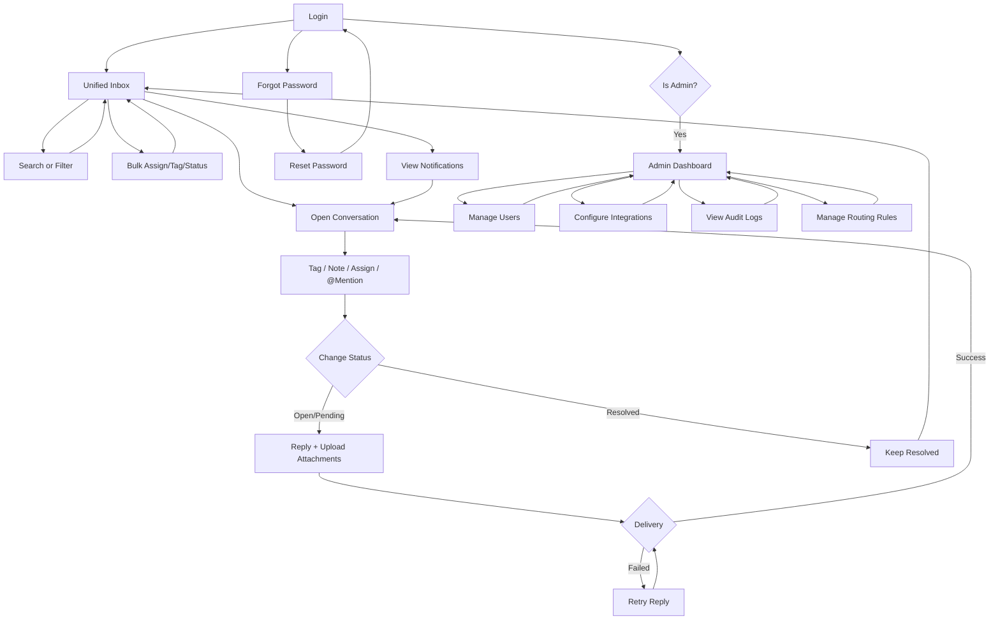

# 01. Product Specification & User Stories

**YACC - Yet Another Chat Client - Omni-Channel Social Inbox MVP**

> **Technical Reference**: See `.docs/03-implementation-guide.md` for system architecture, technology stack, core components, deployment diagrams, and technical decisions.
> **Scope Note**: Phase execution guides and task trackers are removed post-MVP. This document is the authoritative MVP scope and acceptance criteria.

---

## Table of Contents

1. [Product Overview](#1-product-overview)
2. [Target Users & Roles](#2-target-users--roles)
3. [MVP Scope](#3-mvp-scope)
4. [Core User Flows](#4-core-user-flows)
5. [Features Overview](#5-features-overview)
6. [Detailed Product Flows](#6-detailed-product-flows)
7. [UI Requirements & Wireframes](#7-ui-requirements--wireframes)
8. [User Stories with Acceptance Criteria](#8-user-stories-with-acceptance-criteria)
9. [Implementation Milestones](#9-implementation-milestones)

---

## 1. Product Overview

### Concept
**YACC (Yet Another Chat Client)** is a cloud-hosted, single-tenant omni-channel chat platform that centralizes social communications (MVP Phase 1: Telegram groups/channels and IRC) into one unified inbox. Built with React, Node.js, PostgreSQL, and deployed to Cloudflare R2 + CDN for frontend assets and file storage, with backend on VPS.

**Initial Release (Phase 1)**: Unified Inbox + Auth + Basic Ops + Telegram/IRC messaging  
**Post-MVP**: Additional channels (WhatsApp/WeChat/Meta/X) + advanced features

---

## 2. Target Users & Roles

| Role | Permissions |
|------|-----------|
| **Super Admin** | Full access, user/role management, integrations, routing rules |
| **Admin** | Inbox operations, assignments, tags, notes, oversight |
| **Manager** | Assignments, priority handling, team monitoring, view audit logs |
| **User** | Handle assigned conversations, use tags, create notes, reply |

---

## 3. MVP Scope

### Core Features (Required)
**MVP Definition**: MVP includes **Phase 1 + Phase 2** (collaboration + rules). Additional external platforms are post-MVP.

**MVP Platform Scope**: Telegram + IRC (additional platforms: WhatsApp/WeChat/Meta/X are post-MVP).
- ✅ Unified inbox with real-time updates
- ✅ Role-based authentication (login, logout, forgot password)
- ✅ Conversation handling: tags, notes, assignments, bulk actions
- ✅ Rule-based routing (assign, tag, priority)
- ✅ Presence indicators (online/offline, typing)
- ✅ Telegram + IRC connectors
- ✅ Audit logging for all actions
- ✅ Raw platform payload storage (Cloudflare R2)
- ✅ Multi-language UI support (English first, i18n scaffolding)
- ✅ Full-text search (sender, message body, date range)
- ✅ Notifications (in-app: assignment, @mentions, unread badges)
- ✅ Attachment handling (5 MB max, stored on R2, re-hosted)
- ✅ Message retry with exponential backoff (Redis + BullMQ)

### Deferred Features (Post-MVP)
- Email notifications
- WhatsApp, WeChat, Meta, X integrations
- RTL support
- Multi-tenant architecture
- Elasticsearch for search (use PostgreSQL FTS in MVP)

---

## 4. Core User Flows

```
1. Login (email/password)
   ↓
2. View Unified Inbox (all channels, filters, search)
   ├─ Filter by: channel, tag, status, priority, assignee
   ├─ Search by: message text, sender name, date range
   └─ Bulk actions: assign, tag, change status
   ↓
3. Open Conversation
   ├─ View message timeline (inbound/outbound)
   ├─ See attachments (inline images, downloadable files)
   ├─ See system events (assignments, tags, notes, @mentions)
   └─ Change status (open → pending → resolved)
   ↓
4. Collaborate
   ├─ Add tags (create new or reuse)
   ├─ Write internal notes (with @mention support)
   ├─ Assign to team member
   └─ Create @mention notification
   ↓
5. Reply
   ├─ Compose message (with optional attachments)
   ├─ Watch delivery status (pending → sent or failed)
   ├─ Retry on failure (exponential backoff)
   └─ Receive WebSocket update on delivery
   ↓
6. Auto-Routing (if rules match)
   ├─ Rules engine evaluates conditions (channel, keyword, sender, tag, time)
   ├─ Auto-assign, auto-tag, or auto-prioritize
   └─ Log rule execution in audit trail
```

---

## 5. Features Overview

### 5.1 Unified Inbox
- Single queue for all channels (Telegram, IRC)
- Filters: channel, assignment, tags, status, priority
- Bulk actions: tag, assign, set status (max 100 per request)
- Conversation threading per sender + channel
- Search integration with filters

### 5.2 Auth & User Management
- Better Auth for email/password login
- Forgot password via email token (30–60 min TTL)
- Role-based access control (4 roles)
- Session or JWT-based auth

### 5.3 Collaboration
- Internal notes with @mention support (notify tagged users)
- Tagging (user-created, reusable across conversations)
- Assignment and reassignment with audit trail
- Managers and users can reply
- Audit trail for all changes (assignments, tags, notes, status, rule executions)
- Notifications on assignment, @mention, and unread badges

### 5.4 Integrations (Phase 1)
- Telegram groups/channels
- IRC networks
- Other platforms deferred to post-MVP (WhatsApp, WeChat, Meta, X)

### 5.5 Rule-Based Routing
- Rules engine with conditions: channel, keyword, sender, tag, time
- Actions: auto-assign, auto-tag, set priority
- Manual overrides allowed (logged in audit trail)
- Every rule execution logged with matched conditions and applied actions
- Rule execution logs queryable by rule ID or conversation ID

### 5.6 Presence & Live Indicators
- Online/offline presence per user (real-time)
- Typing indicators in conversation view

### 5.7 Localization
- English is default language
- i18n scaffolding for future translations
- No RTL support in MVP (post-MVP)

### 5.8 Raw Payload Storage
- Store raw inbound payloads as plain text on Cloudflare R2
- Link payload reference to message records
- Retain payloads for `RAW_PAYLOAD_RETENTION_DAYS` (default 7 days)
- Limit access to managers+ with audit logging
- Accessible via audit log query (no inline UI link)

### 5.9 Search
- Full-text search across message bodies and sender names
- Filter by date range
- Integrated with inbox list filters (combine search + channel/tag/assignee)
- Results sorted by relevance + recency

### 5.10 Attachments
- Support inbound attachments from Telegram/IRC
- Download and re-host on Cloudflare R2 (5 MB max per file)
- Display inline in message timeline
- Support outbound attachments (upload from UI)
- Failed attachment uploads show clear error

### 5.11 Notifications (In-App)
- Notify user when assigned a conversation
- Notify user on @mention in internal notes
- Unread message badges in inbox
- Notification dismiss/clear UI
- No email notifications in MVP (future phase)

### 5.12 Provider Interface
- Standard connector interface for inbound/outbound messages
- Supports adding new providers after MVP with minimal changes

---

## 6. Detailed Product Flows

### 6.1 Auth Flow
```
User visits login screen
  → Enters email/password
  → Session issued
  
Forgot password:
  → Enter email
  → Receive reset link (with time-limited token)
  → Set new password
  → Login
```

### 6.2 Inbound Message Flow
```
1. Connector receives message from platform
2. Normalize payload to common schema
3. Download and store attachments on R2 (if any)
4. Store raw payload in R2
5. Store message & conversation in Postgres with payload/attachment references
6. Evaluate routing rules
7. Notify UI via WebSocket (conversation_updated event)
8. Send in-app notifications for relevant users (assignments, @mentions)
```

### 6.3 Conversation Status Lifecycle
```
NEW (created on first inbound message)
  ↓
OPEN (active conversation, awaiting reply or action)
  ↓
PENDING (agent replied, awaiting customer response)
  ↓
RESOLVED (conversation closed)
  
If NEW INBOUND MESSAGE arrives on RESOLVED:
  → AUTO-REOPEN to OPEN
  
Note: Status applies to DM/group only (broadcast/channels ignore status)
```

### 6.4 Conversation Handling
```
1. User opens conversation
2. Adds tags/notes/assignments
3. @mention in notes triggers notification to tagged user
4. All actions logged in audit trail (actor, action, timestamp, metadata)
```

### 6.5 Outbound Reply
```
1. User composes reply in UI
2. Backend validates role permissions (users and managers can reply)
3. Save outbound message to DB: status = PENDING
4. Download and store attachments on R2 (if any)
5. Dispatch to connector for delivery to platform
6. On successful delivery → update status to SENT
7. On failure → update to FAILED and enqueue retry:
   - Retry 1: wait 1 minute
   - Retry 2: wait 5 minutes
   - Retry 3: wait 30 minutes
   - After 3 failed attempts: move to DLQ for ops review
8. Emit WebSocket update on send, delivery, and failure
9. User can manually retry (one additional attempt)
```

### 6.6 Rule-Based Routing
```
1. New inbound message arrives and is stored
2. Rules engine evaluates all active rules in priority order
3. First matching rule applies actions (assign, tag, set priority)
4. Audit log records: rule_id, matched_conditions, applied_actions, conversation_id
5. Updated conversation state pushed to UI via WebSocket
6. Manual overrides are allowed (override routing, logged in audit trail)
```

### 6.7 Search Flow
```
1. User enters search query (text + optional date range)
2. Backend performs full-text search on message bodies and sender names
3. Results combined with active filters (channel, tag, assignee, status)
4. Results sorted by relevance + recency
5. Paginated (default 20 per page)
```

---

## 7. UI Requirements & Wireframes

### 7.1 Auth Screens
- [ ] Login form (email + password)
- [ ] Forgot password link
- [ ] Reset password form (token + new password)
- [ ] Validation errors and success states

### 7.2 Unified Inbox
- [ ] Left panel: conversation list (latest message, channel, timestamp)
- [ ] Filters bar (channel, assignee, tags, status, priority)
- [ ] Search input (by sender or keyword, with date range picker)
- [ ] Unread indicator + priority badge
- [ ] Notification badge (count of new notifications)
- [ ] Bulk select + bulk actions bar (max 100 per request)
- [ ] Tag creation UI (inline tag creation on conversation)

### 7.3 Conversation View
- [ ] Header: channel + participant info + status (open/pending/resolved)
- [ ] Presence indicator (online/offline) per team member
- [ ] Timeline: inbound/outbound messages with attachments
- [ ] Attachment display (inline images, file previews, download links)
- [ ] Reply composer with send state (pending/sent/failed) + retry button
- [ ] Typing indicator (user X is typing...)
- [ ] System events (assignment/tag/notes/@mention) in timeline
- [ ] Status transition UI (change from open → pending → resolved)

### 7.4 Right Panel (Actions)
- [ ] Assignment dropdown (shows current assignee + reassign option)
- [ ] Tags selector (multi-select, create new tag inline)
- [ ] Notes panel (create + view, @mention support in notes)
- [ ] Status/priority controls (open/pending/resolved, low/normal/high/urgent)
- [ ] Notification indicators (show who's been notified)

### 7.5 Admin Screens
- [ ] User management table (email, role, status, created_at)
- [ ] Create/Edit user modal (email, role, password)
- [ ] User deactivation + role change (immediate effect, audit logged)
- [ ] Integration setup for Telegram + IRC (credentials form + connection test)
- [ ] Audit log list with filters (actor, action, entity_type, date range)
- [ ] Audit log export (CSV)
- [ ] Language selector (English default, i18n scaffolding)
- [ ] Notifications panel (admin can view/manage user notifications)

### 7.6 Routing Rules Admin
- [ ] Rules list (name, status, priority, last_run_at, execution_count)
- [ ] Rule builder (conditions: channel, keyword, sender, tag, time + actions: assign, tag, priority)
- [ ] Test rule with sample message (preview matched conditions + actions)
- [ ] Rule execution logs (query by rule_id or conversation_id)

### 7.7 User Flow (Mermaid)


---

## 8. User Stories with Acceptance Criteria

### Story 1.1: Login
**As a** user  
**I want** to log in with email/password  
**So that** I can access the unified inbox.

**AC:**
- Valid credentials create authenticated session + return JWT
- Invalid credentials return clear error message
- User lands on inbox after successful login
- Session persists across page refresh
- Locked/disabled users cannot login (error: "Account disabled")

---

### Story 1.2: Forgot Password
**As a** user  
**I want** to reset my password  
**So that** I can regain access if I forget it.

**AC:**
- User can request reset using email
- Reset email contains time-limited token link (TTL: 30–60 mins)
- Token allows setting new password once (invalidates after use)
- Success redirects to login
- Non-existent emails still return success message (no user enumeration)

---

### Story 1.3: Role-Based Access
**As a** super admin  
**I want** role-based access enforced  
**So that** users only see what they're allowed to see.

**AC:**
- Each API request checks role permissions
- Restricted pages inaccessible to unauthorized roles (403)
- Role matrix supports super admin, admin, manager, user

---

### Story 2.1: Inbox List
**As a** user  
**I want** to see all conversations in one list  
**So that** I can handle messages efficiently.

**AC:**
- Inbox shows all channels in single queue
- Conversations display: channel, latest message, timestamp, assignee
- Sorting defaults to newest activity
- Unread count displayed per conversation
- Priority badge visible (low/normal/high/urgent)

---

### Story 2.2: Filters
**As a** user  
**I want** to filter conversations  
**So that** I can focus on specific workloads.

**AC:**
- Filters available for: channel, tag, status, assignee, priority
- Filter results update immediately (<500ms)
- Filters can be combined
- Clear all filters button exists
- Selected filters shown as removable chips

---

### Story 2.3: Conversation View
**As a** user  
**I want** to open a conversation  
**So that** I can read history and respond.

**AC:**
- Timeline displays inbound and outbound messages
- Channel metadata visible (channel name, participant names)
- Messages ordered chronologically (oldest first)
- Message metadata visible (sender, timestamp, status)
- Conversation status visible in header (open/pending/resolved)

---

### Story 3.1: Internal Notes
**As a** manager  
**I want** to add internal notes  
**So that** I can guide other users.

**AC:**
- Notes visible only inside system (not sent to customer)
- Notes show author and timestamp
- Notes stored with conversation (persist on reopen)
- Notes appear in timeline as system events

---

### Story 3.2: Tagging
**As a** user  
**I want** to tag conversations  
**So that** I can categorize them.

**AC:**
- Tags can be added/removed
- Tag list is reusable across conversations
- Tags are filterable in inbox
- Create new tag on-the-fly (inline in tag selector)
- Tag creation logged in audit trail

---

### Story 3.3: Assignment
**As a** manager  
**I want** to assign conversations  
**So that** the right person handles them.

**AC:**
- Conversations can be assigned to users
- Assignment changes are logged in audit trail
- Assigned user sees it in their filtered view
- Reassignment allowed (override old assignee)
- Notification sent to assignee

---

### Story 4.1: Reply to Conversation
**As a** user  
**I want** to reply from the conversation view  
**So that** I can respond without leaving the inbox.

**AC:**
- Reply sends to original channel
- Only managers and users can reply
- Outbound messages appear in timeline with status (pending/sent/failed)
- Errors shown if delivery fails
- Can attach files to reply (max 5 MB per file)

---

### Story 4.2: Real-Time Updates
**As a** user  
**I want** live updates in the inbox  
**So that** I see new messages immediately.

**AC:**
- New inbound messages appear without refresh (<1 second)
- Assignment/tag changes update live
- WebSocket reconnects on disconnect (receives backlog from last 1 hour)
- Typing indicators appear in real-time
- Presence updates (online/offline) in real-time

---

### Story 5.1: Telegram Integration
**Phase**: Phase 1 (MVP)
**As a** super admin  
**I want** Telegram messages ingested  
**So that** teams can manage Telegram in the inbox.

**AC:**
- Telegram group/channel messages appear in inbox
- Conversation threads created correctly (one per group)
- Replies from inbox delivered on-behalf-of system account (not agent's personal)
- Error handling for API failures with retry
- Attachments downloaded and re-hosted

---

### Story 5.2: IRC Integration
**Phase**: Phase 1 (MVP)
**As a** super admin  
**I want** IRC messages ingested  
**So that** teams can manage IRC in the inbox.

**AC:**
- IRC messages appear in inbox
- Conversation threads created correctly (one per channel)
- Replies from inbox delivered to IRC
- Auto-reconnect on disconnect (exponential backoff)
- Error handling for auth/connection failures

---

### Story 6.1: User Management
**As a** super admin  
**I want** to manage users and roles  
**So that** access stays controlled.

**AC:**
- Create, edit, deactivate users
- Assign roles to users
- Role changes take effect immediately
- User deactivation prevents login

---

### Story 6.2: Audit Log
**As a** super admin  
**I want** an audit log  
**So that** I can track actions.

**AC:**
- Logs include: actor, action, target, timestamp
- Logs cover: assignments, tags, notes, status changes, rule executions, user role changes, message retries
- Logs are queryable in admin UI (filters: actor, action, entity_type, date range)
- Export audit logs to CSV
- 1-year retention (configurable)

---

### Story 7.1: Auto-Assignment Rules
**As a** super admin  
**I want** routing rules  
**So that** conversations are assigned automatically.

**AC:**
- Rules can match by: channel, keyword, sender, tag, time
- Actions include: assign, tag, set priority
- Manual override always allowed (logged in audit trail)
- Rules evaluated in priority order (first match wins)
- Rules can be disabled/enabled

---

### Story 7.2: Routing Audit Trail
**As a** super admin  
**I want** routing actions logged  
**So that** I can review automation decisions.

**AC:**
- Each rule execution recorded in audit log
- Logs include: matched rule, matched conditions, applied actions
- Logs filterable by rule ID or conversation ID
- Rule execution logs queryable in admin UI

---

### Story 8.1: Bulk Assignment
**As a** manager  
**I want** to assign multiple conversations at once  
**So that** I can handle spikes quickly.

**AC:**
- Multi-select conversations in inbox (max 100)
- Bulk action "Assign" applies to all selected
- Best-effort: some may fail, show success count + failures
- All successful assignments logged in audit trail

---

### Story 8.2: Bulk Tagging
**As a** user  
**I want** to tag multiple conversations  
**So that** I can categorize faster.

**AC:**
- Bulk tag action available from inbox
- Tag changes reflect in all selected conversations
- Show success: "Applied tag 'Urgent' to 50 conversations"

---

### Story 9.1: Presence Indicators
**As a** user  
**I want** to see who is online  
**So that** I can coordinate responses.

**AC:**
- Online/offline status visible for team members (green/gray dot)
- Presence updates in real time (<1 second)

---

### Story 9.2: Typing Indicators
**As a** user  
**I want** to see typing indicators  
**So that** I avoid duplicate responses.

**AC:**
- Typing indicator appears in conversation view
- Indicator clears after inactivity timeout (5 seconds)

---

### Story 10.1: English Default Language
**As a** user  
**I want** the UI in English by default  
**So that** I can use the system immediately.

**AC:**
- English is the default language
- Language can be extended later without redesign (i18n scaffolding)

---

### Story 11.1: Store Raw Payloads
**As a** manager  
**I want** raw platform payloads stored  
**So that** I can debug connector issues.

**AC:**
- Raw payload stored as plain text in Cloudflare R2
- Message record links to payload reference
- Retention controlled by `RAW_PAYLOAD_RETENTION_DAYS` (default 7 days)
- Access limited to managers+, audit logged
- Accessible via audit log query (no inline UI link)

---

### Story 12.1: Search Conversations
**As a** user  
**I want** to search conversations by sender or keyword  
**So that** I can quickly find past conversations.

**AC:**
- Search box filters conversations by keyword (full-text search on message bodies)
- Search also filters by sender name
- Results sorted by relevance (match score) then recency
- Combine search with other filters (channel, tag, assignee, status, priority)
- Pagination: 20 results per page
- Date range picker to narrow search by conversation date

---

### Story 13.1: Download and Re-Host Inbound Attachments
**As a** user  
**I want** to see inbound attachments inline in messages  
**So that** I can view files without leaving the inbox.

**AC:**
- Attachments from Telegram/IRC downloaded and stored on Cloudflare R2
- Displayed inline in message timeline (images: thumbnails; documents: links)
- Original filename and MIME type preserved
- Max file size: 5 MB per file
- Files that exceed limit show error: "File too large (max 5 MB)"
- Download link available for all attachment types

---

### Story 13.2: Upload Attachments in Replies
**As a** user  
**I want** to attach files to my replies  
**So that** I can send documents without leaving the inbox.

**AC:**
- Attachment upload button in reply composer
- Drag-and-drop file upload supported
- Max file size: 5 MB per file
- Show upload progress bar
- Clear error message if upload fails
- Attached file shows in reply preview before sending

---

### Story 14.1: Notify on Assignment
**As a** user  
**I want** to be notified when assigned a conversation  
**So that** I know when I have new work.

**AC:**
- In-app notification appears in notification center when assigned
- Notification includes: conversation ID, who assigned, timestamp
- Notification marked as unread until viewed
- User can dismiss notification (remove from list)
- Notification persists across sessions (stored in DB)
- Notification icon badge shows unread count in inbox header

---

### Story 14.2: Notify on @Mention in Notes
**As a** user  
**I want** to be notified when @mentioned in internal notes  
**So that** I don't miss important guidance.

**AC:**
- Support @mention syntax in notes (@username)
- When note posted with @mention → create notification for mentioned user
- Notification includes: conversation ID, note preview, who mentioned, timestamp
- Mentioned user can see note in conversation timeline

---

### Story 14.3: Unread Message Badge
**As a** user  
**I want** to see unread message indicators in the inbox  
**So that** I know which conversations need attention.

**AC:**
- Unread count shown on conversation in inbox list
- Unread badge clears when user opens conversation
- Total unread count shown in inbox header
- Filter "Unread" available to show only unread conversations

---

### Story 14.4: Notification Center
**As a** user  
**I want** a notification center to view all my notifications  
**So that** I can review and manage them.

**AC:**
- Notification center panel shows all notifications with timestamps
- Notifications grouped by type (assignment, mention, unread)
- Mark individual notification as read
- Dismiss individual notification
- Mark all as read button
- Click notification → navigate to conversation

---

### Story 15.1: Retry Failed Outbound Messages
**As a** system  
**I want** to retry failed messages with exponential backoff  
**So that** transient errors don't result in dropped messages.

**AC:**
- On outbound message failure: retry with exponential backoff (1m, 5m, 30m; 3 attempts total)
- Use Redis + BullMQ to queue retries asynchronously
- After 3 attempts → move to dead-letter queue (DLQ) for ops review
- Message status: pending → sent (success) or failed (after max retries)
- User can retry manually via "Retry" button (one additional attempt)
- All retry attempts logged in audit trail

---

### Story 15.2: Show Message Delivery Status
**As a** user  
**I want** to see the delivery status of my replies  
**So that** I know if they reached the platform.

**AC:**
- Message shows status badge: "Sending", "Sent", or "Failed"
- Failed messages show "Retry" button
- Retry button attempts delivery again (max 1 additional user-initiated retry)
- Hovering over status shows timestamp and error details (if failed)

---

### Story 16.1: Configure Telegram Integration
**As a** super admin  
**I want** to configure and test Telegram connection  
**So that** teams can start managing Telegram in the inbox.

**AC:**
- Admin UI form to input Telegram bot token
- "Test Connection" button validates credentials and shows status (connected/error)
- Clear error message if credentials invalid
- On success, show "Connected" status and webhook URL for manual Telegram config
- Connection status visible in admin dashboard

---

### Story 16.2: Configure IRC Integration
**As a** super admin  
**I want** to configure and test IRC connection  
**So that** teams can start managing IRC in the inbox.

**AC:**
- Admin UI form to input: server, port, username, password
- "Test Connection" button validates credentials and shows status
- Clear error message on failure
- On success, show "Connected" status
- Connection status visible in admin dashboard
- Auto-reconnect status shown (currently connected/retrying/disconnected)

---

### Story 17.1: Create Tags On-the-Fly
**As a** user  
**I want** to create new tags while tagging a conversation  
**So that** I don't have to ask an admin to create them.

**AC:**
- Tag selector shows existing tags
- "Create new tag" option in dropdown
- User types tag name, optionally selects color
- Tag created and immediately attached to conversation
- New tag appears in global tag list for other users

---

### Story 18.1: Manage Conversation Status
**As a** manager  
**I want** to change conversation status (open/pending/resolved)  
**So that** I can track conversation lifecycle.

**AC:**
- Status dropdown in conversation header (open/pending/resolved)
- Changing status logged in audit trail (old_status, new_status)
- New inbound message on resolved conversation auto-reopens it (status → open)
- Status change triggers WebSocket update to all connected clients
- UI shows reason for auto-reopen: "Conversation reopened: new message from customer"

---

### Story 19.1: Bulk Assignment with Partial Failures
**As a** manager  
**I want** to assign multiple conversations at once, even if some fail  
**So that** I can handle spikes without manual retry.

**AC:**
- Multi-select up to 100 conversations in inbox
- Bulk action button shows "Assign"
- Backend applies assignment best-effort (some may fail)
- Show result summary: "Assigned 98 of 100 conversations" + list of failed IDs + reasons
- All successful assignments logged in audit trail
- Failed assignments show reason (e.g., "Conversation not found", "Permission denied")

---

### Story 19.2: Bulk Tagging
**As a** user  
**I want** to tag multiple conversations at once  
**So that** I can organize faster.

**AC:**
- Multi-select up to 100 conversations
- Bulk action button shows "Tag"
- User selects tag(s) to apply
- All selected conversations tagged (best-effort)
- Confirmation: "Applied tag 'Urgent' to 50 conversations"
- Tag changes logged in audit trail

---

### Story 20.1: Comprehensive Audit Logging
**As a** super admin  
**I want** all system actions logged for compliance  
**So that** I can track who did what and when.

**AC:**
- Audit log covers: assignments, tags, notes, status changes, rule executions, user role changes, message retries
- Each log entry includes: actor_id, action, entity_type, entity_id, metadata (JSON), created_at
- Metadata captures specific details (e.g., old_value, new_value, reason, matched_conditions)
- Logs retained for 1 year (configurable via `AUDIT_LOG_RETENTION_DAYS`)
- Logs queryable by: actor, action, entity_type, date range
- Export audit logs to CSV

---

### Story 20.2: Query and Filter Audit Logs
**As a** super admin  
**I want** to search and filter audit logs  
**So that** I can investigate specific events.

**AC:**
- Audit log UI with filters: actor, action, entity_type, date range
- Search by conversation ID or user ID
- Results paginated (default 50 per page)
- Each log entry shows: timestamp, actor, action, entity, metadata preview
- Click to expand metadata (show full JSON)
- Export filtered results to CSV

---

## 9. Implementation Milestones

### Week 1–2: Core + Messaging + Integrations (Phase 1)
- ✓ Core data model + auth + user roles
- ✓ Basic inbox API (GET /conversations, etc.)
- ✓ Database schema setup
- ✓ WebSocket real-time updates
- ✓ Message retry queue (exponential backoff)
- ✓ Message sending + delivery status
- ✓ Telegram + IRC connectors end-to-end

### Week 3–4: Collaboration & Routing (Phase 2)
- ✓ Tags, notes, assignments + audit log
- ✓ Rule-based routing engine
- ✓ Notifications system
- ✓ Bulk actions

### Week 5: Search & Attachments (Phase 3)
- ✓ Search + attachment handling
- ✓ Raw payload access controls

### Week 6: Admin & Polish (Phase 4)
- ✓ Integration setup (credential management)
- ✓ Admin panel (users, audit logs, rules)
- ✓ QA + bug fixes

---

**Version**: 1.0  
**Last Updated**: January 17, 2026  
**Status**: Ready for implementation
