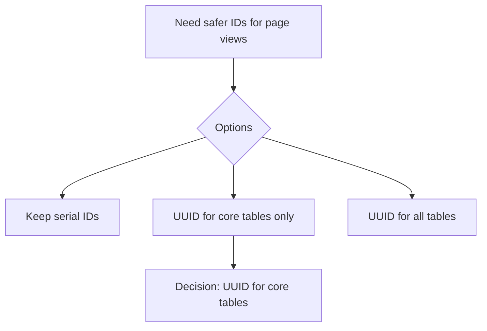

**Status:** Accepted  
**Date:** 2026-01-20  
**Deciders:** Architecture Team, Development Team  
**Technical Story:** Phase 6.5 - Framework Modernization

---

# Architecture Decision Record

## Context / Problem Statement
Core domain entities are exposed as primary page views. Sequential integer IDs leak ordering and are brittle for cross-system references. We need an ID strategy that is safer for public URLs and integrates cleanly with external systems.

## Drivers & Constraints
- API-first integration and zero-trust communication.
- Avoid exposing sequential IDs in URL routes.
- Maintain compatibility with BetterAuth defaults.
- Align with existing Drizzle/PostgreSQL stack.

## Assumptions
- UUIDs are acceptable in API responses and UI routes.
- BetterAuth tables keep text primary keys; foreign keys may reference UUID users.

## Options Considered
1. Keep serial IDs for all tables.
2. Convert core page-view tables to UUIDs; keep BetterAuth table IDs as text (FKs can reference UUID users). ✅
3. Convert all tables (domain + BetterAuth IDs) to UUIDs.

## Decision
Convert core page-view tables to UUID primary keys while keeping BetterAuth table IDs as text and allowing their foreign keys to reference UUID users.

**Tables affected (UUID):** `users`, `conversations`, `messages`, `attachments`, `notes`, `notifications`, `routing_rules`, `audit_logs`.

## Implications & Consequences
- Database schema changes required for listed tables.
- API contracts and services must treat affected IDs as UUID strings.
- Migration must preserve referential integrity for updated foreign keys.

## Architecture Principle Alignment
- **API-First Integration:** safer external references.
- **Secure by Design:** prevents guessable IDs.
- **Zero Trust:** reduces implicit trust in internal ID ordering.

## Security / Compliance Impact
- Reduced enumeration risk in UI/API routes.
- No weakening of auth or authorization controls.

## Operational Impact
- Migration requires coordinated rollout across API + UI.
- Monitoring/logging unaffected.

## Cost / Complexity Impact
- Moderate refactor for schema and foreign keys.
- Minimal runtime overhead for UUIDs.

## Risks & Mitigations
- **Risk:** mismatched ID types in services and controllers.  
  **Mitigation:** update all ID types to string UUID and add schema checks.

## Traceability
- Phase 6.5 - Framework Modernization
- BE-002 (schema) and related API contracts

## Implementation Notes
- Update Drizzle schema and migrations.
- Update API/service types for UUID IDs.
- Leave BetterAuth table IDs unchanged; allow UUID user foreign keys.

## Mermaid (Decision Flow)

## Sign-off
Approved by: Chris Sim (Solution Architect)
