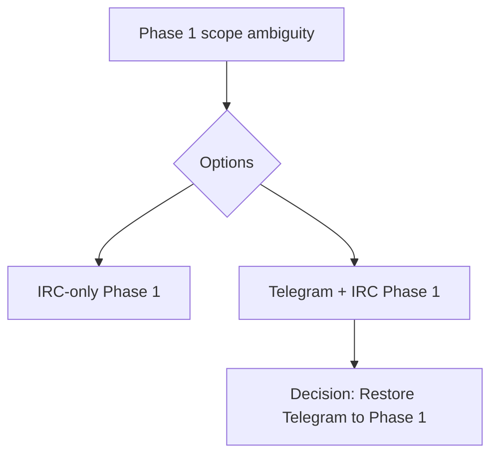

**Status:** Accepted  
**Date:** 2026-01-24  
**Deciders:** Architecture Team, Product Owner  
**Technical Story:** Phase 1 Scope Alignment

---

# Architecture Decision Record

## 1. Context / Problem Statement
Phase 1 scope drifted to IRC-only in some artifacts and code, while the business requirement is to deliver both Telegram and IRC integration in Phase 1. We need an explicit decision to restore Telegram to Phase 1 and align documentation and implementation with that scope.

## 2. Drivers & Constraints
- MVP requires Telegram and IRC integrations.
- Avoid breaking future channel expansion (whatsapp, wechat, meta, x, email, slack).
- Maintain existing channel_type enum compatibility.
- Minimize rework by aligning documentation and tests with scope.

## 3. Assumptions
- Telegram integration is part of the Phase 1 deliverable set.
- Future channels (whatsapp, wechat, meta, x, email, slack) remain defined in enums for forward compatibility.

## 4. Options Considered
1. Keep IRC-only in Phase 1 and defer Telegram to Phase 2.
2. Restore Telegram to Phase 1 scope and keep IRC alongside it. ✅

## 5. Decision
Phase 1 scope includes **both Telegram and IRC** integrations. The channel_type enum remains inclusive of future channels to avoid unnecessary churn.

## 6. Implications & Consequences
- Documentation must explicitly state Phase 1 includes Telegram + IRC.
- API schemas and frontend filters must accept Telegram.
- Tests must validate Telegram filters and behavior in Phase 1.
- Future channels (whatsapp, wechat, meta, x, email, slack) remain in enums but are not part of Phase 1 acceptance criteria.

## 7. Architecture Principle Alignment
- **API-First Integration:** supports required platforms in MVP.
- **Reuse Before Build:** avoids churn by keeping future channel types.
- **Secure by Design:** no change to auth/permissions.

## 8. Security / Compliance Impact
- No new security impact beyond Telegram integration requirements.

## 9. Operational Impact
- Integration ops for Telegram must be included in Phase 1 rollout.

## 10. Cost / Complexity Impact
- Moderate: documentation and validation updates required.

## 11. Risks & Mitigations
- **Risk:** Partial documentation updates create ambiguity.  
  **Mitigation:** Update all Phase 1 scope references and acceptance criteria.

## 12. Traceability
- Phase 1 MVP scope
- PR #142 (scope alignment and related blockers)

## 13. Implementation Notes
- Re-enable Telegram in channel enums and schema validation.
- Update tests to validate Telegram filters.
- Update scope references in product and implementation docs.

## 14. Mermaid (Decision Flow)

## 15. Sign-off
Approved by: Chris Sim (Solution Architect)
