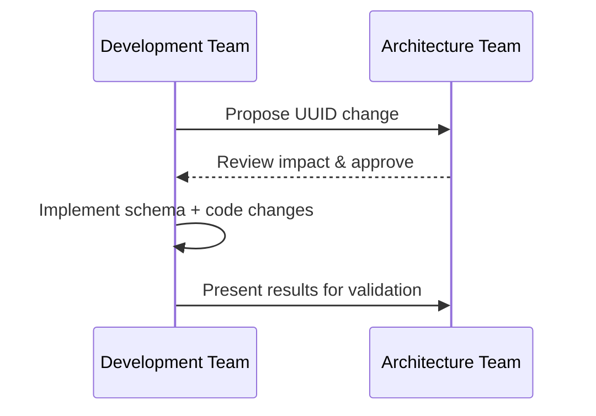

**Status:** Accepted  
**Date:** 2026-01-20  
**Deciders:** Architecture Team, Development Team  
**Technical Story:** Phase 6.5 - Framework Modernization

---

# Governance Log

## Decision Summary
Adopt UUID primary keys for core page-view tables, keep BetterAuth tables unchanged, and clarify audit logs are conversation-scoped (not comprehensive).

## Governance Trigger
Architecture alignment for Phase 6.5 modernization and security hardening.

## Compliance Assessment
Aligned with architecture principles: API-first integration, secure by design, zero trust.

## Impact Assessment
- Schema changes required for core tables and their foreign keys.
- API contracts must treat IDs as UUID strings.
- Audit logs remain conversation-only; update API contract if it implies system-wide coverage.
- No impact to auth plugin schema.

## Risk Acceptance / Waivers
No waivers required.

## Approved Controls / Conditions
- Update Drizzle schema and migrations before BE-002 completion.
- Update API/service ID types for affected entities.
- Verify referential integrity after migration.

## Implementation Oversight
- Backend dev to implement changes.
- Architect to review schema and migration plan.

## Traceability
- ADR-001-core-table-uuids
- Phase 6.5 - Framework Modernization

## Mermaid (Governance Flow)

## Sign-off
Approved by: Chris Sim (Solution Architect)
