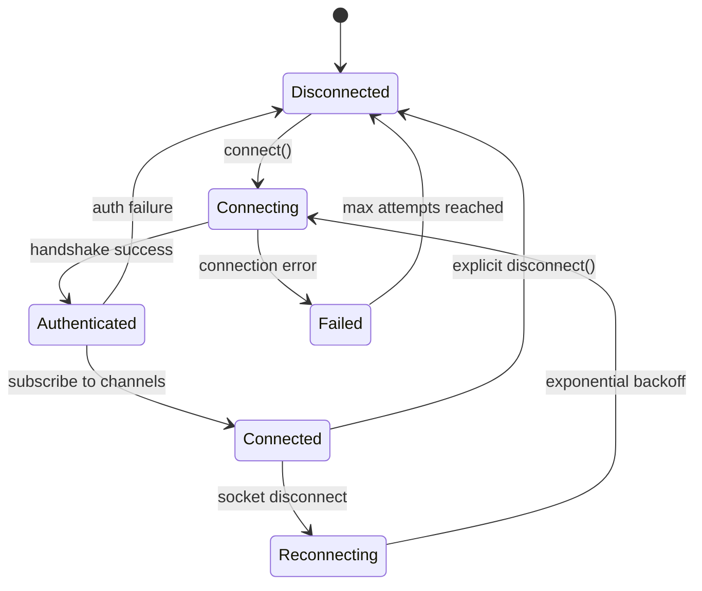
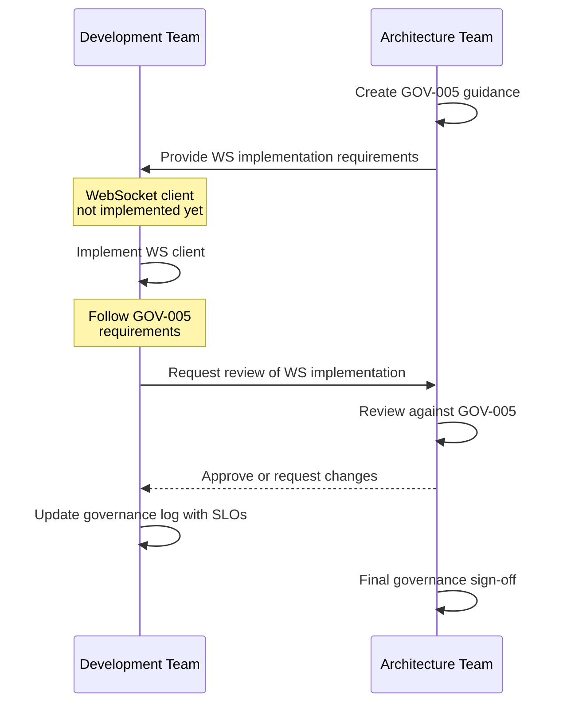

**Status:** Guidance  
**Date:** 2026-01-24  
**Deciders:** Architecture Team, Development Team  
**Technical Story:** Phase 1 - WebSocket Client Implementation Requirements

---

# Governance Guidance

## Purpose
Define implementation requirements for WebSocket client to prevent rework and ensure compliance with architecture principles when development begins.

## Governance Trigger
Issues #132 and #133 from PR #131 are deferred pending WebSocket client implementation. This guidance ensures future development meets architectural standards.

## Compliance Assessment
Aligned with architecture principles: Observability is mandatory, one-definition-per-file rule, zero trust service communication.

## WebSocket Client Implementation Requirements

### 1. File Structure (One-Definition-Per-File)

**Rule:** Each file must export exactly one definition (constant, type, interface, or function). No barrel/index.ts exports for WebSocket-related code.

**Required Structure in `packages/common/src/`:**
```
constants/
  websocket/
    MessageEvents.constant.ts      # Exports: MESSAGE_RECEIVED, MESSAGE_SENT, MESSAGE_FAILED
    ConversationEvents.constant.ts # Exports: CONVERSATION_UPDATED, CONVERSATION_REOPENED
    NotificationEvents.constant.ts # Exports: NOTIFICATION_RECEIVED, NOTIFICATION_READ, NOTIFICATION_DISMISSED
    PresenceEvents.constant.ts      # Exports: PRESENCE_UPDATED, TYPING_STARTED, TYPING_STOPPED

types/
  websocket/
    MessagePayload.ts          # Exports: MessageReceivedPayload, MessageSentPayload, MessageFailedPayload
    ConversationPayload.ts       # Exports: ConversationUpdatedPayload, ConversationReopenedPayload
    NotificationPayload.ts       # Exports: NotificationReceivedPayload, NotificationReadPayload, NotificationDismissedPayload
    PresencePayload.ts           # Exports: PresenceUpdatedPayload, TypingStartedPayload, TypingStoppedPayload
    WebSocketEventType.ts        # Exports: WebSocketEventType (union of all events)
```

**Required Structure in `packages/frontend/src/services/`:**
```
websocket/
  websocket-client.ts           # Exports: WebSocketService class (singleton)
  websocket-logger.ts         # Exports: WebSocketLogger class (observability)
  connection-manager.ts         # Exports: ConnectionManager class (lifecycle)
```

**Import Pattern:**
```typescript
// ✅ CORRECT - Direct file imports
import { MESSAGE_RECEIVED } from '@yacc/common/constants/websocket/MessageEvents.constant';
import type { MessageReceivedPayload } from '@yacc/common/types/websocket/MessagePayload';

// ❌ INCORRECT - Barrel/index imports
import { MessageEvents } from '@yacc/common/constants/websocket';
import type { WebSocketPayloads } from '@yacc/common/types/websocket';
```

### 2. Observability Requirements

**Minimum Metrics to Emit:**

| Metric Name | Type | Trigger | Purpose |
|--------------|------|----------|---------|
| `ws.connection.attempt` | Counter | Connection attempt started | Monitor connection frequency |
| `ws.connection.success` | Counter | Connection established | Monitor success rate |
| `ws.connection.failure` | Counter | Connection failed with error | Monitor failures by error type |
| `ws.connection.duration` | Histogram | Connection established → disconnected | Track session length |
| `ws.reconnection.attempt` | Counter | Auto-reconnect triggered | Monitor reconnection stability |
| `ws.event.received` | Counter | Any WebSocket event received | Track event volume |
| `ws.event.error` | Counter | Event processing error | Track event failures |
| `ws.backlog.replay` | Counter | Missed events replayed on reconnect | Track data loss |

**Minimum Traces/Logs:**

| Event Type | Required Fields | Purpose |
|-------------|-------------------|---------|
| connect | `timestamp`, `socketId`, `userAgent` | Audit connection establishment |
| disconnect | `timestamp`, `socketId`, `reason`, `code` | Audit disconnections |
| reconnect | `timestamp`, `attemptNumber`, `delay` | Monitor reconnection attempts |
| event_received | `timestamp`, `eventType`, `payload` | Debug event flow |
| error | `timestamp`, `errorType`, `message`, `stack` | Debug failures |

**Logging Standards:**
```typescript
// Structured logging with context
logger.info('WebSocket connected', {
  socketId: socket.id,
  userId: user?.id,
  timestamp: new Date().toISOString(),
});
```

### 3. SLO Requirements (Placeholder)

Define SLOs when production metrics are available. Proposed baseline:

| SLO | Target | Measurement |
|------|---------|-------------|
| Connection Success Rate | ≥99.5% | `ws.connection.success / (ws.connection.success + ws.connection.failure)` |
| Event Delivery Latency | ≤100ms (P95) | Time from event emission to client receipt |
| Reconnect Success Rate | ≥95% | `ws.reconnection.success / ws.reconnection.attempt` |

### 4. WebSocket Client Lifecycle



### 5. Error Handling & Retry

**Error Taxonomy:**
| Error Type | Classification | Action |
|-------------|----------------|--------|
| Connection timeout | Transient | Retry with exponential backoff (1s → 60s, 5 attempts) |
| Authentication failure | Permanent | Fail fast, redirect to login |
| Server error (5xx) | Transient | Retry with backoff |
| Client error (4xx) | Permanent | Log and alert |
| Network error | Transient | Retry with backoff |

**Retry Logic:**
- Initial delay: 1 second
- Max delay: 60 seconds
- Max attempts: 5
- Reconnect only if last connection was successful

## Implementation Oversight

### Before Implementation (Now)
- [x] Create this governance guidance (GOV-005)
- [x] Update PHASE1_TODO.md with placeholder tasks
- [ ] Optionally: Refactor backend `WSConstants.ts` to one-definition-per-file

### During Implementation (When WebSocket Client Exists)
- [ ] Review WebSocket client code for one-definition-per-file compliance
- [ ] Verify observability hooks emit all required metrics
- [ ] Validate error handling follows taxonomy
- [ ] Test reconnect logic against backoff specification
- [ ] Update governance log with actual SLOs or explicit rationale

### After Implementation
- [ ] Architect to review and approve implementation
- [ ] Create/update governance log for observability metrics
- [ ] Document any deviations from this guidance

## Traceability
- Issue #132: One-definition-per-file rule for WebSocket
- Issue #133: Observability requirements for WebSocket client
- PR #131: WebSocket client implementation (deferred blockers)
- PR #142: Resolved other blockers from PR #131
- GOV-004: Documented deferral of #132, #133

## Mermaid (Governance Flow)


## Known Constraints & Limitations

1. **No Current WebSocket Client Code**: This guidance is preemptive; actual implementation may reveal gaps not anticipated.

2. **Observability Stack**: No specific observability tool chosen (e.g., Datadog, New Relic). Guidance is agnostic; implement metrics emitter compatible with chosen stack.

3. **Backend Alignment**: Backend `WSConstants.ts` is not yet one-definition-per-file. This is low priority but should be addressed for consistency.

4. **SLO Baselines**: SLOs proposed above are baselines. Adjust based on actual production data when available.

## Sign-off
Approved by: Chris Sim (Solution Architect)
