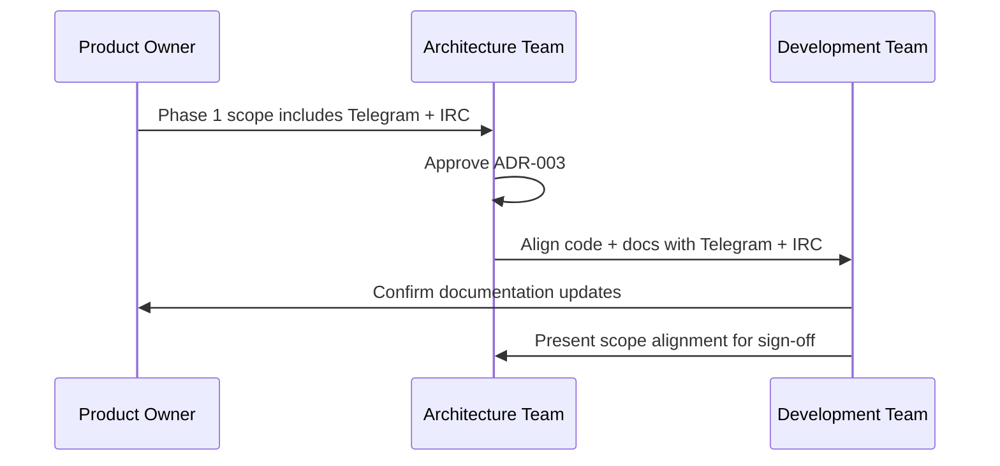

**Status:** Accepted  
**Date:** 2026-01-24  
**Deciders:** Architecture Team, Product Owner  
**Technical Story:** Phase 1 Scope Alignment

---

# Governance Log

## 1. Decision Summary
Restore Telegram to Phase 1 scope alongside IRC and keep future channel types in the enum for forward compatibility.

## 2. Governance Trigger
Scope ambiguity discovered between Phase 1 documentation and implementation; ADR-003 establishes Phase 1 as Telegram + IRC.

## 3. Compliance Assessment
Aligned with architecture principles: API-first integration, reuse before build, and observability requirements remain unchanged.

## 4. Impact Assessment
- Documentation updated to reflect Telegram + IRC in Phase 1.
- API validation and frontend filters must accept Telegram.
- Tests must validate Telegram filters in Phase 1.
- Future channels (whatsapp, wechat, meta, x, email, slack) remain in enums but are not part of Phase 1 acceptance criteria.

## 5. Risk Acceptance / Waivers
No waivers required.

## 6. Approved Controls / Conditions
- Maintain `channel_type` enum with future channels (whatsapp, wechat, meta, x, email, slack) for forward compatibility.
- Ensure Phase 1 acceptance criteria explicitly include Telegram + IRC.

## 7. Implementation Oversight
- Fullstack dev to update schemas, tests, and UI filters.
- Product Owner to align Phase 1 documentation.
- Architect to sign off ADR-003 and governance updates.

## 8. Traceability
- ADR-003-phase1-telegram-irc-scope
- PR #142 (scope alignment)

## 9. Mermaid (Governance Flow)

## 10. Sign-off
Approved by: Chris Sim (Solution Architect)
