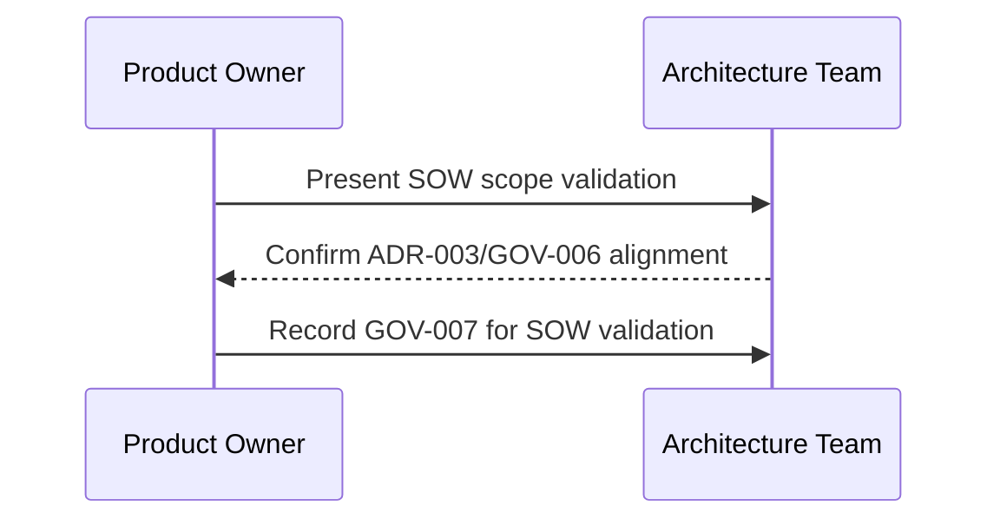

**Status:** Accepted  
**Date:** 2026-01-24  
**Deciders:** Architecture Team, Product Owner  
**Technical Story:** Phase 1 SOW Scope Validation

---

# Governance Log

## 1. Decision Summary
Record acceptance of the Phase 1 SOW scope validation, ensuring Telegram + IRC in Phase 1 and Phase 2 deferrals are explicit and auditable.

## 2. Governance Trigger
SOW created to complete SV-001 to SV-003; governance log required to confirm alignment with ADR-003 and GOV-006.

## 3. Compliance Assessment
Aligned with architecture principles: API-first integration, reuse before build, and documented scope boundaries.

## 4. Impact Assessment
- Phase 1 scope is Telegram + IRC only.
- Phase 2 scope includes WhatsApp/WeChat/Meta/X.
- Future channels (email, slack) remain in enums for forward compatibility.
- Acceptance criteria explicitly cover storage constraints (5 MB attachments, 7-day raw payload retention).

## 5. Risk Acceptance / Waivers
No waivers required.

## 6. Approved Controls / Conditions
- SOW must reference ADR-003 and GOV-006.
- Scope validation checklist must include all Phase 1 requirements and exclude Phase 2 platforms.

## 7. Implementation Oversight
- Product Owner maintains SOW alignment.
- Architect validates scope boundaries and governance traceability.

## 8. Traceability
- ADR-003-phase1-telegram-irc-scope
- GOV-006-phase1-telegram-irc-scope
- SV-001/SV-002/SV-003 (PHASE1_TODO)

## 9. Mermaid (Governance Flow)

## 10. Sign-off
Approved by: Chris Sim (Solution Architect)
