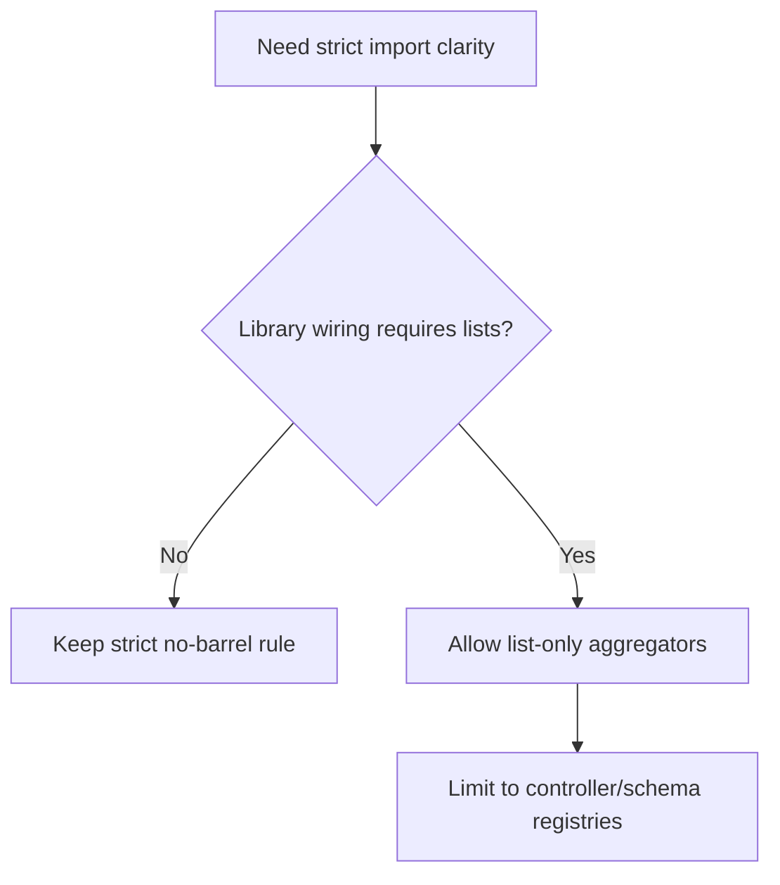

**Date:** 2026-02-07  
**Deciders:** Architecture Team, Development Team  
**Technical Story:** Phase 1.4 - Developer Experience Alignment

---

# Architecture Decision Record

## Context / Problem Statement
The codebase enforces a strict "no barrel exports" rule to keep imports explicit and code discoverable. However, some frameworks and libraries (e.g., routing-controllers, ORM registries) benefit from a single list or registry of items to wire into configuration without duplicating imports. The rule needs a narrowly-scoped exception for index aggregators that export **lists** (not re-exports for convenience).

## Drivers & Constraints
- Preserve discoverability and direct file imports.
- Avoid hidden dependencies and circular import risks.
- Support library wiring patterns (controller lists, schema registries).
- Keep business logic out of index aggregators.

## Assumptions
- Aggregators are used only for configuration wiring, not application logic.
- Direct imports remain the default across services/controllers.

## Options Considered
1. Keep strict ban on all index.ts files outside app entry point.
2. Allow only data-only schema/request registries. ✅
3. Allow limited index.ts for **list/registry exports** used by libraries (controllers, schemas) with strict constraints. ✅

## Decision
Allow **limited index.ts aggregators** that export **lists/registries** for library wiring (e.g., controller arrays for routing-controllers, schema registries for ORM). These files must contain **no business logic** and must **not** be used as general barrel exports for convenience.

## Implications & Consequences
- Enables clean library configuration without scattering lists across bootstrap code.
- Maintains direct import discipline for services and controllers in application code.
- Requires documentation and enforcement of constraints.

## Architecture Principle Alignment
- **Discoverability:** direct imports remain primary; aggregators are explicit lists.
- **Simplicity:** avoids repeated wiring logic.
- **Transparency:** lists are explicit and limited in scope.

## Security / Compliance Impact
- No impact on auth, RBAC, or data handling.
- No effect on audit or logging requirements.

## Operational Impact
- Simplifies bootstrap configuration for frameworks.
- No runtime performance impact.

## Cost / Complexity Impact
- Low: documentation update and enforcement only.

## Risks & Mitigations
- **Risk:** Aggregators used as general barrels.  
  **Mitigation:** Enforce via lint review + documentation; prohibit `import { X } from '../services'` patterns.

## Traceability
- Architecture guidance: `.docs/architecture/INDEX-TS-RULE-CLARIFICATION.md`
- Constraints: AGENTS.md (Index Aggregators rule)

## Implementation Notes
- Allowed patterns:
  - `controllers/index.ts` exporting `export const controllers = [...]` for routing-controllers.
  - `schemas/index.ts` exporting schema registries for ORM.
- Disallowed patterns:
  - `services/index.ts` re-exporting multiple services for convenience.

## Mermaid (Decision Flow)

## Sign-off
Approved by: Chris Sim (Solution Architect)
