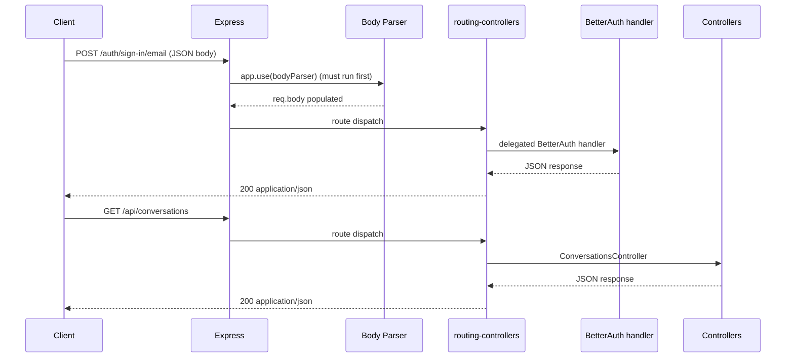

**Status:** Accepted  
**Date:** 2026-02-08  
**Deciders:** Architecture Team  
**Technical Story:** PR #227 BetterAuth body parsing boundary

---

# Architecture Decision Record

## Title
Middleware Registration Exception: `app.use()` for Body Parsing vs routing-controllers-only

## Context / Problem Statement
Architecture guidance prefers registering middleware through `routing-controllers` integration (e.g. `useExpressServer(...)` options and decorators), not via ad-hoc `app.use(...)` registrations.

PR #227 introduced global request body parsing via:

1. `app.use(express.json())`
2. `app.use(express.urlencoded({ extended: true }))`

This is required because BetterAuth uses delegated/forwarded handlers that rely on `req.body` being present before routing-controllers processes controller routing. Routing-controllers middleware ordering (when registered via its config) can result in body parsing occurring too late for these passthrough handlers.

## Drivers & Constraints
1. Keep BetterAuth routes working (sign-up / sign-in / password flows) with deterministic integration tests.
2. Preserve routing-controllers patterns for the rest of the system.
3. Avoid widening exceptions into general-purpose `app.use()` middleware creep.
4. Maintain auditability: any exception must be documented and constrained.

## Options Considered
1. Use `app.use()` for request body parsing before `useExpressServer()`. ✅
2. Build a custom BetterAuth wrapper that parses body inside the handler.
3. Use routing-controllers body parser middleware configuration only (tried; did not satisfy BetterAuth delegated handler ordering).

## Decision
Accept a narrowly-scoped exception:

1. Use `app.use()` for request body parsing **only** (JSON + URL-encoded) and **only** at the backend entrypoint boundary.
2. Register body parsing **before** `useExpressServer()` so BetterAuth delegated routes receive parsed bodies.
3. Apply the same pattern in test app setup to keep supertest suites deterministic.

**Allowed files (current scope):**
1. `packages/backend/src/index.ts`
2. `packages/backend/tests/test-helpers.ts`
3. `packages/backend/src/middleware/bodyParser.middleware.ts` (implementation wrapper)

## Consequences
1. ✅ BetterAuth sign-up/sign-in endpoints reliably receive parsed request bodies.
2. ✅ All POST endpoints consistently receive parsed bodies.
3. ⚠️ Slight deviation from the “routing-controllers-only middleware registration” principle.
4. ⚠️ Requires governance guardrails to prevent additional middleware being added via `app.use()`.

## Guardrails (Non-Negotiable)
1. `app.use()` is permitted for **body parsing only**.
2. Any additional `app.use()` middleware requires a new ADR (or an addendum to this ADR) with explicit rationale.
3. All middleware beyond body parsing remains registered via routing-controllers patterns.

## Trade-offs
1. Option A (chosen): Works immediately, simplest operationally, minimal code.
2. Option B: Cleaner purity boundary, higher implementation cost; deferred.
3. Option C: Preferred principle, but incompatible with BetterAuth delegated handler ordering (observed in PR #227 / Issue #233).

## Lessons Learned
1. External library integrations can impose ordering requirements that justify narrow exceptions.
2. Exceptions must be documented with explicit scope to prevent gradual degradation.
3. Boundary middleware should be kept minimal and centralized.

## Mermaid – Request Handling With BetterAuth Boundary

## Related
1. PR #227: feat: Week 1 complete, BE-007 tag filter, inbox tests, app in index
2. Issue #233: Body parsing regression for BetterAuth routes
3. GOV-015: `.docs/governance/GOV-015-pr227-week1-docs-entrypoint-tests.md`
4. ADR-005: Config vs infrastructure pattern
