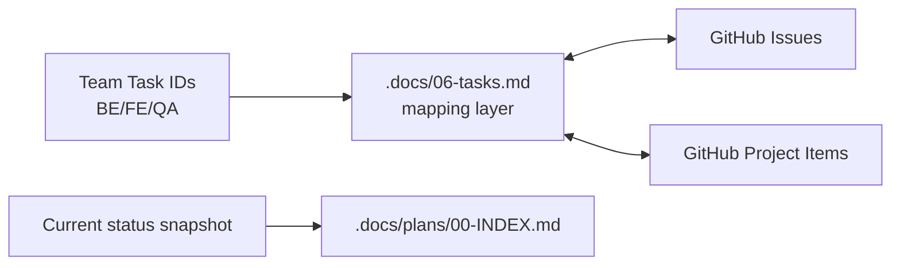

**Status:** Accepted  
**Date:** 2026-02-14  
**Deciders:** Enterprise Architect + Product Owner  
**Related:** ADR-008, ADR-015, GOV-026

---

# Architecture Decision Record

## Title
Keep `.docs/06-tasks.md` as the canonical Task-to-Issue Map (GitHub-aligned)

## Context
Post-MVP documentation pruning (ADR-015) removed pre-MVP working documents from repo HEAD.

After pruning, it became clear that the program still needs a single, human-readable, always-current mapping between:
1. the task catalog used by the team (BE/FE/QA IDs), and
2. GitHub Issues + GitHub Project items.

Relying only on GitHub UI for this mapping slows onboarding and makes audits harder because task IDs used in docs (e.g., BE-014A) may not match issue titles consistently.

## Decision
1. Keep `.docs/06-tasks.md` in repo HEAD.
2. Treat `.docs/06-tasks.md` as the canonical mapping layer between task IDs and GitHub Issues/Project items.
3. Keep `.docs/plans/00-INDEX.md` as the lightweight status page (MVP stage and beyond).
4. All other pre-MVP phase packets / session summaries remain removed from HEAD per ADR-015.

## Guardrails
1. `.docs/06-tasks.md` must always include:
   - Issue IDs for tracked items (or an explicit blank meaning "not tracked as an issue")
   - Project item IDs when present
   - Status aligned to GitHub issue state + project Status field
2. When duplicate issues exist for the same task:
   - close duplicates
   - keep the lowest-numbered issue as the canonical reference unless there is a clear reason not to
3. Do not reintroduce phase-specific document bundles into repo HEAD; use git history if needed.

## Consequences
1. ✅ Restores a single source-of-truth mapping for tasks ↔ GitHub.
2. ✅ Keeps repo HEAD clean while preserving execution traceability.
3. ⚠️ Requires periodic sync effort (mitigated by making GitHub Project the operational surface and `.docs/06-tasks.md` the mapping layer).

## Mermaid – Task Tracking Sources

