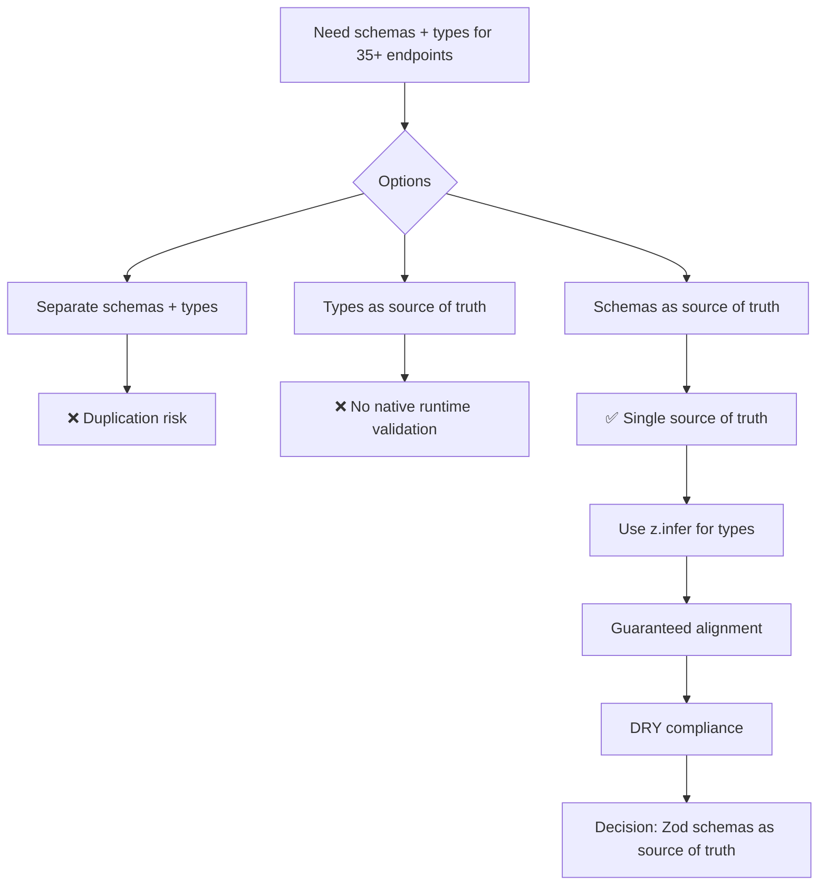

**Status:** Accepted  
**Date:** 2026-02-25  
**Deciders:** Enterprise Architect + Product Owner  
**Related:** ADR-005 (one-definition-per-file), ADR-012 (index aggregator allowance), SH-002 (API types), SH-004 (Zod schemas)

---

# Architecture Decision Record

## Title
Zod Schemas as Single Source of Truth for API Validation

## Context / Problem Statement

SH-004 requires creating Zod schemas for 35+ REST API endpoints alongside TypeScript types for request validation and response type safety. If defined separately, we face:

- **Duplication risk**: Maintaining both Zod schemas and TypeScript types separately
- **Type-schema mismatch**: Runtime validation may accept payloads that TypeScript rejects, or vice versa
- **Maintenance burden**: Every API change requires updating both schema and type definitions
- **DRY violation**: Two sources of truth for the same contract

We need a single source of truth that guarantees type-schema alignment while minimizing maintenance overhead.

## Drivers & Constraints

- **DRY Principle**: No duplication across codebase (AGENTS.md core principle)
- **Type Safety**: Guaranteed compile-time type checking
- **Runtime Validation**: Catch invalid payloads at API boundary
- **No `any` Types**: Strict TypeScript enforcement (AGENTS.md constraint)
- **ADR-005 Compliance**: One-definition-per-file structure
- **Maintainability**: Easy to update when API contracts change

## Assumptions

- Zod is already a project dependency for validation
- Backend validation middleware will use Zod.parse() for request validation
- TypeScript inference from Zod schemas is acceptable (no exotic type constructs needed)
- SH-002 TypeScript types may need migration to Zod-based types (post-MVP refactoring acceptable)

## Options Considered

1. **Separate Zod schemas + TypeScript types** (traditional approach)
   - Pros: Explicit type definitions, familiar pattern
   - Cons: Duplication, drift risk, double maintenance

2. **TypeScript types as source of truth** (use type reflection/codegen)
   - Pros: Types-first approach
   - Cons: No native runtime validation, requires build-time codegen

3. **Zod schemas as source of truth, infer TypeScript types** ✅
   - Pros: Single source of truth, guaranteed alignment, DRY compliance
   - Cons: Slightly verbose imports (`z.infer<typeof schema>`)

## Decision

**Use Zod schemas as the primary definition for all API request/response contracts. Infer TypeScript types via `z.infer<typeof schema>`.**

### Implementation Pattern

```typescript
// ✅ GOOD: Schema as source of truth
// packages/common/schemas/auth.schema.ts
export const loginRequestSchema = z.object({
  email: z.string().email(),
  password: z.string().min(8),
});

export type LoginRequest = z.infer<typeof loginRequestSchema>;

// Usage in controller
import { loginRequestSchema, type LoginRequest } from '@yacc/common/schemas/auth';

@Post('/login')
async login(@Body() body: LoginRequest) {
  // Middleware validates with loginRequestSchema.parse(body)
  // Type safety guaranteed by z.infer
}
```

```typescript
// ❌ BAD: Separate definitions (duplication)
// types/auth.ts
export interface LoginRequest {
  email: string;
  password: string;
}

// schemas/auth.ts
export const loginRequestSchema = z.object({
  email: z.string().email(),
  password: z.string().min(8),
});
// Risk: Type says password is string, schema requires min 8 chars
```

### Scope

- **All request bodies**: Validated via Zod, types inferred
- **All query/path params**: Validated via Zod, types inferred
- **Response types**: Zod schemas define contract, types inferred (response validation optional for MVP)

### Migration Plan (SH-002 Types)

- **Short-term (MVP)**: SH-002 TypeScript types remain as-is; SH-004 creates new Zod-first schemas
- **Post-MVP**: Migrate SH-002 types to Zod-based definitions to eliminate duplication
- **No immediate refactor required**: Existing types continue working until migration

## Implications & Consequences

### Positive

- **Single source of truth**: Schema defines both runtime validation and compile-time types
- **Guaranteed alignment**: Type-schema mismatch is impossible by construction
- **DRY compliance**: No duplication (AGENTS.md principle enforced)
- **Easier maintenance**: API changes require updating only the Zod schema
- **Fewer bugs**: Validation errors caught at development time (TypeScript) and runtime (Zod)
- **Better developer experience**: IDE autocomplete and type inference work seamlessly

### Negative

- **Slightly verbose imports**: Requires `z.infer<typeof schema>` for type extraction
- **Learning curve**: Developers must understand Zod inference patterns
- **SH-002 migration debt**: Existing TypeScript types need eventual migration (post-MVP)

### Neutral

- **Performance**: Negligible impact (Zod validation is fast, type inference is compile-time only)
- **Bundle size**: Zod already a dependency, no additional cost

## Architecture Principle Alignment

- **DRY (Don't Repeat Yourself)**: Single source of truth eliminates duplication
- **KISS (Keep It Simple)**: One pattern for all API contracts, no parallel maintenance
- **Consistency**: All endpoints follow same schema-first pattern
- **Type Safety**: Strict TypeScript enforcement with no `any` types

## Compliance with Existing ADRs

- **ADR-005 (one-definition-per-file)**: Each schema defined in its own file
- **ADR-012 (index aggregator allowance)**: Schemas exported via domain-specific aggregators (`schemas/index.ts`)
- **AGENTS.md (no `any` types)**: `z.infer` produces proper TypeScript types, never `any`

## Security / Compliance Impact

- **Input validation**: Zod schemas enforce strict validation at API boundary
- **Type safety**: Compile-time checks prevent runtime type errors
- **Audit trail**: Schema changes visible in version control

## Operational Impact

- **Minimal**: Existing validation middleware updated to use Zod.parse()
- **Monitoring/logging**: Zod validation errors logged with clear messages
- **Testing**: Schemas testable independently (validate valid/invalid inputs)

## Cost / Complexity Impact

- **Development velocity**: Faster (single definition to maintain)
- **Maintenance cost**: Lower (no drift between types and schemas)
- **Migration cost**: Deferred to post-MVP (SH-002 types migration)

## Risks & Mitigations

| Risk | Mitigation |
|------|------------|
| Developers unfamiliar with Zod inference | Provide code examples in documentation, use in SH-004 as reference |
| SH-002 types drift from SH-004 schemas | Acceptable for MVP; post-MVP migration documented in ADR |
| Complex types hard to infer from Zod | Use explicit type annotations if needed (`as const satisfies`) |

## Traceability

- **Tasks**: SH-004 (Zod schemas), SH-002 (API types, migration candidate)
- **Documentation**: `.docs/02-api-and-data-model.md` (API contracts)
- **Related ADRs**: ADR-005 (flat structure), ADR-012 (index aggregators)

## Implementation Notes

### SH-004 Deliverables (35+ Schemas)

- Auth: login, register, forgot-password, reset-password (4 schemas)
- Conversations: list, get, update, reopen, assign, tag, bulk-action (7 schemas)
- Messages: send, retry, list, get (4 schemas)
- Tags, Notes, Routing Rules: CRUD operations (13 schemas)
- IRC Config: save, test, connect, status, list-profiles (5 schemas)
- Search, Notifications, Bulk, Raw Payloads, DLQ, Integrations (11+ schemas)

### File Structure (ADR-005 Compliance)

```
packages/common/
├── schemas/
│   ├── auth.schema.ts          # loginRequestSchema, registerRequestSchema, etc.
│   ├── conversations.schema.ts # listConversationsSchema, updateConversationSchema, etc.
│   ├── messages.schema.ts      # sendMessageSchema, retryMessageSchema, etc.
│   ├── tags.schema.ts
│   ├── notes.schema.ts
│   ├── routing-rules.schema.ts
│   ├── irc-config.schema.ts
│   ├── search.schema.ts
│   ├── notifications.schema.ts
│   └── index.ts                # Domain-specific aggregator (ADR-012)
```

### Validation Middleware Integration

```typescript
// packages/backend/middleware/validation.middleware.ts
import { ZodSchema } from 'zod';

export function validateBody(schema: ZodSchema) {
  return (req, res, next) => {
    const result = schema.safeParse(req.body);
    if (!result.success) {
      return res.status(400).json({ 
        error: 'validation_error',
        details: result.error.flatten() 
      });
    }
    req.body = result.data; // Use validated data
    next();
  };
}

// Usage in routing-controllers
import { useExpressServer } from 'routing-controllers';

useExpressServer(app, {
  controllers: [...],
  middlewares: [ValidationMiddleware], // NOT app.use() per ADR-014
});
```

## Mermaid (Decision Flow)



## Sign-off

Approved by: Chris Sim (Solution Architect + Product Owner)  
Date: 2026-02-25  
Status: ✅ Accepted - Ready for SH-004 implementation
