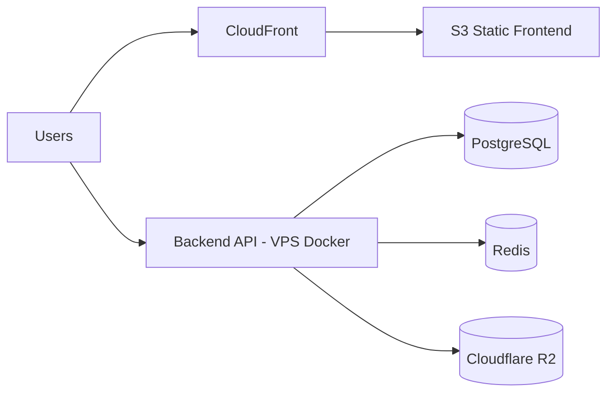

# 001 Technology Architecture

**Last Updated**: 2026-02-14  
**Lifecycle**: MVP

---

## Purpose
Define the approved technology stack, runtime environments, deployment model, and operational standards for YACC MVP.

## Technology Standards (MVP)
### Runtime & Frameworks
- Backend: Node.js 18+, Express, routing-controllers
- Frontend: React 18, TanStack Start

### Data & Messaging
- Database: PostgreSQL 14+ (FTS for search)
- Cache / Queue: Redis + BullMQ

### Storage
- Object storage: Cloudflare R2 (attachments + raw payloads)

### Real-time
- WebSockets: Socket.io

### Auth
- BetterAuth (email/password, sessions/JWT per implementation)

### Tooling
- Monorepo: pnpm workspaces + Turborepo
- Tests: Vitest (unit/integration), Playwright (E2E)

## Deployment Architecture (MVP)
### Targets
- Frontend: AWS S3 + CloudFront
- Backend: Docker on a single VPS instance

### Mermaid – High-Level Deployment

## Observability (MVP)
- Structured logging aligned with ADR-004
- Request correlation where available
- SLO reference: `.docs/observability-slo.md`

## Forbidden / Deferred (Post-MVP)
- Multi-tenant architecture (deferred)
- Secrets vault integration (deferred)

## References
- ADR-004 logging strategy: `.docs/adr/ADR-004-logging-strategy.md`
- ADR-005 config/infrastructure pattern: `.docs/adr/ADR-005-infrastructure-config-pattern.md`
