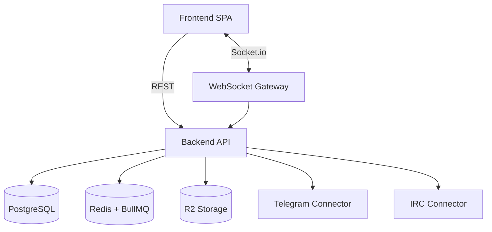

# 002 Application Architecture

**Last Updated**: 2026-02-14  
**Lifecycle**: MVP

---

## Purpose
Document application boundaries, responsibilities, and integration patterns for YACC MVP.

## Application Inventory
### 1. Frontend SPA (`packages/frontend/`)
- TanStack Start + React UI
- Uses REST for CRUD and Socket.io for real-time updates

### 2. Backend API (`packages/backend/`)
- Express + routing-controllers REST API
- Socket.io gateway for real-time events
- Background processing via BullMQ workers

### 3. Shared Package (`packages/common/`)
- Shared types/schemas used across frontend/backend

## Integration Patterns
- Client to Backend: REST + WebSocket (Socket.io)
- Backend to Data stores: PostgreSQL + Redis + R2
- Backend to External platforms: Telegram API, IRC networks (connectors)

## Mermaid – Component View

## Ownership / Lifecycle
- Single-tenant MVP
- Phase 1 + Phase 2 features implemented
- Post-MVP enhancements tracked via ADR/GOV and product backlog

## References
- Core docs: `.docs/01-product-specification.md`, `.docs/03-implementation-guide.md`
