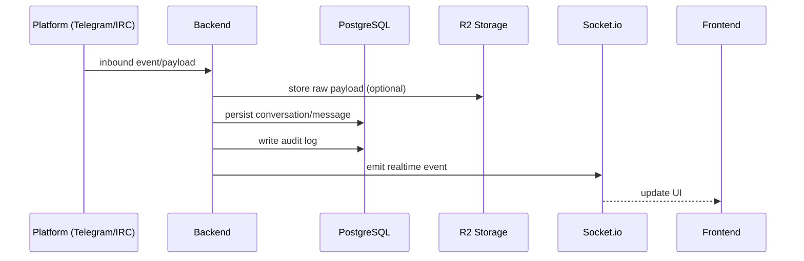

# 003 Data Architecture

**Last Updated**: 2026-02-14  
**Lifecycle**: MVP

---

## Purpose
Define data domains, storage locations, access patterns, and retention expectations for YACC MVP.

## Data Domains (MVP)
- Identity & Access: users, roles, sessions
- Inbox / Conversations: conversations, messages, assignments
- Collaboration: tags, notes
- Rules & Automation: routing rules, rule executions
- Notifications: in-app notifications
- Audit: audit log entries
- Files: attachments, raw payload snapshots

## Stores
### PostgreSQL
Primary system of record for application entities.

### Redis
Queue scheduling and retry/backoff tracking (BullMQ).

### Cloudflare R2
- Attachments (inbound re-host + outbound uploads)
- Raw inbound payload storage (debug)

## Access Patterns
- Frontend accesses data only via Backend API (REST/WebSocket), not direct DB access.
- External integrations write inbound data via backend connectors.

## Retention (MVP defaults)
- Audit logs: 1 year (configurable)
- Raw payloads: 7 days (configurable)

## Mermaid – Data Flow (Inbound Message)

## References
- Data model: `.docs/02-api-and-data-model.md`
