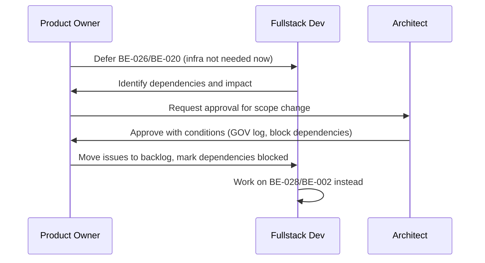

**Status:** Accepted
**Date:** 2026-01-22
**Deciders:** Architect (Chris Sim), Product Owner, Fullstack Developer
**Technical Story:** Phase 1 - Week 1 Foundation

---

# Governance Log

## Decision Summary
Defer BE-026 (environment configuration scaffolding) and BE-020 (Cloudflare R2 storage setup) to backlog to focus Week 1 on non-infrastructure work. Replace with BE-028 (shared types package - close out) and BE-002 (database schema definitions only, no migration execution).

## Governance Trigger
Product Owner directive to defer infrastructure configuration tasks to prioritize core development work in Week 1.

## Compliance Assessment
Aligned with architecture principles:
- **Configuration over customization**: Infrastructure setup can be deferred without blocking core functionality
- **Cloud-ready by default**: R2 and env config are integration points that can be added later
- **Zero Trust**: Deferral does not compromise security; env vars remain accessible for core tasks

## Impact Assessment

### Tasks Moved to Backlog
- **BE-026**: Environment configuration scaffolding (Zod validation, config service, startup validation)
- **BE-020**: Cloudflare R2 storage SDK integration (signed URLs, lifecycle policies, CORS)

### Direct Dependencies Now Blocked
- **BE-025**: Set up email service (Nodemailer/SendGrid) - requires env config
- **BE-021**: Implement raw payload storage - requires R2
- **BE-022**: Implement raw payload retrieval endpoint - requires BE-021
- **BE-023**: Implement attachment download and re-host - requires R2
- **HD-001**: Docker Compose configuration - requires R2 local/minio
- **DOC-007**: Environment variables reference - partially blocked until BE-026 resumes
- **HD-002**: Production Docker image for backend - depends on complete env config
- **HD-006**: Production environment template - blocked by env config gaps

### Week 1 Timeline Impact
**Before:**
- Day 1: BE-028, BE-026, BE-001
- Day 2: BE-002, BE-027
- Day 3: BE-020, BE-025

**After:**
- Day 1: BE-028 (close out), BE-001
- Day 2: BE-002 (schema only), BE-027
- Day 3: [BE-020 BLOCKED], BE-025 [BLOCKED - env vars]

### Replacement Tasks
1. **BE-028**: Create shared types package - currently in review, can be closed out
2. **BE-002**: Define database schema - schema definitions + migration files only, no execution until BE-001 ready

## Risk Acceptance / Waivers

### Accepted Risks
1. **Delayed env config validation**: Startup validation won't check all required env vars until BE-026 resumes
   - **Mitigation**: Use local .env files with documentation of required variables
2. **Blocked email service**: BE-025 (email service) cannot be completed without env config
   - **Mitigation**: Email endpoints can be implemented with mock/stub service for testing
3. **Blocked R2-dependent features**: Raw payloads and attachments cannot be implemented
   - **Mitigation**: IRC messages can be processed without attachments in initial integration

### No Waivers Required

## Approved Controls / Conditions

1. **Mark all downstream tasks as blocked** in their issue descriptions
2. **Update Week 1 timeline** (issue #110) to reflect blocked items
3. **BE-002 scope limited to**:
   - Schema definitions only (Drizzle schema.ts)
   - Migration file generation (no execution)
   - Migration execution deferred until BE-001 (PostgreSQL + Drizzle) is complete
4. **Environment variables** must still be documented in `.env.example` for current work
5. **BE-026 and BE-020** must be rescheduled before end of Phase 1 (blocking release)

## Implementation Oversight

- **Product Owner**: Track blocked tasks and reschedule BE-026/BE-020
- **Architect**: Monitor for additional dependency impacts
- **Fullstack Developer**: Work on BE-028 (close review) and BE-002 (schema only)

## Traceability

- **Issues Affected**: #106 (BE-020), #108 (BE-026)
- **Week 1 Plan**: Issue #110 [WEEK-1] Phase 1 Week 1: Foundation
- **Phase 1 Tasks**: `.docs/06-phase1-execution-guide.md`
- **ADR Reference**: None (deferral, not architecture change)

## Mermaid (Governance Flow)

## Sign-off

**Approved by:**
- Chris Sim (Solution Architect) - Approved 2026-01-22
- Product Owner - Proposed 2026-01-22

**Executed by:**
- Fullstack Developer - Implementation 2026-01-22

## Follow-up Actions

- [ ] All dependent tasks marked as blocked in GitHub issues
- [ ] Week 1 timeline (issue #110) updated
- [ ] BE-028 review closed
- [ ] BE-002 schema definitions created (no migrations executed)
- [ ] BE-026 rescheduled before end of Phase 1
- [ ] BE-020 rescheduled before end of Phase 1
