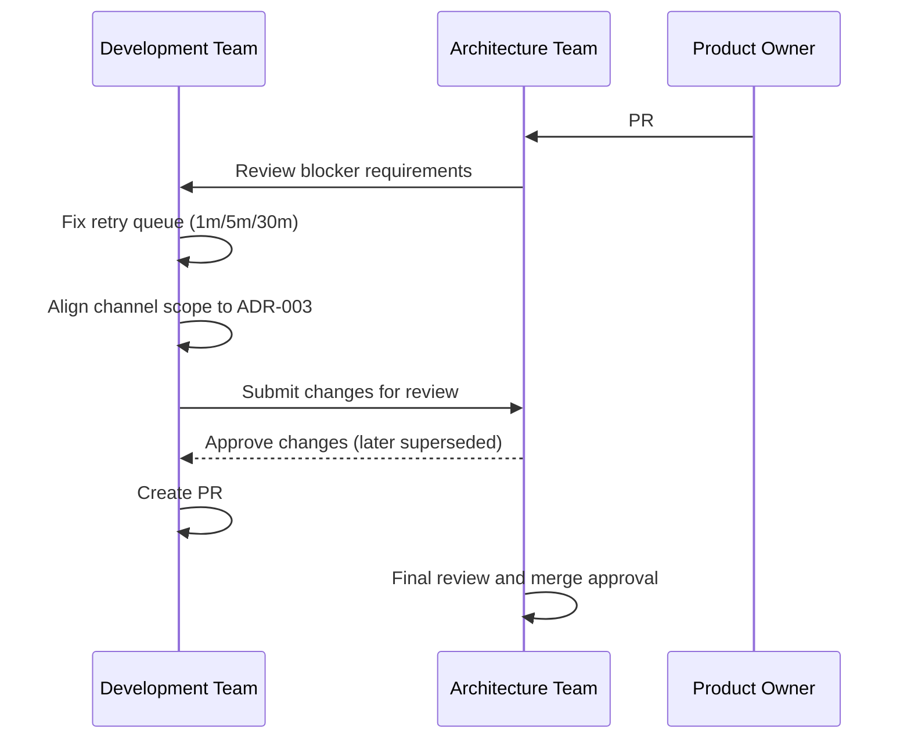

**Status:** Accepted  
**Date:** 2026-01-24  
**Deciders:** Architecture Team, Development Team  
**Technical Story:** Phase 1 - PR #131 Blocker Fixes

---

# Governance Log

## Decision Summary
Fix PR #131 blockers by correcting retry queue backoff schedule to strict 1m/5m/30m. Channel scope is now governed by ADR-003 (Phase 1 = Telegram + IRC) and GOV-006.

## Governance Trigger
Blockers #134 and #135 from PR #131 preventing merge of WebSocket client implementation.

## Compliance Assessment
Aligned with architecture principles: Cloud-ready by default, observability is mandatory, reuse before build.

## Impact Assessment

### Retry Queue Changes (#134)
- Removed BullMQ exponential backoff (produces 1m, 2m, 4m, 8m...)
- Implemented strict delay schedule: Attempt 1=60s, Attempt 2=300s, Attempt 3=1800s
- Fixed `removeFromQueue()` to use correct BullMQ API signature
- Enhanced observability with removedCount logging

### Channel Type Changes (#135)
- Channel enum remains forward-compatible with future channels
- Phase 1 UI filters restricted to Telegram + IRC per ADR-003
- Phase 2 platforms (WhatsApp/WeChat/Meta/X) are deferred

## Risk Acceptance / Waivers
No waivers required. Retry queue changes remain approved; channel scope was later updated by ADR-003.

## Approved Controls / Conditions

### Retry Queue
- Verify BullMQ job delay calculation matches 1m/5m/30m specification
- Monitor `removeFromQueue()` operation in production
- Ensure retry jobs respect MAX_ATTEMPTS=3 limit

### Channel Types
- Phase 1 UI filters limited to Telegram + IRC
- Future channels remain in enums for forward compatibility
- Database migrations must add new enum values idempotently

## Implementation Oversight
- Backend dev implemented retry queue fixes
- Fullstack dev updated channel types across all packages
- Architect to review and approve changes

## Traceability
- Issue #134: BE-013 Retry backoff schedule
- Issue #135: BE-001 Channel type restrictions
- PR #142: fix(blockers): Resolve PR #131 blockers
- ADR-003: Restore Telegram + IRC Phase 1 scope
- Phase 1 scope: Telegram + IRC (ADR-003/GOV-006)

## Mermaid (Governance Flow)

## Known Constraints & Limitations
- WebSocket client (#132, #133) not implemented yet, blocked by missing client code
- Governance log for FE-012 (#136) deferred until WebSocket client is ready
- Phase 2 channels (WhatsApp/WeChat/Meta/X) remain deferred

## Sign-off
Approved by: Chris Sim (Solution Architect)
