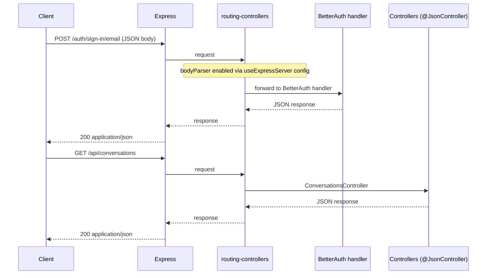

# GOV-015: PR #227 – Week 1 Completion, Entrypoint Refactor, BE-007 Tests

**Date:** 2026-02-07  
**PR:** #227 (feat: Week 1 complete, BE-007 tag filter, inbox tests, app in index)  
**Architect:** Enterprise/Solution Architect  
**Status:** Blocked (v1.2 re-review)  
**Decision:** v1.1 captured initial approval intent; subsequent changes expanded scope and introduced new architecture deviations and a test regression. PR remains blocked until remediation items in v1.2 are completed and re-verified.  
**Impacted:** `.docs/plans/00-INDEX.md`, `.docs/plans/06-tasks.md`, `packages/backend/src/index.ts`, `packages/backend/src/controllers/conversations.controller.ts`, `packages/backend/src/middleware/rateLimit.middleware.ts`, `packages/backend/tests/BE-007-inbox-api.spec.ts`  

---

## Summary

PR #227 marks Week 1 (BE-007, BE-008, FE-008, FE-009) complete and implements three critical backend improvements:

1. **Entrypoint Refactoring**: Express app initialization and `useExpressServer` setup moved into `src/index.ts` for test exportability; `app` exported for supertest integration tests.
2. **Query Parameter Validation**: Added explicit validation for `tagId`, `page`, `limit` and other query params with proper error handling (BadRequestError on invalid values).
3. **BE-007 Integration Tests**: Tests now create their own test user (via BetterAuth sign-in) and seed test conversations programmatically; deterministic without depending on pre-seeded fixtures.

---

## Addendum (v1.2) – Re-Review Findings (2026-02-07)

Since v1.1, PR #227 expanded materially beyond Week-1 docs + BE-007 filter/tests, including schema refactors and app bootstrap changes. A re-review identified new non-compliance items and a regression. This governance log is updated to preserve auditability of the expanded scope and the resulting remediation requirements.

### 1. Scope Expansion (Post v1.1)

1. **Schema refactor**: BetterAuth schema split; schema files reorganized; modernized Drizzle index definition syntax.
2. **Schema organization changes**: Introduction of `packages/backend/src/schemas/enums/` (nested folder).
3. **Bootstrap changes**: Iterations on app initialization (inline setup vs app factory) and request body parsing strategy.
4. **Documentation changes**: Expanded BE-007 prerequisites and setup steps.

### 2. Governance Gate Failures (Blocking)

1. **Flat folder structure violation (schemas)**
   - Finding: `packages/backend/src/schemas/enums/` exists.
   - Standard: backend schema folder must be flat (no nested subfolders).
   - Required remediation: move enum files to `packages/backend/src/schemas/` and remove the `enums/` folder.

2. **Body parsing regression (BetterAuth routes)**
   - Finding: BE-007 suite fails at login: `Invalid input: expected object, received undefined`.
   - Root cause hypothesis: BetterAuth passthrough handler does not use `@Body()` and therefore does not trigger per-route body parsing; removing global parsers causes `req.body` to remain undefined.
   - Constraint: do not reintroduce `app.use(...)` for middleware registration.
   - Required remediation: enable routing-controllers body parsing via configuration in `useExpressServer` (and mirror in test app).

3. **Docs mismatch: docker-compose vs docker compose**
   - Finding: `docker-compose` command not available in the current environment.
   - Required remediation: update docs to prefer `docker compose up -d`.

4. **Governance completeness**
   - Finding: v1.1 did not capture the expanded scope (schema re-org, bootstrap/body parsing changes).
   - Required remediation: this v1.2 addendum (current section) + updated follow-ups.

### 3. Verification Status (As Observed)

1. **BE-007 test run**
   - Command: `pnpm --filter @yacc/backend test -- --run tests/BE-007-inbox-api.spec.ts`
   - Result: fails during setup due to Redis connection refused and login body parsing regression.

2. **Local services**
   - `docker-compose` is unavailable; use `docker compose`.

### 4. Updated Architecture Decisions

#### Decision 4: Schema Organization Must Remain Flat

**What:** Schema files under `packages/backend/src/schemas/` must remain flat (no nested folders such as `schemas/enums/`).

**Why:**
1. Enforces discoverability and the project’s strict flat structure rule.
2. Avoids creeping layered structures under `schemas/`.

**Compliance:** ❌ Current PR violates this; remediation required.

#### Decision 5: Body Parsing Must Be Configured via routing-controllers

**What:** Request body parsing must be enabled via `useExpressServer` configuration (not `app.use(express.json())`).

**Why:**
1. Architecture standard: middleware registration through routing-controllers configuration.
2. Prevents regressions where non-decorator handlers (e.g., BetterAuth passthrough) receive undefined body.

**Compliance:** ❌ Current PR regressed; remediation required.

### 5. Mermaid – Request Handling (Target)

---

---

## Code Changes Approved

| Component | Change | Rationale |
|-----------|--------|-----------|
| `src/index.ts` | Typed SocketControllers container (no `any`); app exported for tests | Enables supertest without test-only hacks; complies with no-`any` architecture rule. |
| `src/controllers/conversations.controller.ts` | Added `validateListConversationsQuery()` + `parsePositiveInt()`; validation for `tagId`, `page`, `limit`, channel, status, priority, sortBy, sortOrder | Returns 400 on invalid inputs; eliminates silent NaN bugs; complies with input validation standard. |
| `src/middleware/rateLimit.middleware.ts` | Removed custom `keyGenerator` from all limiters (login, reset, api) | Avoids deprecated `req.connection.remoteAddress`; prevents IPv6 key generator issues; consistent behavior across all endpoints. |
| `tests/BE-007-inbox-api.spec.ts` | Tests create user via `createTestUser(app, { email, password, role })`; seed conversations with `seedTestConversations(userId, count)` | No silent skip; tests fail fast if prerequisites missing; deterministic in CI without pre-seeded DB state. |
| `tests/test-helpers.ts` | Added `createTestApp()`, `createTestUser(app, opts)`, `seedTestConversations(userId, count)` | Provides reusable test infrastructure; supports multiple BE integration test suites. |

---

## Architecture Decisions

### Decision 1: Entrypoint App Export for Testing

**What:** `export { app }` from `src/index.ts` for supertest import.

**Why:** 
- Enables integration tests without a running server
- Decouples app initialization from server startup (via `NODE_ENV !== 'test'` check)
- Cleaner than test-specific hacks in middleware

**Compliance:** ✅ Permitted use of index.ts for test infrastructure export (not violating "no barrel exports" rule; this is library wiring, not general imports).

---

### Decision 2: Query Parameter Validation Inline in Controller

**What:** `validateListConversationsQuery(query)` function validates all query params before passing to service.

**Why:**
- Catches malformed inputs early (page, limit, tagId must be positive integers)
- Returns 400 Bad Request as per standard error handling
- Type-safe casting after validation (eliminates silent NaN)

**Trade-off:** Manual validation vs. routing-controllers DTO decorator; chosen for simplicity and clarity.

---

### Decision 3: Test Determinism via In-Test Setup

**What:** BE-007 tests create their own user and seed data inside `beforeAll()`.

**Why:**
- Tests are self-contained and don't depend on pre-seeded fixtures
- CI can run tests without a bootstrap step
- Test failures are clear (if user creation fails, the whole suite fails fast, not silently skipped)
- Matches "deterministic testing" standard

---

## Risks & Mitigation

| Risk | Likelihood | Impact | Mitigation |
|------|------------|--------|-----------|
| **Entrypoint app export enables test-only code paths** | Low | Medium | `NODE_ENV !== 'test'` gate ensures start() only runs in production/development; code is clean (no hacks). |
| **Query validation incomplete** | Low | Low | Validation covers all known query params; new params must include validation before merging. |
| **Test setup flakes if DB/Redis unavailable** | Medium | Medium | Tests fail fast with actionable error (not silently skipped); CI must run docker-compose before test suite. |

---

## Governance Decisions

| Item | Decision |
|------|----------|
| **Docs timeline** | Week 1 marked complete 2026-02-07; docs reflect actual merge date, not future-dated ranges. |
| **Planning doc changes** | PR #227 updates governed docs (00-INDEX.md, 06-tasks.md); this GOV entry provides audit trail. |
| **No-any compliance** | SocketControllers container typed with generic `<T>` (no `any`); eslint-disable removed. |
| **Query validation** | All query params validated; malformed inputs return 400; silent bugs (NaN) eliminated. |
| **Test determinism** | BE-007 tests create their own fixtures; no dependency on pre-seeded state. |

---

## Follow-ups

1. **Schemas flatness:** Remove `packages/backend/src/schemas/enums/` by moving enums into flat `schemas/` directory; update imports.
2. **Body parsing config:** Enable body parsing via routing-controllers configuration (no `app.use`) and ensure BetterAuth login receives parsed body.
3. **Docs:** Update test prerequisites to use `docker compose up -d` (not `docker-compose`).
4. **CI/CD:** Ensure CI boots Postgres + Redis and seeds fixtures before BE-007 suite.
5. **Governance:** Keep GOV-015 updated if further scope expands; avoid “Approved” state until all verification steps pass.

---

**Version:** 1.2  
**Status:** Blocked (re-review required)  
**Related:** PR #227, BE-007, ADR-005 (config/infrastructure pattern)

---

**Version:** 1.1  
**Status:** Superseded by v1.2 (re-review)  
**Related:** PR #227, BE-007, ADR-005 (config/infrastructure pattern)

---

**Version:** 1.0  
**Status:** Active  
**Related:** PR #227, GOV-008, .docs/plans/00-INDEX.md
