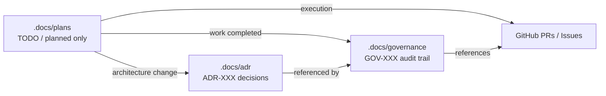

# GOV-017: Plans Directory Cleanup (Phase 2 Prep)

Date: 2026-02-09
Change / PR / ADR ID: Phase 2 preparation (docs hygiene); references PR #227, PR #239; ADR-014; GOV-011; GOV-015; GOV-016
Decision: Consolidate completed planning artifacts into governance references and remove them from `.docs/plans/`; keep `.docs/plans/` limited to actionable TODO / planned execution documents.
Reason: `.docs/plans/` is treated as an execution workspace; completed artifacts create ambiguity and reduce auditability. Governance logs remain the authoritative audit trail.
Architect: Enterprise / Solution Architect
Impacted Systems: Documentation only (`.docs/plans/`, `.docs/governance/`)
Risk Level: Low
Follow-up Required: No

---

## 1. Scope

1. Keep only TODO / planned execution documents under `.docs/plans/`.
2. Remove completed summaries, reviews, and historical plans from `.docs/plans/`.
3. Preserve auditability by referencing the authoritative GOV/ADR records.

---

## 2. Resulting `.docs/plans/` Contract

1. `.docs/plans/` contains only:
   1. Active execution checklists.
   2. In-progress logs tied to active work.
   3. Planned work documents ready to execute.
2. Completed work evidence belongs in:
   1. `.docs/governance/` (GOV-XXX logs)
   2. `.docs/adr/` (ADR-XXX decisions)
   3. GitHub PRs/issues (operational trace)

---

## 3. Files Removed From `.docs/plans/` (Consolidation Map)

1. `REVIEW-SESSION-SUMMARY-2026-02-08.md`
   1. Archived as governance context for Phase 2 readiness.
   2. Authoritative references: PR #239, ADR-014, GOV-015.

2. `PR-239-REVIEW-SUMMARY.md`
   1. Archived as governance context for Phase 2 readiness.
   2. Authoritative references: ADR-014 and PR #239 review record in GitHub.

3. `ISSUE-BREAKDOWN-PR227-BLOCKERS.md`
   1. Archived as historical remediation planning for post-merge issues.
   2. Authoritative references: GOV-015 (PR #227 governance trail).

4. `week1-qa-test-cases-and-data.md`
   1. Archived as historical QA preparation for Week 1.
   2. Authoritative references: GOV-015 (Week 1 completion + verification narrative).

5. `BE-003-COMPLETION-SUMMARY.md`
   1. Archived; completion approval is already governed.
   2. Authoritative reference: `.docs/governance/GOV-011-BE-003-completion-review.md`.

6. `BE-004-password-reset-guide.md`
   1. Archived as completed implementation guide for Phase 1.
   2. Authoritative references: the merged PR/commit history and GOV logs associated to Phase 1.

7. `00-consolidated-active-plans.md`
   1. Archived as historical consolidation; no longer active.
   2. Authoritative references: `.docs/plans/00-INDEX.md` and GOV logs (GOV-011, GOV-015, GOV-016).

8. `BE-206-SESSION-COMPLETION-SUMMARY.md`
   1. Archived; authoritative BE-206 session documentation already exists.
   2. Authoritative reference: `.docs/governance/GOV-016-be-206-phase4-session-summary.md`.

---

## 4. Active Plans That Remain In `.docs/plans/`

1. `.docs/plans/00-INDEX.md` (Phase 2 / Week 2 execution checklist)
2. `.docs/plans/BE-206-phase4-integration-plan.md` (planned execution)
3. `.docs/plans/BE-206-PHASE-4-EXECUTION-LOG.md` (in-progress log)
4. `.docs/plans/BE-206-PHASE-4-STATUS.md` (status snapshot)

---

## 5. Traceability Diagram

