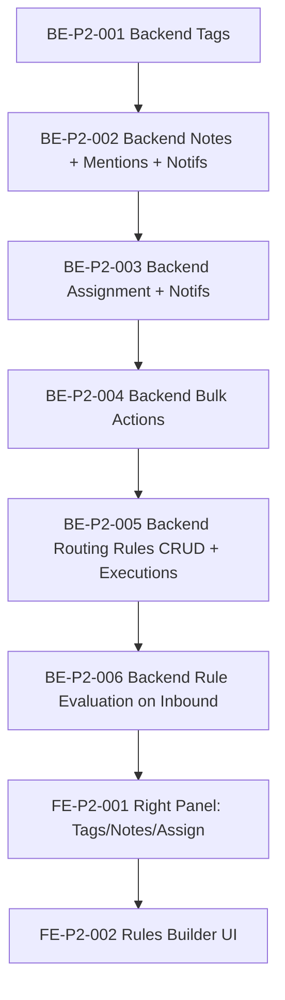

# GOV-021: Phase 2 (Collaboration & Rules) EA Validation Conditions

Date: 2026-02-11
Change / PR / ADR ID: Phase 2 implementation gate (pre-development governance)
Decision: Approve Phase 2 (Collaboration & Rules) implementation ONLY under the validation conditions documented here.
Reason: Resolve known ambiguities, lock RBAC + event semantics, and preserve an auditable trail before developer handoff.
Architect / EA Validator: Enterprise Architecture Validator (Solution Architect)
Product Owner: Product Owner (Collaboration & Rules)
Impacted Systems: Backend API, WebSocket events, database schema/migrations, frontend collaboration UI
Risk Level: Medium (RBAC, auditability, and workflow semantics)
Follow-up Required: Yes (documentation sync items listed in Section 10)

References:
- ADR-005 (`.docs/adr/ADR-005-infrastructure-config-pattern.md`) and addendum (`.docs/adr/ADR-005-infrastructure-config-pattern.addendum-1-flat-structure-di-pattern.md`)
- ADR-004 (`.docs/adr/ADR-004-logging-strategy.md`)
- ADR-008 (`.docs/adr/ADR-008-documentation-governance-framework.md`)
- Product Stories: `.docs/01-product-specification.md` (Story 3.1, 3.2, 3.3, 14.1, 14.2, 14.4, 19.1, 19.2, 20.1)
- API/Data contract: `.docs/02-api-and-data-model.md` (notifications, routing_rules, routing_rule_executions)
- Phase execution scope: `.docs/06-tasks.md` (Phase 2 scope)

---

## 1. Phase 2 Scope Confirmation

1. Phase 2 scope is confirmed as **Collaboration & Rules** (Weeks 3-4) and includes:
   - Tags (CRUD + conversation add/remove)
   - Notes (create/view, internal-only)
   - Assignment (set/reassign)
   - Notifications (assignment + @mention; persisted + WebSocket push)
   - Bulk Actions (assign/tag/status; max 100; best-effort)
   - Routing Rules (CRUD + evaluation + execution logs)

2. Phase terminology clarification (auditability requirement):
   - For execution planning, **"Phase 2" = Collaboration & Rules** as per `.docs/06-tasks.md`.
   - `.docs/02-api-and-data-model.md` currently contains older wording that implies Phase 2 is "additional platforms"; this is treated as a documentation defect and MUST be corrected as part of Section 10.

3. Phase 1.4 stability gate (precondition to start Phase 2):
   - Confirmed target baseline: Week 2 merged and stable for demo: **BE-009/010/011/014** and **FE-008/009/010/012/013/014/015**.
   - Definition of stable: merged to `dev`, tests green, and WebSocket `conversation.updated` is operational for Phase 2 consumers.

---

## 2. RBAC Matrix (Architectural Decision)

This RBAC matrix is authoritative for Phase 2 implementation and overrides any conflicting drafts.

Legend: ✅ allowed, ❌ not allowed.

| Capability | Super Admin | Admin | Manager | User | Notes |
|---|---:|---:|---:|---:|---|
| Tags: create (global tag list) | ✅ | ✅ | ✅ | ✅ | Aligns with Story 3.2 + Story 17.1 (create on-the-fly) |
| Tags: add/remove on conversation | ✅ | ✅ | ✅ | ✅ | Emits `conversation.updated` (see Section 3) |
| Notes: create (internal) | ✅ | ✅ | ✅ | ✅ | Supports @mention parsing (see Section 4) |
| Notes: view | ✅ | ✅ | ✅ | ✅ | Notes are internal-only (never outbound) |
| Assignment: set/reassign (`POST /conversations/:id/assign`) | ✅ | ✅ | ✅ | ❌ | Architect decision: **manager-led** operations; resolves contradiction in draft expectations |
| Bulk actions (assign/tag/status) | ✅ | ✅ | ✅ | ❌ | Applies to `POST /conversations/bulk` and any equivalent endpoints |
| Routing rules: CRUD | ✅ | ❌ | ❌ | ❌ | Super Admin only (admin panel capability) |
| Routing rules: evaluation | N/A | N/A | N/A | N/A | Automatic system behavior; no auth gate (see Section 6) |
| Notifications: list own | ✅ | ✅ | ✅ | ✅ | Users may only access their own notifications (see below) |
| Notifications: mark read/dismiss/delete own | ✅ | ✅ | ✅ | ✅ | Must enforce `notification.user_id == auth.user.id` |

Notes / audit implications:
1. The decision to disallow `user` for Assignment and Bulk Actions intentionally narrows scope vs Story 19.2 (Bulk Tagging). This must be reconciled by updating the docs referenced in Section 10.
2. Enforcement requirement: use consistent RBAC decorators/guards across all Phase 2 endpoints; do not rely on frontend gating.

---

## 3. Event & Audit Semantics

### 3.1 WebSocket event emission

1. `conversation.updated` is emitted when any of these fields change:
   - `status`
   - `priority`
   - `assignedUserId` (assignment)
   - `tags` (add/remove)

2. `notification.received` is emitted when a notification is created or refreshed (dedup upsert):
   - assignment notifications
   - mention notifications

### 3.2 Audit logging requirements (Phase 2)

All Phase 2 actions MUST be audit logged, including:
1. Tags: tag created, tag added/removed on conversation.
2. Notes: note created (including any mention parsing metadata).
3. Assignment: assignment changed/reassigned.
4. Bulk actions: bulk applied (including per-conversation outcomes).
5. Routing rules:
   - rule created/updated/deleted
   - rule evaluated and rule executed (see Section 6)

### 3.3 Rules override policy (audit semantics)

1. If a rule matches and applies actions, audit MUST record:
   - `rule.executed` with `matched_conditions` and `applied_actions` metadata.
2. If a user later manually changes assignment/tags/priority after rule evaluation, audit MUST also record:
   - the user action (e.g., `conversation.assigned`, `conversation.tag_added`, `conversation.tag_removed`, `conversation.priority_changed`)
   - metadata flag that indicates a manual override occurred after a rule execution (implementation detail may be JSON metadata field such as `overrideOfRuleExecutionId` or `overrideReason: "manual"`).

---

## 4. Mention Resolution Strategy

Decision: resolve `@username` tokens in note bodies by matching the **email local-part** (case-insensitive).

1. Matching rules:
   - Token format: `@<token>` where `<token>` is `[A-Za-z0-9._-]+` (implementation detail; exact regex may vary but MUST be documented in code).
   - Resolution: compare `<token>` to `lower(email.split('@')[0])`.
   - Example: `@john` matches `john@example.com`.

2. No-match behavior:
   - If no user matches the token: log warning (structured), do not create a notification.
   - Warning must include: conversation id, note id (if available), token, and correlation id.

3. Duplicates:
   - If multiple users share the same local-part (unlikely but possible in some environments), resolve deterministically (e.g., first by created date) AND log warning. Prefer to treat as non-match if ambiguity is detected.

4. Future decision (Phase 3+): add a dedicated `username` field to avoid email format coupling.

---

## 5. Notifications Table Uniqueness & Dedup

Decision: prevent notification spam by enforcing uniqueness for active (not dismissed) notifications.

1. Database constraint:
   - Add a partial unique index enforcing: `(user_id, conversation_id, type)` WHERE `dismissed_at IS NULL`.
   - Rationale: allow one active notification per type per conversation per user; allow new notification after dismissal.

2. Duplicate behavior (assignment/mention):
   - Use upsert semantics:
     - if an active notification exists, refresh it instead of inserting a new row
     - refresh includes setting `is_read = false`, `read_at = NULL`, updating `body`/`actor_id`/`actor_name` as appropriate, and refreshing the timestamp (either by updating `created_at` or by adding and updating an `updated_at` column if explicitly introduced).

3. WebSocket:
   - Emit `notification.received` for both insert and refresh, so the client reliably updates.

---

## 6. Data Model Assumptions

1. `routing_rule_executions` MUST capture (at minimum):
   - `rule_id`
   - `conversation_id`
   - `matched_conditions` (JSON)
   - `applied_actions` (JSON)
   - `created_at`

2. Evaluation trigger:
   - Rules are evaluated on **inbound message ingestion** (connector -> storage -> rule evaluation).

3. Rule definitions:
   - Rules use JSON `conditions` and `actions` as defined in `.docs/02-api-and-data-model.md`.
   - Evaluation order is deterministic: priority ascending.
   - First matching rule wins.

---

## 7. Sequential Implementation (Approved Order)

Approved implementation order (sequenced for auditability and reduced blast radius):

1. Backend tags (CRUD + conversation add/remove)
2. Backend notes + mention parsing + notifications
3. Backend assignment + notification
4. Backend bulk actions
5. Backend routing rules CRUD + executions listing
6. Backend routing rules evaluation on inbound messages
7. Frontend right panel (tags/notes/assign)
8. Frontend rules builder UI

Optional dependency visualization:

---

## 8. Risks & Mitigations

1. Risk: mention parsing breaks if email format changes
   - Mitigation: Phase 3 add `username` field; keep resolution logic isolated and tested.

2. Risk: rules override confusion
   - Mitigation: audit metadata must clearly distinguish rule-applied changes vs manual user overrides.

3. Risk: notification spam
   - Mitigation: partial unique index + upsert refresh logic (Section 5).

4. Risk: RBAC enforcement inconsistency
   - Mitigation: this matrix is authoritative; code review checklist verifies endpoint decorators/guards match roles.

---

## 9. Approval & Sign-Off

Date: February 11, 2026
Approved by: Enterprise Architecture Validator
Conditions met: Yes (Sections 1-8)
Go/No-Go: GO — developer may proceed with Phase 2 implementation

---

## 10. Handoff Checklist

- [ ] Update `.docs/02-api-and-data-model.md` with Phase 2 clarifications:
  - Phase scope wording consistency (Phase 2 = Collaboration & Rules for execution)
  - RBAC updates (assignment + bulk restricted; notifications self-only)
  - Event scope for `conversation.updated` includes tags
  - Mention resolution strategy details

- [ ] Update `.docs/06-tasks.md` Phase 2 section:
  - RBAC matrix updated to match Section 2 (assignment + bulk actions restricted)
  - Notification dedup assumption (unique constraint + upsert)

- [ ] Link this GOV entry in `.docs/plans/00-INDEX.md` (Phase 2 readiness / gate section)

- [ ] Developer briefed on RBAC matrix + mention resolution + notification dedup semantics

- [ ] First ticket ready: BE-P2-001 (Tags)
