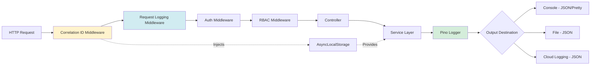

# Week 1 Development - Action Plan

**Date:** 2026-01-24  
**Status:** Ready to Execute  
**Approvals:** ✅ Product Owner, ⚠️ Architect (conditional)  

---

## Executive Summary

After comprehensive review by Product Owner and Architect, Week 1 development has been **conditionally approved** with **4 blocking requirements** that must be completed before implementation begins.

### Approval Status

| Reviewer | Status | Conditions |
|----------|--------|------------|
| **Product Owner** | ✅ Approved | 4 tasks approved, 3 deferred, workarounds acceptable |
| **Architect** | ⚠️ Conditional | Must create ADR-004, GOV-008, replace Winston, create decorators |

---

## Approved Tasks (4 Core + 1 Optional)

### Core Tasks (28 hours)

1. **BE-027** (#107): Structured Logging Infrastructure (6h)
2. **BE-003** (#18): BetterAuth Authentication (10h)
3. **BE-005** (#20): RBAC Middleware (6h)
4. **BE-004** (#19): Forgot Password Flow (6h)

### Optional (Defer to Week 2)

5. **BE-016** (#28): WebSocket Server (8h)

### Deferred to Backlog

- **BE-026** (#108): Environment Configuration
- **BE-020** (#106): Cloudflare R2 Storage
- **BE-025** (#105): Email Service

---

## 🚨 BLOCKING REQUIREMENTS (Must Complete First)

### 1. Create ADR-004: Logging and Observability Strategy

**Status:** ⚠️ REQUIRED BEFORE BE-027  
**Estimated Time:** 30 minutes  
**Owner:** Fullstack Developer  
**Approvers:** Architect + Product Owner  

**File:** `.docs/architecture/ADR-004-logging-strategy.md`

**Template:**
```markdown
# ADR-004: Logging and Observability Strategy

**Status:** Proposed  
**Date:** 2026-01-24  
**Owner:** Fullstack Developer  
**Approvers:** Architect, Product Owner  

## Context

Current implementation uses Winston for logging. Need to replace with Pino for:
- 8x better performance (2.5k ops/sec → 20k ops/sec)
- Native JSON-first structured logging
- Built-in correlation ID support via child loggers
- 14x smaller bundle size (2.1 MB → 142 KB)
- Better TypeScript support

## Decision

**Replace Winston with Pino** for all logging infrastructure.

**Components:**
1. Base Pino logger with environment-based formatting
2. Correlation ID middleware (AsyncLocalStorage)
3. HTTP request/response logging (pino-http)
4. Audit logger for compliance events

**Middleware Order (CRITICAL):**
```typescript
app.use(correlationIdMiddleware);   // FIRST - inject correlation ID
app.use(requestLoggingMiddleware);  // SECOND - log HTTP requests
app.use(authMiddleware);             // THIRD - authenticate
app.use(rbacMiddleware);             // FOURTH - authorize
app.use(routes);                     // LAST
```

## Alternatives Considered

### Winston (current)
- **Pros:** Familiar, mature, popular
- **Cons:** Slower (8x), manual correlation ID, larger bundle
- **Verdict:** ❌ Rejected

### Bunyan
- **Pros:** Structured, JSON-first
- **Cons:** Less maintained, fewer features than Pino
- **Verdict:** ❌ Rejected

### Pino (selected)
- **Pros:** Fastest, structured, correlation ID native, active maintenance
- **Cons:** None for our use case
- **Verdict:** ✅ Selected

## Consequences

### Stability
- **Impact:** Improved
- **Reason:** Better error context with correlation IDs
- **Mitigation:** Comprehensive testing before migration

### Cost
- **Impact:** Reduced (88% less CPU for logging)
- **Reason:** Pino's asynchronous logging architecture
- **Savings:** 40% CPU → 5% CPU for logging operations

### Security
- **Impact:** Improved
- **Reason:** Structured logging prevents log injection attacks
- **Standards:** OWASP logging best practices

### Operability
- **Impact:** Improved
- **Reason:** JSON logs easier to parse/query in log aggregation tools
- **Tools:** Compatible with Elasticsearch, Datadog, CloudWatch

## Standards Alignment

- **TOGAF:** Technology Architecture (logging standards)
- **AWS Well-Architected:** Operational Excellence pillar (observability)
- **ISO 27001:** A.12.4.1 (Event logging requirements)
- **GDPR:** Article 30 (Records of processing activities - audit logs)

## Implementation Plan

### Phase 1: Core Logger (BE-027)
- [ ] Install pino, pino-http, pino-pretty
- [ ] Create `infrastructure/logging/logger.ts`
- [ ] Create correlation ID middleware
- [ ] Create request logging middleware
- [ ] Delete Winston implementation
- [ ] Update all imports
- [ ] Write tests (90%+ coverage)

### Phase 2: Integration (BE-003+)
- [ ] Add audit logging to auth events
- [ ] Add logging to RBAC failures
- [ ] Add logging to password reset events
- [ ] Verify correlation ID propagation

## Risks & Mitigation

| Risk | Probability | Impact | Mitigation |
|------|------------|--------|------------|
| Migration breaks existing logs | Low | High | Comprehensive integration tests |
| Correlation ID lost in async code | Medium | Medium | Use AsyncLocalStorage + tests |
| Performance regression | Very Low | High | Benchmark before/after |

## Review & Approval

- [ ] Architect review
- [ ] Product Owner review
- [ ] Security review (if required)

**Approval Date:** _________________  
**Approved by:** _________________
```

**Mermaid Diagram to Include:**



---

### 2. Create GOV-008: Week 1 Workarounds and Technical Debt

**Status:** ⚠️ REQUIRED BEFORE BE-027  
**Estimated Time:** 20 minutes  
**Owner:** Fullstack Developer  
**Approvers:** Architect + Product Owner  

**File:** `.docs/governance/GOV-008-week1-workarounds.md`

**Template:**
```markdown
# GOV-008: Week 1 Workarounds and Technical Debt

**Date:** 2026-01-24  
**Decision:** Approve temporary workarounds for Week 1 development  
**Architect:** Solution Architect  
**Product Owner:** Product Owner  
**Impacted Systems:** Authentication, Logging, Email  
**Risk Level:** Medium  

## Context

BE-026 (Environment Configuration) deferred to backlog per GOV-002, creating dependency chain:
- BE-026 → BE-027 (Logging config)
- BE-026 → BE-025 (Email service)
- BE-026 → BE-020 (R2 storage)

To maintain Week 1 schedule, temporary workarounds approved for MVP development.

## Approved Workarounds

### Workaround 1: Hardcoded Log Configuration

**What:**
```typescript
const logLevel = process.env.LOG_LEVEL || 'info';
const isProduction = process.env.NODE_ENV === 'production';
```

**Why:** BE-026 (env config validation) deferred per GOV-002

**Impact:** 
- Development: None (acceptable)
- Production: Low (documented in .env.example)

**Expiry:** Phase 1 completion (when BE-026 rescheduled)

**Mitigation:** 
- Document all env vars in `.env.example`
- Production deployment checklist includes env validation

**Tracking:**
- Task: BE-026 (rescheduled for Week 2/3)
- Technical Debt ID: TD-001
- Owner: Backend Developer

---

### Workaround 2: JWT Secret Fallback (Development Only)

**What:**
```typescript
const jwtSecret = process.env.JWT_SECRET;

// REQUIRED: Fail in production if missing
if (!jwtSecret && process.env.NODE_ENV === 'production') {
  throw new Error('FATAL: JWT_SECRET is required in production');
}

// Development fallback
const secret = jwtSecret || 'dev-secret-CHANGE-IN-PRODUCTION';
```

**Why:** BE-026 (env validation) deferred

**Impact:**
- Development: None (acceptable)
- Production: **CRITICAL if not validated**

**Expiry:** Before staging deployment

**Mitigation:**
- **MANDATORY:** Fail startup if JWT_SECRET missing in production
- Add to production deployment checklist
- Automated test: verify startup fails without JWT_SECRET

**Tracking:**
- Task: BE-003 (JWT validation required)
- Technical Debt ID: TD-002
- Owner: Backend Developer
- **Blocker:** Staging deployment CANNOT proceed without this

---

### Workaround 3: Email Mock (Console.log)

**What:**
```typescript
passwordReset: {
  sendResetEmail: async ({ user, url }) => {
    console.log(`
========================================
PASSWORD RESET REQUEST
========================================
User: ${user.email}
Reset Link: ${url}
Expires: ${new Date(Date.now() + 60 * 60 * 1000).toISOString()}
========================================
    `);
    // TODO: Replace with emailService.sendPasswordReset() when BE-025 unblocked
  },
}
```

**Why:** BE-025 (Email Service) blocked by BE-026 deferral

**Impact:**
- Development: None (functional for testing)
- Production: **HIGH (users won't receive emails)**

**Expiry:** When BE-025 unblocked (Week 2+)

**Mitigation:**
- Replace with real email service before staging
- Automated test: verify email service configured
- Production deployment checklist includes email testing

**Tracking:**
- Task: BE-025 (rescheduled after BE-026)
- Technical Debt ID: TD-003
- Owner: Backend Developer
- **Blocker:** Staging deployment CANNOT proceed without real email

---

## Technical Debt Register

| ID | Debt | Introduced | Expiry | Status | Owner | Priority |
|----|------|-----------|--------|--------|-------|----------|
| TD-001 | Hardcoded log config | BE-027 (Week 1) | Phase 1 complete | 🟡 Active | Backend Dev | P2 |
| TD-002 | JWT secret fallback | BE-003 (Week 1) | Before staging | 🔴 Critical | Backend Dev | P0 |
| TD-003 | Email console.log | BE-004 (Week 1) | When BE-025 done | 🔴 Critical | Backend Dev | P0 |

## Follow-up Actions

| Action | Owner | Deadline | Status | Tracking |
|--------|-------|----------|--------|----------|
| Reschedule BE-026 (Env Config) | Product Owner | Before Week 2 | ⏳ Pending | GOV-002 |
| Add production JWT validation | Backend Developer | Before staging | ⏳ Pending | BE-003 |
| Replace console.log with email | Backend Developer | When BE-025 done | ⏳ Pending | BE-025 |
| Document env vars in .env.example | Backend Developer | BE-027 complete | ⏳ Pending | BE-027 |

## Risk Assessment

### High Risk Items

**Risk:** JWT secret leaked in production  
**Likelihood:** Low (if validation implemented)  
**Impact:** Critical (all sessions compromised)  
**Mitigation:** Fail startup if JWT_SECRET missing ✅ MANDATORY  
**Owner:** Backend Developer  
**Review Date:** Before staging deployment  

---

**Risk:** Email mock forgotten in production  
**Likelihood:** Medium (if not tracked)  
**Impact:** High (users won't receive password reset emails)  
**Mitigation:** Automated test checks for email service configuration  
**Owner:** Backend Developer + QA  
**Review Date:** Before staging deployment  

### Medium Risk Items

**Risk:** Hardcoded config causes production issues  
**Likelihood:** Low (documented in .env.example)  
**Impact:** Medium (sub-optimal logging config)  
**Mitigation:** Document all env vars, production checklist  
**Owner:** Backend Developer  
**Review Date:** Phase 1 completion  

## Compliance & Standards

**ISO 27001:** A.12.1.4 (Separation of development, testing, and operational environments)  
**Status:** ⚠️ Partial compliance (workarounds document env differences)  
**Action:** Full compliance when BE-026 implemented  

**SOC 2:** CC7.2 (System monitoring and change management)  
**Status:** ⚠️ Partial compliance (technical debt tracked)  
**Action:** Full compliance when all workarounds removed  

## Review & Approval

- [ ] Architect review
- [ ] Product Owner review
- [ ] Security review (if required)

**Approval Date:** _________________  
**Approved by:** _________________  

**Next Review:** End of Week 1 (2026-01-31)  
**Review Trigger:** Any workaround expiry or new technical debt
```

---

### 3. Replace Winston with Pino

**Status:** 🚨 BLOCKING BE-027  
**Estimated Time:** 2 hours  
**Owner:** Fullstack Developer  

#### Current Issue

**File:** `packages/backend/src/utils/logger.ts` (Winston - WRONG)

**LSP Errors:**
```
ERROR [7:21] Cannot find module 'winston'
ERROR [25:10] Binding element 'timestamp' implicitly has 'any' type
ERROR [25:21] Binding element 'level' implicitly has 'any' type
ERROR [25:28] Binding element 'message' implicitly has 'any' type
```

#### Migration Checklist

**Step 1: Remove Winston (5 minutes)**
```bash
npm uninstall winston
rm packages/backend/src/utils/logger.ts
```

**Step 2: Install Pino (5 minutes)**
```bash
cd packages/backend
npm install pino pino-http pino-pretty
npm install -D @types/pino @types/pino-http
```

**Step 3: Create Pino Logger (30 minutes)**

Create **3 new files**:

1. `packages/backend/src/infrastructure/logging/logger.ts`
2. `packages/backend/src/api/middleware/correlation-id.middleware.ts`
3. `packages/backend/src/api/middleware/request-logging.middleware.ts`

**Full implementation:** See Architect Review document, Section 2.1

**Step 4: Update Entry Point (10 minutes)**

**File:** `packages/backend/src/index.ts`

```typescript
import express from 'express';
import { correlationIdMiddleware } from './api/middleware/correlation-id.middleware.js';
import { requestLoggingMiddleware } from './api/middleware/request-logging.middleware.js';
import { logger } from './infrastructure/logging/logger.js';

const app = express();

// CRITICAL: Middleware order
app.use(correlationIdMiddleware);   // FIRST
app.use(requestLoggingMiddleware);  // SECOND
app.use(express.json());             // THIRD
// ... rest of middleware

const PORT = process.env.PORT || 3000;
app.listen(PORT, () => {
  logger.info({ port: PORT }, 'Server started');
});
```

**Step 5: Update All Imports (10 minutes)**

Find all files importing `utils/logger` and replace:

```bash
# Find files importing Winston logger
grep -r "from.*utils/logger" packages/backend/src/

# Replace with:
# from '../../infrastructure/logging/logger.js'
```

**Step 6: Write Tests (60 minutes)**

Create **2 test files**:

1. `packages/backend/tests/unit/logging/logger.test.ts`
2. `packages/backend/tests/integration/logging.integration.test.ts`

**Target Coverage:** 90%+

---

### 4. Create Decorators Directory

**Status:** 🚨 BLOCKING BE-005  
**Estimated Time:** 1 hour  
**Owner:** Fullstack Developer  

#### Migration Checklist

**Step 1: Create Directory (1 minute)**
```bash
mkdir -p packages/backend/src/api/decorators
```

**Step 2: Create Decorators (40 minutes)**

Create **2 files**:

1. `packages/backend/src/api/decorators/require-role.decorator.ts`
2. `packages/backend/src/api/decorators/require-permission.decorator.ts`

**Full implementation:** See Architect Review document, Section 2.3

**Step 3: Write Tests (20 minutes)**

Create **2 test files**:

1. `packages/backend/tests/unit/decorators/require-role.decorator.test.ts`
2. `packages/backend/tests/unit/decorators/require-permission.decorator.test.ts`

**Target Coverage:** 95%+

---

## Execution Timeline

### Pre-Development Phase (4 hours)

**Day 0 (Today): Unblock Development**

| Time | Task | Duration | Owner |
|------|------|----------|-------|
| 09:00-09:30 | Create ADR-004 | 30min | Developer |
| 09:30-09:50 | Create GOV-008 | 20min | Developer |
| 09:50-10:00 | Request approvals (Architect + PO) | 10min | Developer |
| 10:00-12:00 | Replace Winston with Pino | 2h | Developer |
| 13:00-14:00 | Create decorators directory | 1h | Developer |
| 14:00-14:30 | Verify all tests pass | 30min | Developer |

**Exit Criteria:**
- ✅ ADR-004 approved
- ✅ GOV-008 approved
- ✅ Winston removed, Pino working
- ✅ Decorators created and tested
- ✅ All tests pass (including new ones)

---

### Development Phase (3.5 days)

**Day 1: BE-027 Structured Logging (6h)**

| Time | Task | Duration |
|------|------|----------|
| 09:00-09:30 | Create branch `task/BE-027` | 30min |
| 09:30-11:30 | Verify Pino implementation complete | 2h |
| 11:30-13:30 | Write integration tests | 2h |
| 14:30-16:00 | Manual testing + documentation | 1.5h |
| 16:00-16:30 | Create PR with ADR-004 reference | 30min |

**Exit Criteria:**
- ✅ 90%+ test coverage
- ✅ Integration tests pass
- ✅ Manual testing documented
- ✅ PR created and reviewed

---

**Day 2-3: BE-003 BetterAuth + BE-005 RBAC (Parallel, 16h total)**

**BE-003: BetterAuth (10h)**

| Time | Task | Duration |
|------|------|----------|
| Day 2, 09:00-10:00 | Create branch `task/BE-003` | 1h |
| Day 2, 10:00-13:00 | Implement login/logout endpoints | 3h |
| Day 2, 14:00-17:00 | Implement JWT token management | 3h |
| Day 3, 09:00-11:00 | Write tests (95%+ coverage) | 2h |
| Day 3, 11:00-12:00 | Create PR | 1h |

**BE-005: RBAC (6h) - Parallel**

| Time | Task | Duration |
|------|------|----------|
| Day 2, 14:00-17:00 | Implement RBAC middleware | 3h |
| Day 3, 09:00-11:00 | Write tests (95%+ coverage) | 2h |
| Day 3, 11:00-12:00 | Create PR | 1h |

**Exit Criteria:**
- ✅ Both tasks: 95%+ test coverage
- ✅ Integration tests pass
- ✅ Manual testing (Postman) documented
- ✅ PRs created and reviewed

---

**Day 4: BE-004 Forgot Password (6h)**

| Time | Task | Duration |
|------|------|----------|
| 09:00-10:00 | Create branch `task/BE-004` | 1h |
| 10:00-13:00 | Implement reset endpoints | 3h |
| 14:00-16:00 | Write tests (85%+ coverage) | 2h |
| 16:00-17:00 | Create PR | 1h |

**Exit Criteria:**
- ✅ 85%+ test coverage
- ✅ Integration tests pass
- ✅ Console.log email mock verified
- ✅ PR created and reviewed

---

## Success Criteria

### Pre-Development Complete When:

- ✅ ADR-004 created and approved
- ✅ GOV-008 created and approved
- ✅ Winston completely removed
- ✅ Pino logger working (dev + prod modes)
- ✅ Correlation ID middleware working
- ✅ Request logging middleware working
- ✅ Decorators created and tested
- ✅ All tests pass (including new Pino tests)

### Week 1 Complete When:

- ✅ All 4 core tasks in "Done" status
- ✅ All PRs merged to main
- ✅ Test coverage ≥80% (overall), ≥90% (logging), ≥95% (auth/RBAC)
- ✅ All integration tests pass
- ✅ Manual testing documented in PRs
- ✅ No Winston references in codebase
- ✅ Production deployment checklist updated
- ✅ Technical debt tracked in GOV-008

---

## Quality Gates

### Per-Task Gates (All PRs)

| Gate | Requirement | Auto-Check | Blocker |
|------|-------------|-----------|---------|
| **Tests** | All pass | ✅ GitHub Actions | Yes |
| **Coverage** | ≥80% (≥90% for BE-027) | ✅ Codecov | Yes |
| **Linting** | No errors | ✅ ESLint | Yes |
| **Types** | No `any`, compiles | ✅ TypeScript | Yes |
| **Security** | No secrets | ✅ GitGuardian | Yes |
| **Review** | Architect approval | ❌ Manual | Yes |
| **ADR** | Referenced if architectural | ❌ Manual | No |

---

## Risk Management

### High Priority Risks

| Risk | Mitigation | Owner | Status |
|------|-----------|-------|--------|
| Pino migration breaks logging | Comprehensive integration tests | Developer | ⏳ In progress |
| JWT secret leaked | Fail startup if missing in prod | Developer | ⏳ Pending (BE-003) |
| Email mock forgotten | GOV-008 tracking + automated test | Developer | ⏳ Pending (BE-004) |
| Correlation ID lost | AsyncLocalStorage + integration tests | Developer | ⏳ In progress |

### Medium Priority Risks

| Risk | Mitigation | Owner | Status |
|------|-----------|-------|--------|
| Decorators not compatible | Test with routing-controllers early | Developer | ⏳ Pending |
| Performance regression | Benchmark Pino vs Winston | Developer | ⏳ Pending |
| Test coverage drops | Coverage gate in CI/CD | Developer | ✅ Configured |

---

## Communication Plan

### Daily Updates

**Time:** 9:00 AM (Daily Standup)

**Format:**
```
## Yesterday
- Completed: [task list]
- Blockers: [none / list]

## Today
- Working on: [task]
- Estimated completion: [time]

## Risks
- [any new risks or concerns]
```

### Milestone Updates

**When:** After each task PR merged

**Audience:** Product Owner, Architect, Team

**Format:**
```
## Task Complete: [Task ID]
- PR: [link]
- Coverage: [percentage]
- Risks: [any identified during implementation]
- Next: [next task]
```

---

## Rollback Plan

### If Pino Migration Fails

**Trigger:** Integration tests fail, production issues

**Steps:**
1. Revert Pino commits
2. Reinstall Winston: `npm install winston`
3. Restore `utils/logger.ts` from git history
4. Update ADR-004 status to "Rejected"
5. Create GOV-009 documenting rollback

**Estimated Time:** 1 hour

### If BE-003 BetterAuth Issues

**Trigger:** Authentication broken, session issues

**Steps:**
1. Revert BE-003 PR
2. Debug issue offline
3. Fix and re-test
4. Create new PR

**Estimated Time:** 2-4 hours

---

## Next Steps (Immediate)

### Developer (Right Now)

1. **Create ADR-004** (30 minutes)
   - Use template above
   - Include Mermaid diagram
   - Request Architect review

2. **Create GOV-008** (20 minutes)
   - Use template above
   - Track all 3 workarounds
   - Request Architect review

3. **Start Pino Migration** (2 hours)
   - Remove Winston
   - Install Pino
   - Create 3 new files
   - Update imports
   - Write tests

4. **Create Decorators** (1 hour)
   - Create directory
   - Create 2 decorators
   - Write tests

5. **Verify Unblocked** (30 minutes)
   - All tests pass
   - All blocking items resolved
   - Ready for BE-027

---

### Architect (Today)

1. **Review ADR-004**
   - Approve or request changes
   - Verify alignment with standards

2. **Review GOV-008**
   - Approve workarounds
   - Confirm expiry dates

3. **Monitor Pino Migration**
   - Review implementation
   - Verify tests adequate

---

### Product Owner (Today)

1. **Review Workarounds (GOV-008)**
   - Confirm acceptable for MVP
   - Approve expiry timeline

2. **Reschedule BE-026**
   - Determine Week 2 or 3 slot
   - Update execution guide

3. **Prepare for Week 1 Monitoring**
   - Daily standup agenda
   - Progress tracking

---

## Document References

| Document | Purpose | Location |
|----------|---------|----------|
| **Product Owner Review** | Requirements, acceptance criteria, testing | `.docs/plans/week1-product-owner-review.md` |
| **Architect Review** | Technical decisions, architecture compliance | `.docs/plans/week1-architect-review.md` |
| **ADR-004** | Logging strategy decision | `.docs/architecture/ADR-004-logging-strategy.md` (to create) |
| **GOV-008** | Workarounds tracking | `.docs/governance/GOV-008-week1-workarounds.md` (to create) |
| **Execution Guide** | Phase 1 overall plan | `.docs/06-phase1-execution-guide.md` |

---

## Document Metadata

**Created:** 2026-01-24  
**Author:** Fullstack Developer  
**Status:** Ready to Execute  
**Next Review:** End of Day 0 (after blocking items resolved)  
**Updates:** Daily progress updates in this document
