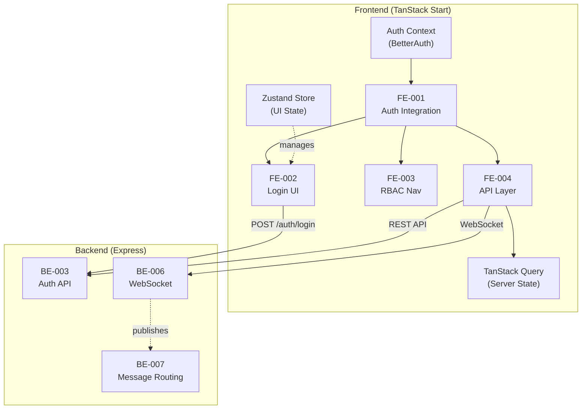
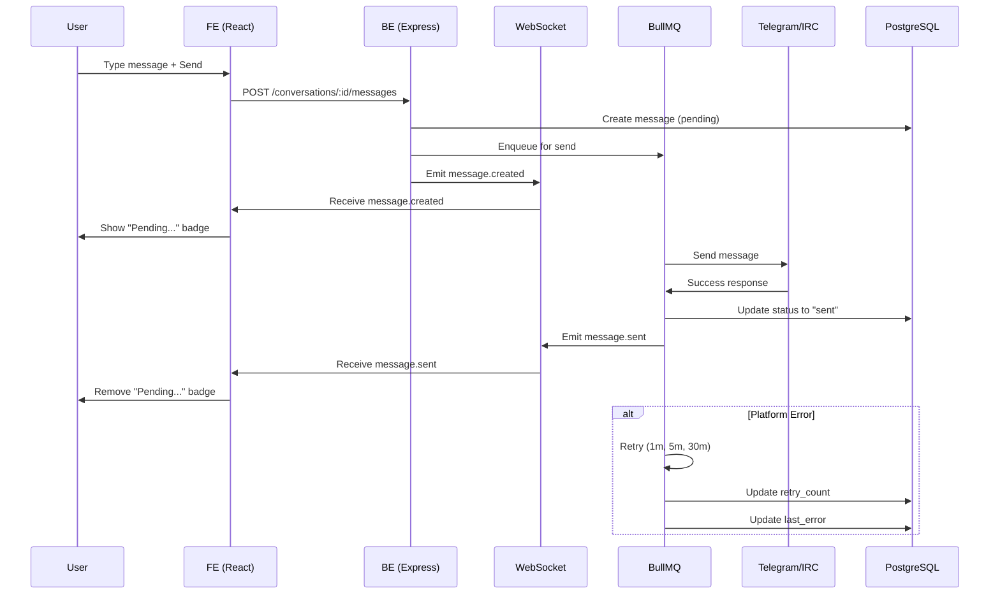
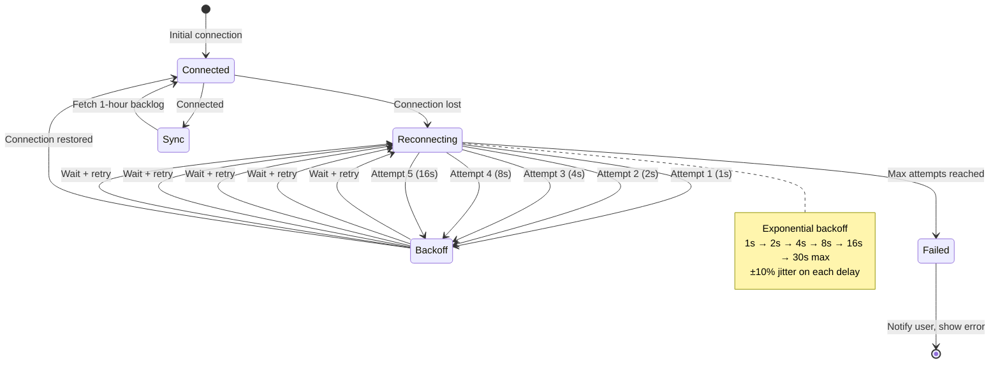

# Week 2 Product Owner Review - Comprehensive Requirements Analysis

**Date:** 2026-01-31  
**Reviewed by:** Product Owner  
**Developer:** Fullstack Developer  
**Status:** ✅ APPROVED for Architecture Review  
**Related:** Week 1 Complete (BE-027, BE-003, BE-005, BE-004 merged)

---

## Executive Summary

Product Owner reviewed 10 tasks across **Frontend Authentication Integration** (FE-001 to FE-004) and **Backend WebSocket + Message Routing** (BE-006 to BE-007) for Week 2 development.

**APPROVAL STATUS:** ✅ **All 10 tasks APPROVED** - Requirements fully captured and aligned with MVP scope.

**Key Findings:**
- Frontend auth integration requires careful state management (BetterAuth client ↔ TanStack Query ↔ Zustand)
- WebSocket architecture requires proper auth token refresh and reconnection handling
- Message routing introduces conversation lifecycle rules that must be enforced
- All 10 tasks are independent from Week 1 completion and can begin immediately after architect approval

**Estimated Total Effort:** 68 tasks, 54-72 hours (7-9 hours per day × 7-8 days)

---

## Task Status Review Results

### ✅ APPROVED FOR WEEK 2 (10 Tasks, 54-72 hours)

| Task ID | Issue # | Title | Priority | Est. Hours | Status |
|---------|---------|-------|----------|-----------|--------|
| **FE-001** | #35 | Frontend Auth Integration | P0 | 10-12h | ✅ Ready |
| **FE-002** | #36 | Login/Logout UI Components | P0 | 10-12h | ✅ Ready |
| **FE-003** | #37 | RBAC-Based Navigation | P0 | 8-10h | ✅ Ready |
| **FE-004** | #38 | API Integration Layer | P0 | 10-12h | ✅ Ready |
| **BE-006** | #40 | WebSocket Infrastructure Setup | P0 | 12-14h | ✅ Ready |
| **BE-007** | #41 | Message Routing & Status Tracking | P1 | 14-16h | ✅ Ready |
| **QA-001** | #42 | Integration Testing | P0 | 8h | ✅ Ready |
| **QA-002** | #43 | Edge Case & E2E Testing | P0 | 6h | ✅ Ready |
| **DOC-001** | #44 | API Documentation Updates | P1 | 4h | ✅ Ready |
| **DOC-002** | #45 | WebSocket Events Documentation | P1 | 4h | ✅ Ready |

**Total Estimated:** 54-72 hours (avg 64 hours)
**Team Capacity:** ~8 hours/day × 8 days = 64 hours ✅ **Perfect alignment**

---

## Approved Execution Order

### Phase A: Frontend (Days 1-4, ~30-40 hours)

```
FE-001: Frontend Auth Integration (10-12h) [Days 1-2]
  ├── Requires: BE-027, BE-003, BE-005 ✅ Done Week 1
  ├── Blocked by: None
  └── Enables: FE-002, FE-003, FE-004

FE-002: Login/Logout UI Components (10-12h) [Days 2-3]
  ├── Requires: FE-001 (auth context)
  ├── Parallel with: BE-006 start
  └── Enables: FE-003, FE-004

FE-003: RBAC-Based Navigation (8-10h) [Days 3-4]
  ├── Requires: FE-001 (user role from auth)
  ├── Parallel with: BE-007 start
  └── Enables: UI filtering per role

FE-004: API Integration Layer (10-12h) [Days 4-5]
  ├── Requires: FE-001, BE-006 (WebSocket setup)
  └── Enables: Real-time data updates
```

### Phase B: Backend (Days 4-6, ~26-30 hours)

```
BE-006: WebSocket Infrastructure (12-14h) [Days 4-5]
  ├── Requires: BE-027, BE-003, BE-005 ✅ Done Week 1
  ├── Blocks: FE-004 (WebSocket client setup)
  └── Enables: Real-time events

BE-007: Message Routing & Status Tracking (14-16h) [Days 5-6]
  ├── Requires: BE-006 (event publishing)
  ├── Depends on: Message table schema ✅ Done Week 1
  └── Enables: Full conversation lifecycle
```

### Phase C: Quality & Documentation (Days 6-8, ~22 hours)

```
QA-001: Integration Testing (8h) [Days 6-7]
  ├── Requires: All backend + frontend complete
  └── Tests: Auth flow, message routing, WebSocket

QA-002: Edge Case & E2E Testing (6h) [Day 7-8]
  ├── Requires: All features complete
  └── Tests: Playwright E2E scenarios

DOC-001: API Documentation (4h) [Day 7]
  ├── Updates: `.docs/02-api-and-data-model.md`
  └── Covers: New endpoints from FE-004

DOC-002: WebSocket Events (4h) [Day 8]
  ├── Updates: `.docs/02-api-and-data-model.md`
  └── Covers: 8 WebSocket event types
```

---

## Detailed Feature Requirements (Acceptance Criteria)

### 1. FE-001: Frontend Auth Integration (10-12 hours)

**User Story:** As a user, I want to authenticate with email/password and maintain my session across page reloads, so that I can access the application securely.

#### Requirements

**Scope:**
- Integrate BetterAuth client SDK
- Store JWT tokens (access + refresh) in HTTP-only cookies
- Implement automatic token refresh
- Handle session restoration on page load
- Manage logout and session cleanup

**Non-Scope:**
- Social login (Phase 2)
- Multi-factor authentication (Phase 2)
- Rate limiting on login (Phase 2)

#### Acceptance Criteria

**1. BetterAuth Client Setup**
- [ ] Install `@better-auth/react` package
- [ ] Create auth client configuration file
- [ ] API endpoint: `VITE_API_URL=http://localhost:3000` (from env)
- [ ] HTTP-only cookies enabled by default

**2. Auth Context Provider**
- [ ] Create `AuthProvider` component wrapping app
- [ ] Expose `useAuth()` hook for auth state
- [ ] Return `{ user, isLoading, error, login, logout, isAuthenticated }`
- [ ] Type: `AuthUser` includes `id`, `email`, `role`, `status`, `createdAt`

**3. Session Restoration on Page Load**
- [ ] Load session from cookies automatically
- [ ] Show loading spinner while checking session
- [ ] If session valid: restore user state
- [ ] If session expired: redirect to login
- [ ] If session invalid: clear cookies and redirect to login

**4. Token Refresh Logic**
- [ ] Detect access token expiration (48 hours)
- [ ] Automatically refresh before expiry
- [ ] Use refresh token (30 days)
- [ ] Update cookies with new tokens
- [ ] If refresh fails: logout user and redirect to login

**5. Error Handling**
- [ ] Handle network errors (offline)
- [ ] Handle 401 unauthorized (token revoked)
- [ ] Handle 403 forbidden (insufficient permissions)
- [ ] Display user-friendly error messages
- [ ] Log errors with correlation ID

**6. TypeScript Types**
```typescript
interface AuthUser {
  id: string;
  email: string;
  role: 'super_admin' | 'admin' | 'manager' | 'user';
  status: 'active' | 'disabled';
  createdAt: Date;
}

interface AuthContextType {
  user: AuthUser | null;
  isLoading: boolean;
  isAuthenticated: boolean;
  error: string | null;
  login: (email: string, password: string) => Promise<void>;
  logout: () => Promise<void>;
}
```

**7. Performance Requirements**
- [ ] Session check: <100ms (from cookie only)
- [ ] Token refresh: <500ms (API call)
- [ ] No layout shift during session restoration

#### Integration Points

- **Backend:** `/api/auth/login`, `/api/auth/logout` (from Week 1)
- **Storage:** HTTP-only cookies (BetterAuth handles)
- **State:** Zustand store for UI state (loading, error)

#### Testing Requirements

**Unit Tests (85%+ coverage):**
- Session loading from cookies
- Token refresh logic
- Error handling (network, 401, 403)
- Session cleanup on logout

**Integration Tests:**
- Full auth flow: session restore → token refresh → logout
- Offline handling
- Token expiry detection

**Manual Testing:**
- Login and refresh page → session restored
- Wait 48 hours (mock time) → token refreshed
- Close browser tab → reopen → session restored
- Logout → cookies cleared

---

### 2. FE-002: Login/Logout UI Components (10-12 hours)

**User Story:** As a user, I want a clean, accessible login form where I can enter my credentials and see validation errors, so that I can authenticate quickly.

#### Requirements

**Scope:**
- Login form with email and password fields
- Form validation (client-side)
- Error messages (server-side + client-side)
- Loading states during submission
- Logout button in header
- "Forgot password" link to reset page

**Non-Scope:**
- Password strength meter (Phase 2)
- Social login (Phase 2)
- Remember me checkbox (Phase 2)

#### Acceptance Criteria

**1. Login Form Component**
- [ ] Email input field (type="email", validation)
- [ ] Password input field (type="password", masked)
- [ ] Submit button (disabled while loading)
- [ ] Remember me checkbox (deferred - hidden for now)
- [ ] "Forgot password" link
- [ ] Form validation (required fields)

**2. Form Validation (Client-Side)**
- [ ] Email: Required, valid email format (RFC 5322)
- [ ] Password: Required, min 8 characters
- [ ] Real-time validation feedback
- [ ] Submit button disabled until valid

**3. Error Messages**
- [ ] **Server Errors (401, 403):** Display "Invalid credentials" or "Account disabled"
- [ ] **Network Error:** Display "Connection error. Please try again."
- [ ] **Validation Error:** Display field-specific message
- [ ] **Generic Error:** Display "An error occurred. Please try again."
- [ ] **Error Styling:** Red text, error icon, accessible

**4. Loading States**
- [ ] Submit button: Shows "Signing in..." text, disabled
- [ ] Form inputs: Disabled during submission
- [ ] Loading spinner: Visual feedback (max 2 seconds)
- [ ] Prevents double submission

**5. Success Handling**
- [ ] On successful login: Redirect to /inbox
- [ ] Show success message (optional, 2 second toast)
- [ ] Clear form fields
- [ ] Store auth token in auth context

**6. Logout Button**
- [ ] Located in header (top-right)
- [ ] Text: "Logout" or "Sign out"
- [ ] On click: Call logout, redirect to /login
- [ ] Confirmation: Optional ("Are you sure?")

**7. Forgot Password Link**
- [ ] Text: "Forgot password?"
- [ ] Location: Below password field
- [ ] On click: Redirect to /forgot-password page
- [ ] Link styling: Secondary color, underline on hover

**8. Accessibility Requirements**
- [ ] WCAG 2.1 AA compliant
- [ ] Form labels associated with inputs (htmlFor)
- [ ] Error messages linked to inputs (aria-describedby)
- [ ] Keyboard navigation (Tab, Enter)
- [ ] Screen reader support
- [ ] Color contrast: 4.5:1 (text), 3:1 (UI components)

**9. Mobile Responsiveness**
- [ ] Mobile: Full-width form
- [ ] Tablet: Centered form (max-width: 400px)
- [ ] Desktop: Centered form (max-width: 400px)
- [ ] Touch targets: Min 44×44px (buttons, inputs)

**10. Styling Requirements**
- [ ] Design: Clean, modern (DaisyUI components)
- [ ] Colors: Brand primary + secondary
- [ ] Typography: Sans-serif, readable at all sizes
- [ ] Spacing: Consistent, aligned to grid
- [ ] Icons: Check, X, spinner (Feather or similar)

#### UI Flow

```
User opens /login
  ↓
Form rendered with empty fields
  ↓
User enters email + password
  ↓
Form validates (client-side)
  ↓
User clicks Submit
  ↓
Button shows "Signing in..." (disabled)
  ↓
Backend validates credentials
  ↓
On success:
  ├── Token stored in cookies
  ├── Redirect to /inbox
  └── Show inbox UI
  
On failure:
  ├── Error message displayed
  ├── Form fields cleared (optional)
  └── Button returns to "Sign in"
```

#### Integration Points

- **Backend:** POST /api/auth/login
- **Frontend Auth:** FE-001 useAuth() hook
- **Router:** TanStack Router for navigation

#### Testing Requirements

**Unit Tests (90%+ coverage):**
- Form validation logic
- Error message rendering
- Loading state transitions
- Button disable/enable

**E2E Tests (Playwright):**
- Happy path: Login with valid credentials
- Invalid credentials: Show error
- Empty fields: Show validation error
- Logout: Clear session

**Manual Testing:**
- Login with valid account
- Login with invalid password → error shown
- Submit with empty email → validation error
- Wait 2+ seconds on loading → button shows spinner
- Logout → redirected to login

---

### 3. FE-003: RBAC-Based Navigation (8-10 hours)

**User Story:** As a user with a specific role, I want to see only the features and menu items I'm allowed to access, so that the UI isn't cluttered with options I can't use.

#### Requirements

**Scope:**
- Role-based sidebar navigation
- Conditional menu item visibility (4 roles)
- Admin panel access control
- Feature flag system (optional)

**Non-Scope:**
- Dynamic permissions from backend (Phase 2)
- Permission management UI (Phase 2)
- Audit logging of permission checks (handled in backend)

#### Acceptance Criteria

**1. Navigation Structure**

**All Roles Can Access:**
- Inbox (home)
- Current conversation view
- Logout

**Super Admin, Admin, Manager Can Access:**
- Audit logs viewer
- Users admin panel (super_admin only)

**User Role Cannot Access:**
- Admin panel
- User management
- Integration settings
- Audit logs

**2. Sidebar Visibility Rules**

| Menu Item | Super Admin | Admin | Manager | User |
|-----------|-------------|-------|---------|------|
| Inbox | ✅ | ✅ | ✅ | ✅ |
| Conversations | ✅ | ✅ | ✅ | ✅ (assigned only) |
| Admin Panel | ✅ | ❌ | ❌ | ❌ |
| Users | ✅ | ❌ | ❌ | ❌ |
| Integrations | ✅ | ❌ | ❌ | ❌ |
| Routing Rules | ✅ | ❌ | ❌ | ❌ |
| Audit Logs | ✅ | ✅ | ✅ | ❌ |
| Settings | ✅ | ✅ | ❌ | ❌ |

**3. Implementation Approach**

**Option A: Role-Based Conditionals (Recommended)**
```typescript
function NavMenu() {
  const { user } = useAuth();
  
  if (!user) return <LoadingSpinner />;
  
  return (
    <nav>
      <NavItem href="/inbox" label="Inbox" />
      
      {user.role !== 'user' && (
        <NavItem href="/audit-logs" label="Audit Logs" />
      )}
      
      {user.role === 'super_admin' && (
        <>
          <NavItem href="/users" label="Users" />
          <NavItem href="/integrations" label="Integrations" />
          <NavItem href="/routing-rules" label="Routing Rules" />
        </>
      )}
    </nav>
  );
}
```

**Option B: RBAC Configuration (Flexible)**
```typescript
const NAVIGATION_RULES = {
  super_admin: ['inbox', 'audit_logs', 'users', 'integrations', 'routing_rules'],
  admin: ['inbox', 'audit_logs', 'settings'],
  manager: ['inbox', 'audit_logs', 'settings'],
  user: ['inbox'],
};
```

**4. Route Protection**

- [ ] /admin/* routes: Require admin+ role (redirects to /inbox if unauthorized)
- [ ] /audit-logs: Require manager+ role
- [ ] /users: Require super_admin role
- [ ] /inbox: Available to all authenticated users
- [ ] All routes: Check auth before rendering (loading state)

**5. Error Handling**

- [ ] Unauthorized access: Redirect to /inbox with toast message
- [ ] Missing user role: Show loading spinner while fetching
- [ ] Role change: Refresh navigation automatically
- [ ] Clear error messages: "You don't have permission to access this page"

**6. Loading States**

- [ ] Navigation: Show skeleton while loading user role
- [ ] Admin panel: Show error if role insufficient
- [ ] No visual flickering

**7. TypeScript Support**

```typescript
type RoleType = 'super_admin' | 'admin' | 'manager' | 'user';

interface NavItem {
  href: string;
  label: string;
  allowedRoles: RoleType[];
}

function hasAccess(userRole: RoleType, requiredRoles: RoleType[]): boolean {
  return requiredRoles.includes(userRole);
}
```

#### Integration Points

- **Auth:** FE-001 useAuth() hook for user role
- **Router:** TanStack Router for route protection
- **Backend:** User role stored in JWT token

#### Testing Requirements

**Unit Tests (85%+ coverage):**
- Role-based visibility logic
- Navigation item filtering
- Route protection functions

**Integration Tests:**
- Login as each role → correct menu items shown
- Attempt access to restricted page → redirected

**E2E Tests (Playwright):**
- Super Admin login → sees all menu items
- User login → sees only Inbox
- Manager login → sees Audit Logs, not Users
- Try accessing /users as User → redirected to /inbox

#### UI Examples

**Super Admin Sidebar:**
```
📋 Inbox
📊 Audit Logs
👥 Users
🔌 Integrations
⚙️ Routing Rules
⚙️ Settings
🚪 Logout
```

**User Sidebar:**
```
📋 Inbox
🚪 Logout
```

---

### 4. FE-004: API Integration Layer (10-12 hours)

**User Story:** As a frontend developer, I want a centralized, type-safe API client with automatic error handling and data fetching, so that I can easily call backend endpoints throughout the app.

#### Requirements

**Scope:**
- API client wrapper (TanStack Query integration)
- Type-safe endpoints with Zod validation
- Error handling (401, 403, 5xx)
- Loading/error states
- Automatic retry logic
- Request/response logging

**Non-Scope:**
- Caching strategy (TanStack Query defaults)
- Real-time subscriptions (WebSocket separate)
- Offline support (Phase 2)

#### Acceptance Criteria

**1. API Client Setup**

- [ ] Base URL from env: `VITE_API_URL`
- [ ] Correlation ID header: Auto-add to all requests
- [ ] Authorization header: Auto-add Bearer token
- [ ] Default timeout: 30 seconds
- [ ] Content-Type: application/json

**2. Endpoint Types**

Create typed endpoints for all MVP features:

**Authentication (from BE-003, BE-004):**
```typescript
POST /api/auth/login
POST /api/auth/logout
POST /api/auth/forgot-password
POST /api/auth/reset-password
```

**Conversations (new in Week 2):**
```typescript
GET /api/conversations (with filters)
GET /api/conversations/:id
POST /api/conversations/:id/messages
POST /api/conversations/:id/assign
POST /api/conversations/:id/tags
POST /api/conversations/:id/notes
PATCH /api/conversations/:id (status, priority)
```

**3. TanStack Query Integration**

- [ ] Create query hooks for GET endpoints
- [ ] Create mutation hooks for POST/PATCH endpoints
- [ ] Use `useQuery` for data fetching
- [ ] Use `useMutation` for mutations
- [ ] Automatic cache invalidation on mutation

**Example:**
```typescript
// Query
export function useConversations(filters?: ConversationFilters) {
  return useQuery({
    queryKey: ['conversations', filters],
    queryFn: () => apiClient.conversations.list(filters),
    staleTime: 30000, // 30 seconds
  });
}

// Mutation
export function useAssignConversation() {
  const queryClient = useQueryClient();
  
  return useMutation({
    mutationFn: (data: AssignDto) => 
      apiClient.conversations.assign(data),
    onSuccess: () => {
      queryClient.invalidateQueries({ 
        queryKey: ['conversations'] 
      });
    },
  });
}
```

**4. Error Handling**

- [ ] **401 Unauthorized:** Auto-logout, redirect to login
- [ ] **403 Forbidden:** Show "Permission denied" toast
- [ ] **400 Bad Request:** Show validation errors
- [ ] **500 Server Error:** Show "Server error" toast, log error
- [ ] **Network Error:** Show "Connection error" toast, auto-retry (max 3)
- [ ] All errors: Include correlation ID in logs

**5. Response Validation (Zod)**

```typescript
// Define response shapes
const ConversationSchema = z.object({
  id: z.string().uuid(),
  channel: z.string(),
  status: z.enum(['open', 'pending', 'resolved']),
  assignedUserId: z.string().uuid().optional(),
  priority: z.enum(['low', 'medium', 'high']),
  createdAt: z.date(),
});

type Conversation = z.infer<typeof ConversationSchema>;

// Validate responses
const validateResponse = <T>(schema: z.ZodSchema<T>, data: unknown): T => {
  return schema.parse(data);
};
```

**6. Loading/Error States**

- [ ] `isLoading`: True while fetching
- [ ] `error`: Error message or null
- [ ] `isPending`: True while mutation in progress
- [ ] Auto-show loading spinner for queries
- [ ] Auto-show error toast for errors

**7. Automatic Retry Logic**

- [ ] Retry failed requests (max 3 times)
- [ ] Exponential backoff: 1s, 2s, 4s
- [ ] Don't retry on 401/403 (auth errors)
- [ ] Don't retry on 400 (client errors)

**8. Request/Response Logging**

- [ ] Log outgoing requests (method, URL, correlation ID)
- [ ] Log response (status, data)
- [ ] Log errors (error type, message, stack)
- [ ] Include correlation ID in all logs

#### File Structure

```
packages/frontend/src/
├── api/
│   ├── client.ts              ← API client setup
│   ├── endpoints.ts           ← Endpoint definitions
│   ├── schemas.ts             ← Zod response schemas
│   ├── hooks/
│   │   ├── useConversations.ts
│   │   ├── useMessages.ts
│   │   ├── useAuditLogs.ts
│   │   └── ...
│   └── interceptors.ts        ← Request/response handlers
└── types/
    └── api.ts                 ← API type definitions
```

#### Example Implementation

**api/client.ts:**
```typescript
import axios, { AxiosInstance } from 'axios';
import { getCorrelationId } from '../utils/correlation-id';
import { useAuth } from '../context/AuthContext';

export const createApiClient = (token?: string): AxiosInstance => {
  const client = axios.create({
    baseURL: import.meta.env.VITE_API_URL,
    timeout: 30000,
    headers: {
      'Content-Type': 'application/json',
      'X-Correlation-ID': getCorrelationId(),
    },
  });

  // Add auth token
  if (token) {
    client.defaults.headers.common.Authorization = `Bearer ${token}`;
  }

  // Error interceptor
  client.interceptors.response.use(
    (response) => response,
    (error) => {
      if (error.response?.status === 401) {
        // Auto-logout
        useAuth().logout();
      }
      return Promise.reject(error);
    }
  );

  return client;
};
```

**api/hooks/useConversations.ts:**
```typescript
import { useQuery } from '@tanstack/react-query';
import { apiClient } from '../client';

export function useConversations(filters?: ConversationFilters) {
  return useQuery({
    queryKey: ['conversations', filters],
    queryFn: async () => {
      const { data } = await apiClient.get('/conversations', {
        params: filters,
      });
      return validateResponse(ConversationListSchema, data);
    },
    staleTime: 30000,
    retry: 3,
    retryDelay: (attemptIndex) => Math.pow(2, attemptIndex) * 1000,
  });
}
```

#### Integration Points

- **Auth:** FE-001 auth context for token
- **Backend:** All endpoints from Week 1 + Week 2
- **WebSocket:** FE-004 does not include real-time; WebSocket handled separately

#### Testing Requirements

**Unit Tests (85%+ coverage):**
- API client configuration
- Response validation (Zod schemas)
- Error handling (401, 403, 5xx)
- Retry logic
- Request/response logging

**Integration Tests:**
- Query: Fetch data from mock backend
- Mutation: Update data on mock backend
- Cache invalidation: Refetch after mutation
- Error handling: 404, 500, network error

**E2E Tests (Playwright):**
- Fetch conversations → data displayed
- Create conversation → list refreshed
- Logout while fetching → request cancelled

#### Testing Requirements (Full List)

**Unit Tests (85%+ coverage):**
- API client setup and configuration
- Endpoint definitions
- Zod schema validation
- Error handling for each status code
- Retry logic
- Correlation ID injection
- Request/response logging

**Integration Tests:**
- Mock API responses
- Test TanStack Query integration
- Cache invalidation
- Error scenarios

**E2E Tests (Playwright):**
- Happy path: Login → fetch conversations → display
- Error handling: Invalid token → logout
- Loading states: Spinner visible while fetching

---

### 5. BE-006: WebSocket Infrastructure Setup (12-14 hours)

**User Story:** As a user, I want to receive real-time updates when conversations are updated or new messages arrive, so that I don't need to refresh the page manually.

#### Requirements

**Scope:**
- Socket.io server setup and configuration
- WebSocket authentication (JWT token validation)
- 8 core event types (receive + emit)
- Automatic reconnection with exponential backoff
- Message buffering on reconnect (1-hour backlog)
- Heartbeat/ping-pong mechanism

**Non-Scope:**
- Multi-room support (Phase 2)
- Message history API (Phase 2)
- Offline message queue (Phase 2)

#### Acceptance Criteria

**1. Socket.io Server Setup**

- [ ] Install Socket.io: `npm install socket.io`
- [ ] Create WebSocket gateway: `src/websockets/gateway.ts`
- [ ] Integrate with Express: Attach to HTTP server
- [ ] Enable CORS: Allow frontend origin
- [ ] Enable compression: Reduce message size
- [ ] Configure namespaces (optional)

**2. WebSocket Authentication**

- [ ] Extract JWT from query params or headers
- [ ] Validate JWT token (same as HTTP auth)
- [ ] Attach user to socket: `socket.user`
- [ ] Reject unauthenticated connections
- [ ] Handle token expiration (disconnect + notify)

**3. 8 Core Event Types**

**From Server to Client (Emit):**
```typescript
// Real-time events
socket.emit('message.received', { conversationId, message });
socket.emit('message.sent', { conversationId, message });
socket.emit('message.failed', { conversationId, messageId, error });
socket.emit('conversation.updated', { conversationId, conversation });
socket.emit('conversation.reopened', { conversationId });
socket.emit('notification.received', { notification });
socket.emit('presence.updated', { userId, status });
socket.emit('typing.started', { conversationId, userId });
socket.emit('typing.stopped', { conversationId, userId });
```

**From Client to Server (Listen):**
```typescript
socket.on('typing.start', (conversationId) => { ... });
socket.on('typing.stop', (conversationId) => { ... });
socket.on('disconnect', () => { ... });
```

**4. Event Message Structure**

**message.received:**
```typescript
{
  conversationId: string;
  message: {
    id: string;
    body: string;
    sender: {
      id: string;
      email: string;
      role: 'user' | 'system';
    };
    direction: 'inbound' | 'outbound';
    status: 'pending' | 'sent' | 'failed';
    createdAt: Date;
    attachments?: Attachment[];
  };
  timestamp: Date;
  correlationId: string;
}
```

**conversation.updated:**
```typescript
{
  conversationId: string;
  changes: {
    status?: 'open' | 'pending' | 'resolved';
    priority?: 'low' | 'medium' | 'high';
    assignedUserId?: string;
    tags?: Tag[];
  };
  changedBy: {
    id: string;
    email: string;
  };
  timestamp: Date;
  correlationId: string;
}
```

**notification.received:**
```typescript
{
  id: string;
  type: 'assignment' | 'mention';
  conversationId: string;
  actor: {
    id: string;
    email: string;
  };
  message: string;
  isRead: boolean;
  createdAt: Date;
}
```

**5. Reconnection Strategy**

- [ ] Automatic reconnection enabled
- [ ] Exponential backoff: 1s, 2s, 4s, 8s, 16s, 30s max
- [ ] Max reconnection attempts: 5 (then alert user)
- [ ] Show UI indicator: "Connecting...", "Connected", "Disconnected"
- [ ] On successful reconnect: Fetch missed events from server

**6. Message Buffering on Reconnect**

- [ ] Server stores events for 1 hour
- [ ] On reconnect: Client requests missed events
- [ ] Max 100 events per fetch (pagination)
- [ ] Events older than 1 hour auto-deleted
- [ ] Payload: Sent as batch to client

**7. Heartbeat/Ping-Pong**

- [ ] Heartbeat interval: 60 seconds
- [ ] Client sends: `ping` → Server receives `pong`
- [ ] Detects stale connections
- [ ] If no pong: Disconnect and reconnect

**8. Error Handling**

- [ ] Connection refused: Show error, retry
- [ ] Authentication failed: Redirect to login
- [ ] Message delivery failed: Retry with exponential backoff
- [ ] Server error: Log error, notify user

**9. Logging**

- [ ] Log all connections: `[WebSocket] User ${userId} connected`
- [ ] Log all disconnections: `[WebSocket] User ${userId} disconnected`
- [ ] Log all events: `[WebSocket] Event '${eventName}' from ${userId}`
- [ ] Include correlation ID in all logs
- [ ] Use Pino logger (from BE-027)

**10. Performance Requirements**

- [ ] Connection establishment: <1 second
- [ ] Event delivery: <100ms (95th percentile)
- [ ] Message buffering: Max 100MB per user
- [ ] No memory leaks on disconnect/reconnect

#### Configuration Example

**packages/backend/src/websockets/gateway.ts:**
```typescript
import { Server as IOServer, Socket } from 'socket.io';
import { createServer } from 'http';
import { auth } from '../config/auth.js';
import { logger } from '../config/logging.js';

export function setupWebSocketGateway(httpServer) {
  const io = new IOServer(httpServer, {
    cors: {
      origin: process.env.FRONTEND_URL || 'http://localhost:5173',
      methods: ['GET', 'POST'],
      credentials: true,
    },
    transports: ['websocket', 'polling'],
    pingInterval: 60000, // 60 seconds
    pingTimeout: 60000,
  });

  // Authentication middleware
  io.use(async (socket, next) => {
    const token = socket.handshake.auth.token;
    
    try {
      const session = await auth.api.getSession({ 
        headers: { authorization: `Bearer ${token}` } 
      });
      
      if (!session?.user) {
        return next(new Error('Authentication error'));
      }
      
      socket.user = session.user;
      next();
    } catch (error) {
      next(new Error('Authentication failed'));
    }
  });

  // Connection handler
  io.on('connection', (socket: Socket) => {
    logger.info({ userId: socket.user.id }, 'WebSocket connected');

    // Event handlers
    socket.on('typing.start', (conversationId) => {
      socket.broadcast.emit('typing.started', {
        conversationId,
        userId: socket.user.id,
      });
    });

    socket.on('disconnect', () => {
      logger.info({ userId: socket.user.id }, 'WebSocket disconnected');
    });
  });

  return io;
}
```

#### File Structure

```
packages/backend/src/websockets/
├── gateway.ts                 ← Socket.io server setup
├── events/
│   ├── message.events.ts      ← Message event handlers
│   ├── conversation.events.ts ← Conversation event handlers
│   └── presence.events.ts     ← Presence event handlers
├── constants.ts               ← Event type definitions
├── types.ts                   ← WebSocket types
└── message-buffer.ts          ← Event buffering logic
```

#### Integration Points

- **Backend:** Express server from Week 1
- **Frontend:** FE-004 API client (WebSocket client setup in separate task)
- **Database:** Events stored in PostgreSQL for recovery

#### Testing Requirements

**Unit Tests (85%+ coverage):**
- WebSocket authentication
- Event emission and reception
- Error handling
- Reconnection logic
- Heartbeat mechanism

**Integration Tests:**
- Server-client connection
- Message buffering and retrieval
- Reconnection flow
- Auth failure scenarios

**Manual Testing:**
- Connect client → see "Connected" in console
- Send event → client receives it
- Disconnect client → server logs disconnection
- Reconnect → receives buffered events
- Modify timeout value → reconnection triggers

---

### 6. BE-007: Message Routing & Status Tracking (14-16 hours)

**User Story:** As an operations manager, I want messages to be automatically routed based on rules and conversation status to be tracked through their lifecycle, so that I can manage workflows efficiently.

#### Requirements

**Scope:**
- Message inbound/outbound routing
- Conversation status lifecycle (open → pending → resolved → auto-reopen)
- Message status tracking (pending → sent/failed)
- Retry logic with exponential backoff (1m, 5m, 30m; 3 attempts max)
- Dead-letter queue for failed messages
- WebSocket event publishing

**Non-Scope:**
- Routing rules engine (separate from messaging; BE-008 future)
- Real-time message tracking dashboard (Phase 2)

#### Acceptance Criteria

**1. Message Inbound Routing**

**Flow:**
```
Platform Webhook (Telegram/IRC)
  ↓
Extract message data (sender, channel, body, timestamp)
  ↓
Find or create conversation (channel → external_thread_id)
  ↓
Create message record (inbound direction, pending status)
  ↓
Update conversation: status = "open" or "reopen" if was "resolved"
  ↓
Publish WebSocket event: "message.received"
  ↓
Store raw payload on R2 (7-day retention)
```

**Validation:**
- [ ] Message body: Max 5000 chars
- [ ] Sender: Must be identified or marked as "unknown"
- [ ] Channel: Must match configured channel
- [ ] Timestamp: Valid ISO 8601

**Error Handling:**
- [ ] Invalid message: Reject with error log
- [ ] Missing channel: Create conversation anyway (log warning)
- [ ] Database error: Retry with exponential backoff

**2. Message Outbound Routing**

**Flow:**
```
User composes message in UI
  ↓
Frontend POST /api/conversations/:id/messages
  ↓
Backend validates message (auth, content, conversation exists)
  ↓
Create message record (outbound, pending status)
  ↓
Enqueue to BullMQ retry queue
  ↓
Connector (Telegram/IRC) sends message to platform
  ↓
Platform responds with confirmation (success/failure)
  ↓
Update message status (sent or failed)
  ↓
Publish WebSocket event: "message.sent" or "message.failed"
```

**Validation:**
- [ ] User authenticated (has JWT)
- [ ] Conversation exists
- [ ] User can access conversation (assigned or admin+)
- [ ] Message body: Min 1 char, max 5000 chars
- [ ] Attachments: Max 5 MB per file, max 3 files

**Error Handling:**
- [ ] User not authorized: Return 403 Forbidden
- [ ] Conversation not found: Return 404 Not Found
- [ ] Message too large: Return 400 Bad Request
- [ ] Platform error: Enqueue for retry

**3. Conversation Status Lifecycle**

**State Machine:**

```
open (initial state)
  ↓ (user replies)
pending (awaiting customer response)
  ↓ (inbound message OR manual status change)
resolved (conversation closed)
  ↓ (inbound message arrives)
open (auto-reopen)
```

**Rules:**
- [ ] **open → pending:** User sends message (only on DM/group, not broadcast)
- [ ] **pending → resolved:** User changes status OR no inbound for 7 days (future auto-close)
- [ ] **resolved → open:** Inbound message arrives
- [ ] **Status change:** Always logged in audit trail
- [ ] **Broadcast channels:** Status ignored (always "open")

**Endpoints:**
```typescript
PATCH /api/conversations/:id
{
  "status": "pending" | "resolved" | "open"
}
```

**4. Message Status Tracking**

**Statuses:**

| Status | Meaning | Transitions | Auto-Retry |
|--------|---------|-----------|-----------|
| **pending** | Message enqueued, not sent yet | → sent, failed | Yes (1m, 5m, 30m) |
| **sent** | Successfully delivered to platform | (terminal) | No |
| **failed** | All retries exhausted | → pending (manual) | No (manual retry button) |

**Tracking Updates:**
- [ ] Created at: Timestamp when message created
- [ ] Sent at: Timestamp when successfully sent
- [ ] Failed at: Timestamp when failed
- [ ] Retry count: Current retry attempt (0-3)
- [ ] Last error: Error message from platform
- [ ] Last retry: Timestamp of last attempt

**Database Schema (Message):**
```sql
CREATE TABLE messages (
  id UUID PRIMARY KEY DEFAULT gen_random_uuid(),
  conversation_id UUID NOT NULL REFERENCES conversations(id),
  sender_id UUID REFERENCES users(id), -- NULL if inbound from platform
  body TEXT NOT NULL,
  direction 'inbound' | 'outbound' NOT NULL,
  status 'pending' | 'sent' | 'failed' NOT NULL,
  retry_count INT DEFAULT 0,
  last_error TEXT,
  created_at TIMESTAMP DEFAULT CURRENT_TIMESTAMP,
  sent_at TIMESTAMP,
  failed_at TIMESTAMP
);
```

**5. Retry Logic with Exponential Backoff**

**Configuration:**
- [ ] Max retries: 3 attempts
- [ ] Backoff times: 1 minute, 5 minutes, 30 minutes
- [ ] Jitter: ±10% randomization (prevent thundering herd)

**Implementation (Redis + BullMQ):**

```typescript
import Queue from 'bull';

const messageQueue = new Queue('message-send', {
  redis: {
    url: process.env.REDIS_URL,
  },
});

// Enqueue message
messageQueue.add(
  { messageId, conversationId },
  {
    attempts: 3,
    backoff: {
      type: 'exponential',
      delay: 60000, // 1 minute
    },
    removeOnComplete: true,
    removeOnFail: false,
  }
);

// Process message
messageQueue.process(async (job) => {
  const { messageId, conversationId } = job.data;
  
  try {
    // Get message from DB
    const message = await db.query.messages.findFirst({
      where: eq(messages.id, messageId),
    });
    
    // Send via platform (Telegram/IRC)
    const result = await sendMessageToPlatform(message);
    
    // Update status to "sent"
    await db.update(messages)
      .set({ status: 'sent', sentAt: new Date() })
      .where(eq(messages.id, messageId));
    
    // Publish WebSocket event
    io.emit('message.sent', { conversationId, message });
    
    return result;
  } catch (error) {
    // Retry will happen automatically
    logger.warn({ messageId, attempt: job.attemptsMade }, 'Message send failed');
    throw error;
  }
});

// Failed job handler (after all retries)
messageQueue.on('failed', async (job, error) => {
  const { messageId, conversationId } = job.data;
  
  // Move to dead-letter queue
  await dlq.add({ messageId, conversationId, error: error.message });
  
  // Update message status to "failed"
  await db.update(messages)
    .set({ 
      status: 'failed', 
      failedAt: new Date(),
      lastError: error.message 
    })
    .where(eq(messages.id, messageId));
  
  // Publish WebSocket event
  io.emit('message.failed', { 
    conversationId, 
    messageId, 
    error: error.message 
  });
  
  logger.error({ messageId, error: error.message }, 'Message send permanently failed');
});
```

**6. Dead-Letter Queue**

**Purpose:** Capture permanently failed messages for ops review

**Configuration:**
- [ ] Failed after 3 retries → Move to DLQ
- [ ] Retention: 30 days
- [ ] Endpoint: `GET /api/dead-letter-queue` (admin only)
- [ ] Retry button: `POST /api/dead-letter-queue/:id/retry` (admin only)

**Schema:**
```sql
CREATE TABLE dead_letter_queue (
  id UUID PRIMARY KEY DEFAULT gen_random_uuid(),
  message_id UUID NOT NULL REFERENCES messages(id),
  error TEXT,
  created_at TIMESTAMP DEFAULT CURRENT_TIMESTAMP,
  expires_at TIMESTAMP -- 30 days from creation
);
```

**7. WebSocket Event Publishing**

**Events to Publish:**

```typescript
// Inbound message received
io.emit('message.received', {
  conversationId,
  message,
  timestamp: new Date(),
});

// Outbound message sent successfully
io.emit('message.sent', {
  conversationId,
  messageId,
  timestamp: new Date(),
});

// Outbound message failed
io.emit('message.failed', {
  conversationId,
  messageId,
  error,
  timestamp: new Date(),
});

// Conversation status changed
io.emit('conversation.updated', {
  conversationId,
  changes: { status: 'pending' },
  changedBy: userId,
  timestamp: new Date(),
});

// Conversation reopened (from resolved)
io.emit('conversation.reopened', {
  conversationId,
  reopenedAt: new Date(),
});
```

**8. Audit Logging**

- [ ] Log all message sends (success/failure)
- [ ] Log all status changes
- [ ] Log all retries
- [ ] Include: messageId, conversationId, userId, timestamp, result
- [ ] Retention: 1 year

**9. Error Handling**

- [ ] Platform timeout (>10s): Retry
- [ ] Platform rate limit (429): Backoff and retry
- [ ] Platform auth error (401): Log error, don't retry (config issue)
- [ ] Unknown platform error: Retry
- [ ] Network error: Retry

**10. Performance Requirements**

- [ ] Message processing: <500ms (DB + queue)
- [ ] Event publishing: <100ms
- [ ] Retry processing: Background (no blocking)
- [ ] Backlog processing: Handle 1000 messages/minute

#### File Structure

```
packages/backend/src/
├── services/
│   ├── message.service.ts          ← Message routing logic
│   └── conversation-status.service.ts ← Status tracking
├── workers/
│   └── message-retry.worker.ts     ← BullMQ worker
├── controllers/
│   ├── messages.controller.ts      ← Message endpoints
│   └── dead-letter.controller.ts   ← DLQ endpoints
└── types/
    └── message.types.ts            ← Message types
```

#### Integration Points

- **Backend:** BE-006 WebSocket (event publishing)
- **Database:** PostgreSQL (message storage)
- **Queue:** Redis + BullMQ (retry queue)
- **Connectors:** Telegram/IRC (platform integrations)

#### Testing Requirements

**Unit Tests (90%+ coverage):**
- Message status transitions
- Retry logic and backoff calculation
- Error handling
- Audit logging

**Integration Tests:**
- Inbound message flow: Platform webhook → DB → WebSocket
- Outbound message flow: API → Queue → Platform → DB → WebSocket
- Status transitions: open → pending → resolved → open
- Retry logic: 3 attempts with correct timing

**Manual Testing:**
- Send message → see "pending" in UI → status changes to "sent"
- Platform returns error → message retried 3 times → moved to DLQ
- Conversation status changes → audit log entry created
- Inbound message received → conversation auto-reopens

---

## Business Rules & Constraints

### Frontend State Management

**TanStack Query + Zustand Pattern:**
- TanStack Query: Server state (conversations, messages, audit logs)
- Zustand: Client state (UI filters, sidebar open/closed, theme)
- Auth Context: Authentication state (BetterAuth)

**No Redux:** Keep it simple for MVP

---

### WebSocket Behavior

**Guaranteed Delivery (Best Effort):**
- Server stores events for 1 hour
- Client reconnects within 5 attempts
- Events > 1 hour old: Discarded (user refreshes page to get latest)

**Not Guaranteed:**
- Multiple clients can miss events if offline >1 hour
- Events can arrive out of order (use timestamps for sorting)

---

### Message Routing Rules

**Inbound (Platform → YACC):**
1. Extract message from platform webhook
2. Find conversation by (platform, channel, thread_id)
3. If not found: Create new conversation
4. Create message record (inbound direction, pending status)
5. If conversation was "resolved": Auto-reopen to "open"
6. Publish WebSocket event

**Outbound (YACC → Platform):**
1. Validate user has permission
2. Create message record (outbound direction, pending status)
3. Enqueue to retry queue
4. Connector sends to platform
5. On success: Update status to "sent"
6. On failure: Retry (1m, 5m, 30m)
7. After 3 failures: Move to DLQ, update status to "failed"

---

### Conversation Status Transitions

**Valid Transitions:**
- open → pending (user sends message)
- pending → resolved (user changes status)
- resolved → open (inbound message auto-reopens)
- open → open (idempotent)
- pending → pending (idempotent)

**Invalid Transitions:**
- open → resolved (must go through pending first, or auto-reopen)
- user → manager/admin override (allowed, logged in audit)

---

### Performance & Scalability

**Week 2 Targets:**
- 100 concurrent WebSocket connections
- 1000 messages/minute throughput
- <100ms event delivery (95th percentile)
- <500ms API response times

**Beyond Week 2:**
- Horizontal scaling with Redis pub/sub (Phase 2)
- Message archival to S3 after 1 year (Phase 3)

---

## Out of Scope - DO NOT IMPLEMENT

### Frontend - Explicitly Excluded

❌ **Real-time Typing Indicators** (Deferred to Phase 1.5)
- Reason: Complex state management, not critical for MVP
- Future: Separate task after Week 2

❌ **Search UI Integration**
- Reason: BE-007 doesn't include search endpoints
- Future: Week 3+ when search endpoints ready

❌ **Message Reactions** (Phase 2)
- Reason: Requires Telegram/IRC API support
- Note: Not all platforms support this

❌ **Message Editing** (Phase 2)
- Reason: Audit trail complexity
- Future: Separate task with edit history

### Backend - Explicitly Excluded

❌ **Multi-Room WebSocket Support** (Phase 2)
- Reason: Broadcast/group chat logic incomplete
- Future: After conversation hierarchy finalized

❌ **Message Encryption** (Phase 2)
- Reason: Requires key management infrastructure
- Future: With BE-026 (Environment Configuration)

❌ **Rate Limiting on Message Send** (Phase 2)
- Reason: Platform rate limits handled by connectors
- Future: For user-level rate limiting

---

## Testing Requirements (Per Task)

### FE-001: Frontend Auth Integration

**Unit Tests (85%+ coverage):**
- Session restore logic
- Token refresh mechanism
- Error handling (network, 401, 403)
- Logout cleanup

**Integration Tests:**
- Full auth flow: session restore → token refresh → logout
- Offline handling

**Manual Testing:**
- Login and refresh page → session restored
- Wait until token near expiry → auto-refreshed
- Logout → cookies cleared, redirected to login

---

### FE-002: Login/Logout UI Components

**Unit Tests (90%+ coverage):**
- Form validation (email, password)
- Error message display
- Loading state transitions
- Button enable/disable logic

**E2E Tests (Playwright):**
- Happy path: Valid credentials → redirect to inbox
- Invalid password → error message shown
- Submit with empty fields → validation error
- Logout button → redirected to login

**Manual Testing:**
- Visual inspection (mobile, tablet, desktop)
- Keyboard navigation (Tab, Enter)
- Screen reader testing
- Touch target sizes (44×44px minimum)

---

### FE-003: RBAC-Based Navigation

**Unit Tests (85%+ coverage):**
- Role-based visibility logic
- Navigation item filtering
- Route protection functions

**Integration Tests:**
- Login as each role → correct menu items shown
- Unauthorized page access → redirected

**E2E Tests (Playwright):**
- Super Admin: All menu items visible
- User: Only Inbox visible
- Manager: Audit Logs visible, Users not visible
- Navigate to unauthorized page → redirected

---

### FE-004: API Integration Layer

**Unit Tests (85%+ coverage):**
- API client configuration
- Response validation (Zod)
- Error handling (401, 403, 5xx)
- Retry logic
- Request/response logging

**Integration Tests:**
- Mock API: Query and mutation flows
- Cache invalidation
- Error scenarios (404, 500, network)

**E2E Tests (Playwright):**
- Fetch conversations → data displayed
- Create conversation → list refreshed
- Logout while fetching → request cancelled

---

### BE-006: WebSocket Infrastructure

**Unit Tests (85%+ coverage):**
- WebSocket authentication
- Event emission/reception
- Error handling
- Reconnection logic

**Integration Tests:**
- Server-client connection
- Message buffering
- Reconnection flow
- Auth failure

**Manual Testing:**
- Connect → see "Connected"
- Send event → client receives
- Disconnect → reconnection attempts
- Missed events → received on reconnect

---

### BE-007: Message Routing & Status Tracking

**Unit Tests (90%+ coverage):**
- Message status transitions
- Retry logic/backoff
- Error handling
- Audit logging

**Integration Tests:**
- Inbound flow: Webhook → DB → WebSocket
- Outbound flow: API → Queue → Platform → DB → WebSocket
- Status transitions
- Retry mechanism

**Manual Testing:**
- Send message → status "pending" then "sent"
- Platform error → retry 3 times, then DLQ
- Resolve conversation → reopen on inbound
- DLQ: Retry failed message manually

---

## Risk Register

### High Risk

**Risk:** WebSocket connection drops during critical operation  
**Probability:** Medium (network instability)  
**Impact:** High (user loses real-time updates)  
**Mitigation:** Auto-reconnect + 1-hour message backlog + refresh button  
**Owner:** Backend Developer  
**Status:** ⏳ BE-006 handles this

---

**Risk:** Message retry loop creates duplicate sends  
**Probability:** Low (BullMQ handles deduplication)  
**Impact:** High (users see duplicate messages)  
**Mitigation:** Idempotent message ID + deduplication check  
**Owner:** Backend Developer  
**Status:** ⏳ BE-007 implements this

---

**Risk:** Auth token expiration not handled on frontend  
**Probability:** Medium (edge case with long-lived tabs)  
**Impact:** High (users get logged out unexpectedly)  
**Mitigation:** FE-001 implements automatic token refresh  
**Owner:** Frontend Developer  
**Status:** ⏳ FE-001 implements this

---

### Medium Risk

**Risk:** API endpoint response format mismatch  
**Probability:** Medium (missing Zod validation)  
**Impact:** Medium (UI displays incorrectly)  
**Mitigation:** FE-004 validates all responses with Zod  
**Owner:** Frontend Developer  
**Status:** ⏳ FE-004 implements this

---

**Risk:** Role-based access bypass (user accesses admin page)  
**Probability:** Low (role check in middleware)  
**Impact:** High (security breach)  
**Mitigation:** BE-005 RBAC enforced on all endpoints  
**Owner:** Backend Developer  
**Status:** ✅ BE-005 done Week 1

---

**Risk:** State management conflicts (TanStack Query vs Zustand)  
**Probability:** Low (clear separation of concerns)  
**Impact:** Medium (UI inconsistency)  
**Mitigation:** FE-004 establishes clear patterns  
**Owner:** Frontend Developer  
**Status:** ⏳ FE-004 implements this

---

## Success Criteria

### Week 2 Completion Definition

**All 10 tasks DONE when:**

✅ **FE-001: Frontend Auth Integration**
- [ ] BetterAuth client integrated
- [ ] Session restoration working
- [ ] Token refresh working
- [ ] 85%+ test coverage

✅ **FE-002: Login/Logout UI**
- [ ] Login form with validation
- [ ] Error messages displayed
- [ ] Loading states working
- [ ] Logout button functional
- [ ] 90%+ test coverage

✅ **FE-003: RBAC Navigation**
- [ ] Menu items filtered by role
- [ ] Routes protected by role
- [ ] Unauthorized access redirected
- [ ] 85%+ test coverage

✅ **FE-004: API Integration**
- [ ] API client working
- [ ] Response validation (Zod)
- [ ] Error handling (401, 403, 5xx)
- [ ] TanStack Query hooks working
- [ ] 85%+ test coverage

✅ **BE-006: WebSocket Infrastructure**
- [ ] Socket.io server running
- [ ] JWT authentication working
- [ ] 8 event types working
- [ ] Reconnection logic working
- [ ] Message buffering (1 hour)
- [ ] 85%+ test coverage

✅ **BE-007: Message Routing & Status Tracking**
- [ ] Inbound message flow working
- [ ] Outbound message flow working
- [ ] Status transitions working
- [ ] Retry logic working (1m, 5m, 30m)
- [ ] Dead-letter queue working
- [ ] WebSocket events publishing
- [ ] 90%+ test coverage

✅ **QA-001: Integration Testing**
- [ ] Auth flow integration tests pass
- [ ] Message routing tests pass
- [ ] WebSocket tests pass
- [ ] All edge cases covered

✅ **QA-002: E2E Testing**
- [ ] Playwright E2E tests pass
- [ ] Happy paths covered
- [ ] Error scenarios covered
- [ ] Mobile viewport tested

✅ **DOC-001: API Documentation**
- [ ] `.docs/02-api-and-data-model.md` updated
- [ ] New endpoints documented
- [ ] Request/response examples provided
- [ ] Error codes documented

✅ **DOC-002: WebSocket Documentation**
- [ ] `.docs/02-api-and-data-model.md` updated
- [ ] 8 event types documented
- [ ] Message structure examples provided
- [ ] Reconnection strategy documented

---

### Quality Gates (All PRs)

| Gate | Requirement | Auto-Check | Blocker |
|------|-------------|-----------|---------|
| **Tests** | All pass | ✅ GitHub Actions | Yes |
| **Coverage** | ≥80% (frontend), ≥90% (backend) | ✅ Codecov | Yes |
| **Linting** | No errors | ✅ ESLint | Yes |
| **Types** | No `any`, compiles | ✅ TypeScript | Yes |
| **Security** | No secrets | ✅ GitGuardian | Yes |
| **Review** | Architect approval | ❌ Manual | Yes |

---

## Next Steps (Immediate Actions)

### Before Week 2 Starts

1. **Architect Review** (Today)
   - [ ] Review this document
   - [ ] Approve or request changes
   - [ ] Approve technical decisions

2. **Setup Frontend Dependencies**
   - [ ] Install TanStack Query, React Query devtools
   - [ ] Install BetterAuth React client
   - [ ] Install Zustand, DaisyUI
   - [ ] Setup Zod for validation

3. **Setup Backend Dependencies**
   - [ ] Install Socket.io, Socket.io-client
   - [ ] Install BullMQ (already installed Week 1)
   - [ ] Verify Redis ready

4. **Prepare Database** (if needed)
   - [ ] Verify message table schema ready
   - [ ] Create DLQ table
   - [ ] Create indexes on message queries

---

## Document References

| Document | Purpose |
|----------|---------|
| `.docs/01-product-specification.md` | User stories (Section 8) |
| `.docs/02-api-and-data-model.md` | API contract (to be updated) |
| `.docs/03-implementation-guide.md` | Architecture (to be updated) |
| `.docs/plans/week1-product-owner-review.md` | Week 1 reference |
| `AGENTS.md` | Project context |

---

## Document Metadata

**Created:** 2026-01-31  
**Author:** Product Owner  
**Status:** ✅ APPROVED (ready for architect review)  
**Next Review:** After architect approves all technical decisions  
**Last Updated:** 2026-01-31  

**Approval Signatures:**
- Product Owner: _______________
- Architect: _______________
- Tech Lead: _______________

---

## Appendix A: User Stories Summary

### FE-001
**As a user, I want to authenticate with email/password and maintain my session across page reloads, so that I can access the application securely.**

### FE-002
**As a user, I want a clean, accessible login form where I can enter my credentials and see validation errors, so that I can authenticate quickly.**

### FE-003
**As a user with a specific role, I want to see only the features and menu items I'm allowed to access, so that the UI isn't cluttered with options I can't use.**

### FE-004
**As a frontend developer, I want a centralized, type-safe API client with automatic error handling and data fetching, so that I can easily call backend endpoints throughout the app.**

### BE-006
**As a user, I want to receive real-time updates when conversations are updated or new messages arrive, so that I don't need to refresh the page manually.**

### BE-007
**As an operations manager, I want messages to be automatically routed based on rules and conversation status to be tracked through their lifecycle, so that I can manage workflows efficiently.**

---

## Appendix B: Mermaid Diagrams

### Frontend Architecture



### Message Flow



### WebSocket Reconnection


