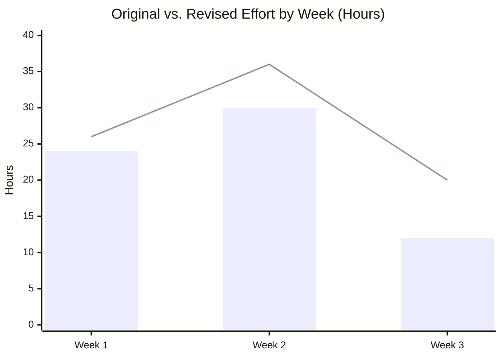
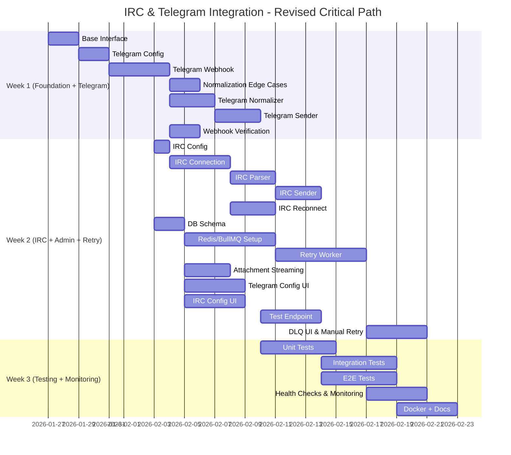
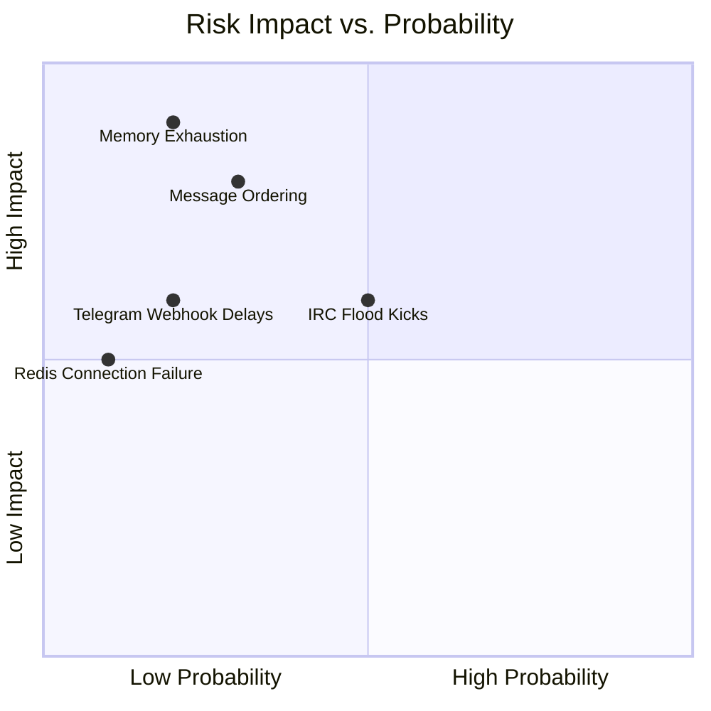
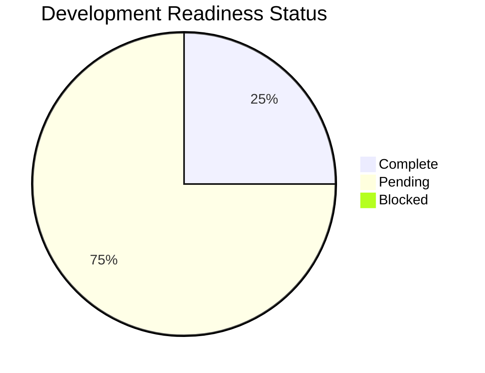
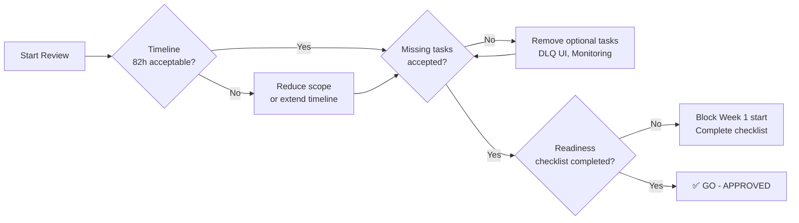
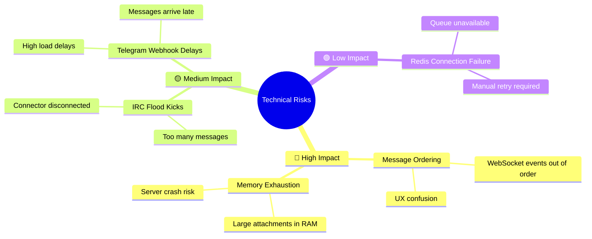
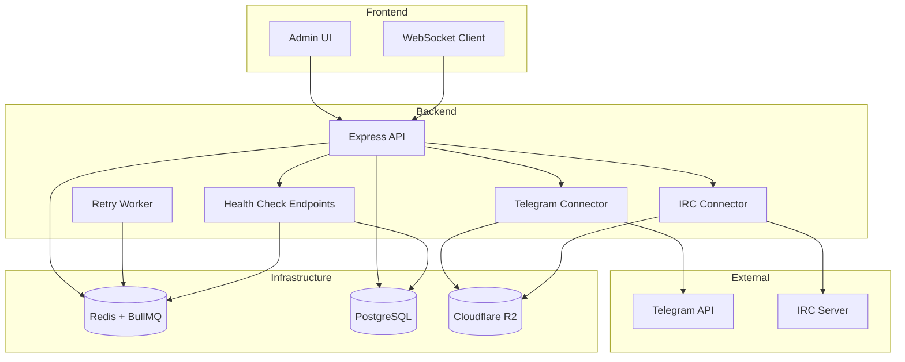
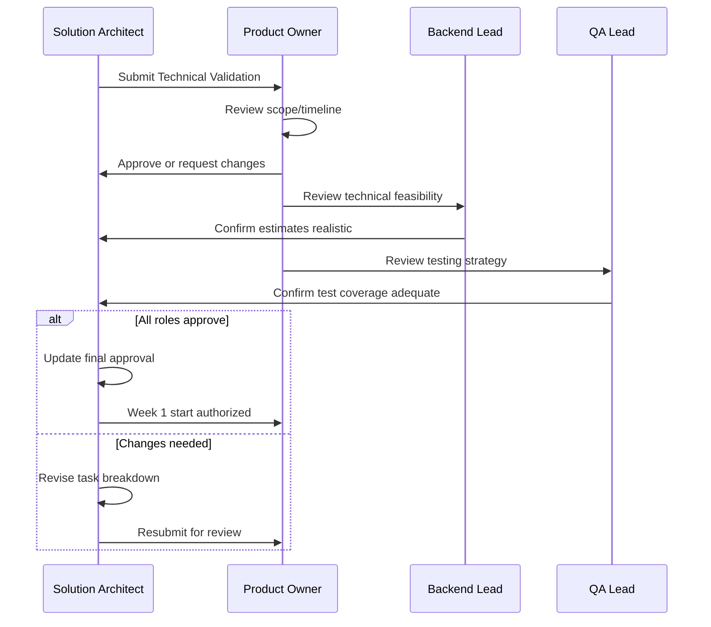

# Integration Task Breakdown: Visual Summary

**Status**: Pending Product Owner Review
**Total Effort**: Original: 65h → Revised: 82h (+26%)
**Timeline**: 3 Weeks

---

## Task Effort Comparison



**Legend**: 🔵 Bar = Original Plan | 🟡 Line = Revised Plan

---

## Critical Path with New Tasks



---

## Risk Matrix



---

## Technical Validation Summary

| Category | Original | Revised | Status |
|----------|----------|---------|--------|
| **Total Effort** | 65h | 82h (+26%) | ⚠️ Increased |
| **Testing** | 9h (14%) | 15h (18%) | ✅ Aligned with standards |
| **Deployment** | 2h | 8h | ✅ Comprehensive |
| **Missing Tasks** | 0 | 4 new tasks | ✅ Identified and added |
| **Technical Risks** | Not documented | 5 risks documented | ✅ Mitigation in place |
| **Architecture** | Sound | Sound (no changes) | ✅ Approved |

---

## Readiness Checklist Status



### Check by Category

| Category | Complete | Pending | Total |
|----------|----------|---------|-------|
| **Technical** | 1/6 | 5 | 6 |
| **Documentation** | 0/5 | 5 | 5 |
| **Tooling** | 0/4 | 4 | 4 |
| **Team** | 2/4 | 2 | 4 |
| **Overall** | **3/19** | **16** | **19** |

---

## Go/No-Go Decision Matrix



---

## New Tasks Added

| ID | Task | Hours | Week | Priority |
|----|------|-------|------|----------|
| INT-022 | Message Normalization Edge Cases | 2h | 1 | High |
| INT-023 | Dead-Letter Queue UI & Manual Retry | 4h | 2 | Medium |
| INT-024 | Attachment Streaming Implementation | 3h | 2 | High |
| INT-025 | Health Check & Monitoring Endpoints | 4h | 3 | High |

**Rationale**:
- INT-022: Edited messages, forwarded messages, CTCP actions are critical edge cases
- INT-023: Ops team needs visibility into failed messages without manual DB queries
- INT-024: Streaming is required for production to avoid memory exhaustion
- INT-025: Health checks are essential for monitoring connector status in production

---

## Top 5 Technical Risks



---

## Deployment Architecture



---

## Additional Considerations Addressed

| Consideration | Status | Notes |
|---------------|--------|-------|
| **Database Migrations** | ✅ Updated | Added `raw_payload_ref` index, `integrations.status` index |
| **Environment Variable Documentation** | ✅ Enhanced | Created dedicated `.docs/integration-env-vars.md` |
| **Docker Compose Changes** | ✅ Complete | Added Redis with persistence and health checks |
| **Monitoring/Metrics** | ✅ Added | INT-025: Health check + Prometheus metrics |
| **Rate Limiting Configuration** | ✅ Fixed | Made rate limits configurable via env vars |

---

## Sign-Off Workflow



---

## Quick Reference: Effort Changes

```mermaid
xychart-beta
    title Task-by-Task Effort Changes (Hours)
    x-axis ["INT-013", "INT-014", "INT-018", "INT-019", "INT-020", "INT-021"]
    y-axis "Hours" 0 --> 10
    bar [4, 3, 3, 3, 3, 2]
    line [6, 6, 5, 5, 5, 4]
```

**Changed Tasks**:
- INT-013 (Redis/BullMQ): 4h → 6h (+50%)
- INT-014 (Retry Worker): 3h → 6h (+100%)
- INT-018 (Unit Tests): 3h → 5h (+67%)
- INT-019 (Integration Tests): 3h → 5h (+67%)
- INT-020 (E2E Tests): 3h → 5h (+67%)
- INT-021 (Docker/Docs): 2h → 4h (+100%)

**New Tasks**: INT-022 (2h), INT-023 (4h), INT-024 (3h), INT-025 (4h) = 13h

---

**Document Version**: 1.0
**Last Updated**: January 21, 2026
**Related Documents**:
- `.docs/temp/07-irc-telegram-integration-tasks.md` (Task Breakdown)
- `.docs/temp/08-integration-technical-validation.md` (Full Validation Report)
