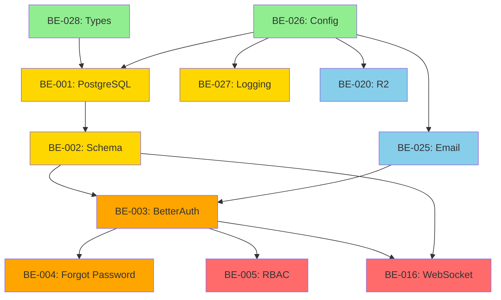

# Week 1 Work Plan - Phase 1 Foundation

**Status**: Ready for Implementation
**Start Date**: January 22, 2026
**Duration**: 5 business days

---

## Overview

Week 1 focuses on foundational infrastructure required for all subsequent development. We have 11 tasks across 5 days:

| Day | Tasks | Focus |
|------|-------|-------|
| Day 1 | BE-028, BE-026, BE-001 | Core Infrastructure |
| Day 2 | BE-002, BE-027 | Database + Logging |
| Day 3 | BE-020, BE-025 | External Services |
| Day 4 | BE-003, BE-004 | Authentication |
| Day 5 | BE-005, BE-016 | Authorization + Real-Time |

---

## Task Breakdown

### Day 1: Core Infrastructure (3 tasks)

#### BE-028: Create shared types package ⭐
**Issue**: #109
**Priority**: P0
**Estimated Time**: 4-6 hours
**Dependencies**: None (should be done first)

**Technical Approach**:
1. Initialize `packages/common/` with TypeScript configuration
2. Create directory structure: `types/`, `schemas/`, `constants/`, `utils/`
3. Define all TypeScript interfaces for domain entities
4. Create Zod validation schemas for API requests/responses
5. Define enums (Role, Status, Channel, etc.)
6. Export everything from `src/index.ts`
7. Configure workspace dependency in monorepo

**Key Technical Decisions**:
- Package name: `@yacc/common`
- Use Zod for runtime validation
- Export both types (TS) and schemas (Zod)
- Separate concerns: types for compile-time, schemas for runtime

**Acceptance Criteria** (from issue):
- [x] All entity types defined (User, Conversation, Message, etc.)
- [x] API request/response types defined
- [x] Zod validation schemas created
- [x] Enums & constants exported
- [x] Package builds successfully
- [x] Workspace dependency configured

**Files to Create**:
```
packages/common/
├── package.json
├── tsconfig.json
├── src/
│   ├── index.ts
│   ├── types/
│   │   ├── entities.ts
│   │   ├── api.ts
│   │   ├── auth.ts
│   │   └── index.ts
│   ├── schemas/
│   │   ├── entities.ts
│   │   ├── api.ts
│   │   ├── auth.ts
│   │   └── index.ts
│   ├── constants/
│   │   ├── roles.ts
│   │   ├── status.ts
│   │   └── errors.ts
│   └── index.ts
```

---

#### BE-026: Create environment configuration scaffolding
**Issue**: #108
**Priority**: P0
**Estimated Time**: 2-3 hours
**Dependencies**: None

**Technical Approach**:
1. Create `.env.example` with all 40+ environment variables
2. Create Zod validation schema for environment variables
3. Create typed config service (`IConfig` interface)
4. Add startup validation in `index.ts`
5. Create documentation for environment variables

**Key Technical Decisions**:
- Fail-fast on startup if required vars missing
- Use Zod for type coercion (strings to numbers/booleans)
- Group config into logical sections (database, auth, storage, etc.)
- Provide sensible defaults for optional variables

**Acceptance Criteria** (from issue):
- [x] `.env.example` with all variables
- [x] Zod schema validates all variables
- [x] Config service exports typed interface
- [x] Startup validation fails if required vars missing
- [x] Documentation created

**Files to Create**:
```
packages/backend/src/config/
├── config.schema.ts    # Zod validation
├── index.ts            # Config service
└── README.md

packages/backend/.env.example
packages/frontend/.env.example
```

---

#### BE-001: Set up PostgreSQL + Drizzle ORM
**Issue**: (Not listed in visible issues, but referenced in Week 1)
**Priority**: P0
**Estimated Time**: 4-5 hours
**Dependencies**: BE-026 (for DATABASE_URL env var)

**Technical Approach**:
1. Install `drizzle-orm` and `drizzle-kit`
2. Configure Drizzle with PostgreSQL driver
3. Create database connection singleton
4. Set up Drizzle config for migrations
5. Test connection and basic query

**Key Technical Decisions**:
- Use Drizzle ORM (type-safe SQL)
- PostgreSQL 14+ (supports FTS, JSON)
- Connection pooling via pg driver
- Use `drizzle-kit` for migrations

**Acceptance Criteria**:
- [x] Drizzle ORM configured
- [x] Database connection established
- [x] Migration framework set up
- [x] Basic query test passes

**Files to Create**:
```
packages/backend/
├── drizzle.config.ts
├── drizzle/
│   └── schema.ts       # Will be moved in BE-002

packages/backend/src/infrastructure/database/
├── connection.ts       # DB connection singleton
├── index.ts
└── README.md
```

**Dependencies**:
```bash
pnpm add drizzle-orm postgres
pnpm add -D drizzle-kit @types/pg
```

---

### Day 2: Database + Logging (2 tasks)

#### BE-002: Define database schema (11 tables)
**Issue**: (Not listed in visible issues)
**Priority**: P0
**Estimated Time**: 6-8 hours
**Dependencies**: BE-001 (Drizzle configured)

**Technical Approach**:
1. Create Drizzle schema for all 11 tables
2. Define indexes for performance (search, filters)
3. Create foreign key relationships
4. Set up full-text search vector for messages table
5. Generate initial migration

**Key Technical Decisions**:
- Use Drizzle's `pgTable` API
- Define indexes inline in schema
- Use `tsvector` for full-text search
- Cascade deletes where appropriate

**Acceptance Criteria**:
- [x] All 11 tables defined in Drizzle schema
- [x] Indexes created for query performance
- [x] Foreign keys configured
- [x] Full-text search vector set up
- [x] Migration generated

**Tables** (from `.docs/02-api-and-data-model.md`):
1. `users`
2. `roles`
3. `conversations`
4. `messages`
5. `conversation_participants`
6. `attachments`
7. `tags`
8. `conversation_tags` (join table)
9. `notes`
10. `notifications`
11. `routing_rules`
12. `routing_rule_executions`
13. `raw_payloads`
14. `audit_logs`

**Files to Create**:
```
packages/backend/src/infrastructure/database/
└── schema/
    ├── users.ts
    ├── conversations.ts
    ├── messages.ts
    ├── attachments.ts
    ├── tags.ts
    ├── notes.ts
    ├── notifications.ts
    ├── routing_rules.ts
    ├── raw_payloads.ts
    ├── audit_logs.ts
    └── index.ts              # Exports all schemas
```

---

#### BE-027: Set up structured logging infrastructure
**Issue**: #107
**Priority**: P0
**Estimated Time**: 4-6 hours
**Dependencies**: BE-026 (for LOG_* env vars)

**Technical Approach**:
1. Install Pino logger
2. Configure multiple output streams (console, file, audit)
3. Create correlation ID middleware (AsyncLocalStorage)
4. Create request logging middleware
5. Create audit log writer
6. Configure file rotation

**Key Technical Decisions**:
- Use Pino for performance (recommended over Winston)
- Separate audit log file
- Correlation ID in all log entries
- Structured JSON logs in production
- Pretty-printed logs in development

**Acceptance Criteria** (from issue):
- [x] Logger configured with Pino
- [x] Multiple output streams (console, file, audit)
- [x] Correlation ID middleware working
- [x] Request logging middleware working
- [x] Audit log writer working
- [x] File rotation configured

**Files to Create**:
```
packages/backend/src/infrastructure/logging/
├── logger.ts                    # Main logger setup
├── logger.config.ts             # Config
├── correlation.middleware.ts     # Correlation ID
├── request-logger.middleware.ts # Request logging
├── audit-logger.ts             # Audit log writer
├── index.ts
└── README.md

logs/                           # Created at runtime
├── app.log
├── audit.log
└── .gitkeep
```

**Dependencies**:
```bash
pnpm add pino pino-multi-stream pino-pretty
pnpm add -D @types/pino
```

---

### Day 3: External Services (2 tasks - can be done in parallel)

#### BE-020: Set up Cloudflare R2 storage
**Issue**: #106
**Priority**: P0
**Estimated Time**: 4-5 hours
**Dependencies**: BE-026 (for R2 env vars)

**Technical Approach**:
1. Install `@aws-sdk/client-s3` (S3-compatible for R2)
2. Configure S3 client with R2 credentials
3. Create R2 service wrapper
4. Implement bucket initialization
5. Implement signed URL generation
6. Configure CORS rules
7. Set up lifecycle policies (7-day payload deletion)

**Key Technical Decisions**:
- Use AWS S3 SDK (R2 is S3-compatible)
- Signed URLs for secure uploads/downloads
- Separate folders: `attachments/`, `payloads/`, `exports/`
- Lifecycle policies for automatic cleanup

**Acceptance Criteria** (from issue):
- [x] R2 SDK configured with env vars
- [x] Upload/download/delete operations working
- [x] Signed URL generation working
- [x] CORS configured
- [x] Lifecycle policies set
- [x] Error handling with retry

**Files to Create**:
```
packages/backend/src/infrastructure/storage/
├── r2.service.ts          # Main R2 operations
├── r2.config.ts           # Client initialization
├── index.ts
└── README.md
```

**Dependencies**:
```bash
pnpm add @aws-sdk/client-s3 @aws-sdk/s3-request-presigner
```

---

#### BE-025: Set up email service (Nodemailer/SendGrid)
**Issue**: #105
**Priority**: P0
**Estimated Time**: 3-4 hours
**Dependencies**: BE-026 (for email env vars)

**Technical Approach**:
1. Install `nodemailer` and `@sendgrid/mail`
2. Create email service interface
3. Implement SendGrid provider
4. Implement SMTP provider (fallback)
5. Create HTML email templates
6. Create verification endpoint (`/api/_internal/test-email`)
7. Add rate limiting

**Key Technical Decisions**:
- SendGrid preferred for production
- SMTP fallback for development
- HTML templates with inline CSS
- Rate limit: 10 emails/min per address

**Acceptance Criteria** (from issue):
- [x] Email service configured
- [x] HTML and plain-text templates created
- [x] Verification endpoint working
- [x] Error handling with retry
- [x] Rate limiting enforced

**Files to Create**:
```
packages/backend/src/infrastructure/email/
├── email.service.ts         # Main service
├── templates/
│   ├── password-reset.html
│   └── password-reset.txt
├── providers/
│   ├── sendgrid.provider.ts
│   └── smtp.provider.ts
├── index.ts
└── README.md
```

**Dependencies**:
```bash
pnpm add nodemailer @sendgrid/mail
```

---

### Day 4: Authentication (2 tasks)

#### BE-003: Implement BetterAuth for authentication
**Issue**: (Not listed in visible issues, but in Week 1 plan)
**Priority**: P0
**Estimated Time**: 6-8 hours
**Dependencies**: BE-002 (database schema), BE-025 (email service)

**Technical Approach**:
1. Install BetterAuth
2. Configure BetterAuth with PostgreSQL adapter
3. Set up JWT plugin with bearer auth
4. Create auth endpoints (login, logout, refresh)
5. Integrate with users table
6. Create auth middleware for protected routes
7. Store JWT in localStorage (frontend)

**Key Technical Decisions**:
- Use BetterAuth with JWT plugin
- Access token TTL: 48h
- Refresh token TTL: 30d (HttpOnly cookie)
- Password hashing: bcrypt/argon2

**Acceptance Criteria**:
- [x] BetterAuth configured
- [x] Login endpoint working
- [x] Logout endpoint working
- [x] JWT token generation/validation
- [x] Auth middleware protecting routes
- [x] Password hashing implemented

**Files to Create**:
```
packages/backend/src/api/auth/
├── auth.controller.ts      # BetterAuth setup
├── auth.routes.ts         # Auth endpoints
├── auth.middleware.ts     # JWT verification
└── index.ts
```

**Dependencies**:
```bash
pnpm add better-auth
pnpm add bcrypt   # or argon2
```

---

#### BE-004: Implement forgot password flow
**Issue**: (Not listed in visible issues, but in Week 1 plan)
**Priority**: P0
**Estimated Time**: 4-5 hours
**Dependencies**: BE-003 (BetterAuth setup), BE-025 (email service)

**Technical Approach**:
1. Create password reset tokens table
2. Implement forgot password endpoint (always returns success)
3. Generate reset token and send email
4. Implement reset password endpoint (validate token)
5. Token TTL: 60 minutes
6. One-time use tokens

**Key Technical Decisions**:
- Don't reveal if email exists (security)
- Token expires after 60 minutes
- Single-use tokens (delete after use)
- Email template includes reset link

**Acceptance Criteria**:
- [x] Forgot password endpoint working
- [x] Reset email sent successfully
- [x] Reset password endpoint working
- [x] Token validation (not expired, not used)
- [x] Password updated in database

**Files to Create**:
```
packages/backend/src/api/auth/
├── forgot-password.controller.ts
└── forgot-password.routes.ts

packages/backend/src/infrastructure/database/schema/
└── password-reset-tokens.ts
```

---

### Day 5: Authorization + Real-Time (2 tasks - can be done in parallel)

#### BE-005: Implement RBAC middleware
**Issue**: (Not listed in visible issues, but in Week 1 plan)
**Priority**: P0
**Estimated Time**: 4-6 hours
**Dependencies**: BE-003 (auth middleware)

**Technical Approach**:
1. Define permission matrix for 4 roles
2. Create role-based access control middleware
3. Implement permission checking decorator/middleware
4. Apply RBAC to protected routes
5. Test role hierarchy

**Key Technical Decisions**:
- 4 roles: super_admin, admin, manager, user
- Permission format: `resource:action` (e.g., `users:create`)
- Decorator-based RBAC (if using routing-controllers)
- Role hierarchy: super_admin > admin > manager > user

**Acceptance Criteria**:
- [x] Permission matrix defined
- [x] RBAC middleware working
- [x] Protected routes enforce permissions
- [x] 403 forbidden for unauthorized access
- [x] Role hierarchy working

**Permission Matrix** (from docs):
| Role | Permissions |
|------|-------------|
| super_admin | `users:*`, `roles:*`, `integrations:*`, `rules:*`, `audit:*`, `inbox:*`, `messages:*`, `collaboration:*` |
| admin | `inbox:*`, `messages:*`, `collaboration:*`, `audit:read` |
| manager | `inbox:*`, `messages:send`, `messages:read`, `collaboration:*`, `audit:read`, `rawPayloads:read` |
| user | `inbox:read`, `messages:send`, `messages:read`, `collaboration:create`, `collaboration:read` |

**Files to Create**:
```
packages/backend/src/api/auth/
├── rbac.middleware.ts     # Permission checking
├── permissions.ts         # Permission matrix
└── index.ts
```

---

#### BE-016: Set up Socket.io WebSocket server
**Issue**: (Not listed in visible issues, but in Week 1 plan)
**Priority**: P0
**Estimated Time**: 5-7 hours
**Dependencies**: BE-003 (auth), BE-002 (database)

**Technical Approach**:
1. Install Socket.io
2. Configure Socket.io with HTTP server
3. Implement authentication middleware for WebSocket
4. Set up heartbeat mechanism (60s interval)
5. Create room strategy (user-specific rooms)
6. Implement event handlers (8 event types)
7. Store missed events for backlog (1 hour)

**Key Technical Decisions**:
- Heartbeat: 60 seconds (ping/pong)
- Backlog: 1 hour of missed events
- Reconnect: Exponential backoff (1s → 60s)
- Rooms: `user:{userId}`, `conversation:{conversationId}`

**Event Types**:
- `conversation.updated`
- `message.received`
- `message.sent`
- `message.failed`
- `notification.received`
- `conversation.reopened`
- `presence.updated`
- `typing.started/stopped`

**Acceptance Criteria**:
- [x] Socket.io server configured
- [x] WebSocket authentication working
- [x] Heartbeat mechanism working
- [x] Event handlers implemented
- [x] Room strategy working
- [x] Missed events stored for backlog

**Files to Create**:
```
packages/backend/src/infrastructure/websocket/
├── socket.server.ts       # Socket.io setup
├── socket.auth.ts        # WebSocket auth middleware
├── events/               # Event handlers
│   ├── conversation.events.ts
│   ├── message.events.ts
│   ├── notification.events.ts
│   ├── presence.events.ts
│   └── index.ts
├── backlog/              # Missed events storage
│   └── event-store.ts
└── index.ts
```

**Dependencies**:
```bash
pnpm add socket.io
pnpm add -D @types/socket.io
```

---

## Parallel Work Opportunities

These tasks can be worked on simultaneously by multiple developers:

| Day | Parallel Pairs |
|------|----------------|
| Day 1 | BE-028 (types) + BE-026 (config) → BE-001 (PostgreSQL) after config |
| Day 2 | BE-002 (schema) + BE-027 (logging) - logging doesn't depend on schema |
| Day 3 | BE-020 (R2) + BE-025 (email) - both independent services |
| Day 4 | BE-003 (BetterAuth) must complete before BE-004 (forgot password) |
| Day 5 | BE-005 (RBAC) + BE-016 (WebSocket) - both depend on auth, can run parallel |

---

## Dependency Graph



---

## Risk Mitigation

| Risk | Mitigation |
|------|------------|
| R2 credentials not available | Use MinIO (local S3) for development |
| SendGrid API key not ready | Use Mailtrap or SMTP for testing |
| PostgreSQL connection issues | Use Docker Compose for local DB |
| WebSocket connection issues | Fallback to polling for MVP |
| BetterAuth configuration complexity | Start with simple JWT, add plugins later |
| Migration conflicts | Use `drizzle-kit push` for development, generate migrations for production |

---

## Next Steps

1. ✅ Assign BE-028 to Backend Developer (Day 1 priority 1)
2. ✅ Assign BE-026 to Backend Developer (Day 1 priority 2)
3. ✅ Start BE-001 after BE-026 completes
4. ✅ Plan Day 2-5 tasks based on Day 1 completion
5. ✅ Daily standups to track progress and unblock issues

---

**Created**: January 22, 2026
**Author**: Product Owner
**Status**: Ready for execution
